# SeNARS Development Plan

> **Semantic Non-Axiomatic Reasoning System**  
> **Status**: Living development document  
> **Foundation**: Stream reasoner, 7 NAL rules, 105 tests (99.8% pass)

---

## Table of Contents

1. [Principles](#principles)
2. [Foundation Status](#foundation-status)
3. [Proven Capabilities](#proven-capabilities)
4. [Development Tree](#development-tree)
5. [Phase 4: Polish & Scale](#phase-4-polish--scale)
6. [Phase 5: ML as Terms](#phase-5-ml-as-terms)
7. [Phase 6: Temporal](#phase-6-temporal-deferred)
8. [Ecosystem](#ecosystem)
9. [Key Files](#key-files)

---

## Principles

| Principle | Implication |
|-----------|-------------|
| **NAL First** | LM augments, not replaces formal semantics |
| **Declarative** | Logic defined by patterns, not imperative code |
| **Compiled** | Patterns compiled to optimized decision trees |
| **Composable** | Standard interfaces, plug-and-play |
| **Observable** | Emit events, bounded retention |
| **Resource-Aware** | Budgets, timeouts, graceful degradation |

---

## Foundation Status

### Assets Already Built

| Asset | Location | Status |
|-------|----------|--------|
| **Unification** | [Unifier.js](file:///home/me/senars10/core/src/term/Unifier.js) | ✅ |
| **Backward Chaining** | [PrologStrategy.js](file:///home/me/senars10/core/src/reason/strategy/PrologStrategy.js) | ✅ |
| **Embeddings** | [EmbeddingLayer.js](file:///home/me/senars10/core/src/lm/EmbeddingLayer.js) | ✅ |
| **RuleCompiler** | [RuleCompiler.js](file:///home/me/senars10/core/src/reason/rules/compiler/RuleCompiler.js) | ✅ |
| **RuleExecutor** | [RuleExecutor.js](file:///home/me/senars10/core/src/reason/rules/executor/RuleExecutor.js) | ✅ |
| **SemanticStrategy** | [SemanticStrategy.js](file:///home/me/senars10/core/src/reason/strategy/SemanticStrategy.js) | ✅ |
| **AnalogicalStrategy** | [AnalogicalStrategy.js](file:///home/me/senars10/core/src/reason/strategy/AnalogicalStrategy.js) | ✅ |
| **GoalDrivenStrategy** | [GoalDrivenStrategy.js](file:///home/me/senars10/core/src/reason/strategy/GoalDrivenStrategy.js) | ✅ |

### Needed Foundations

| Foundation | Unlocks | Effort | Priority |
|------------|---------|--------|----------|
| **Derivation Tracing** | Debugger, Explainer, RL | 1 week | ⭐⭐⭐ |
| **Serialization Layer** | API, Playground, Ingestion | 3 days | ⭐⭐⭐ |
| **Advanced Indexing** | 100K+ concepts, GNN | 1-2 weeks | ⭐⭐ |

---

## Proven Capabilities

### Core (Tested)

| Component | Evidence |
|-----------|----------|
| **Terms** | Immutability, normalization, traversal, macros |
| **Truth** | All 11 NAL functions |
| **Unifier** | Two-way, one-way, occurs check, transitive chains |
| **Stamps** | Provenance, derivation depth |
| **Tasks** | Validation, cloning, type checking |

### Reasoning (Tested)

| Rule | Pattern |
|------|---------|
| Modus Ponens | (a ==> b), a ⊢ b |
| Syllogism | (a→b), (b→c) ⊢ (a→c) |
| Induction | (M→P), (M→S) ⊢ (S→P) |
| Abduction | (P→M), (S→M) ⊢ (S→P) |
| Conversion | (P→S) ⊢ (S→P) |
| Contraposition | (S⇒P) ⊢ (¬P⇒¬S) |

### Strategies (Tested)

| Strategy | Implementation | Status |
|----------|----------------|--------|
| TaskMatchStrategy | Syllogistic patterns | ✅ |
| DecompositionStrategy | Extract subterms | ✅ |
| TermLinkStrategy | Associative links | ✅ |
| **SemanticStrategy** | Embedding similarity | ✅ |
| **AnalogicalStrategy** | Structure mapping via unifier | ✅ |
| **GoalDrivenStrategy** | Backward chaining + plan synthesis | ✅ |
| PrologStrategy | Full Prolog + recursion | ✅ |

### Memory (Tested)

| Component | Capability |
|-----------|------------|
| Memory | Concepts, consolidation, resource management |
| Focus | Working memory, attention decay, priority eviction |
| ResourceManager | Pressure detection, adaptive forgetting |

### LM (Tested)

| Capability | Status |
|------------|--------|
| Bidirectional translation | ✅ |
| Provider ecosystem | ✅ |
| LM rules (elaboration, decomposition, hypothesis) | ✅ |

### Infrastructure (Tested)

| Component | Status |
|-----------|--------|
| EventBus (middleware, error handling) | ✅ |
| CircuitBreaker | ✅ |
| CapabilityManager (security) | ✅ |

---

## Development Tree

```mermaid
graph TD
    subgraph Done["✅ DONE (NAL-1 to NAL-6, Phase 3)"]
        UNI[Unifier]
        EMB[EmbeddingLayer]
        RC[RuleCompiler]
        NAL16[NAL-1 to NAL-6]
        SEM[SemanticStrategy]
        ANA[AnalogicalStrategy]
        GOAL[GoalDrivenStrategy]
    end

    subgraph Phase4["🛠️ PHASE 4: Polish & Scale"]
        TRC[Derivation Tracing]
        SER[Serialization]
        IDX[Advanced Indexing]
        API[REST API]
        PLAY[Playground]
    end

    subgraph Phase5["🧠 PHASE 5: ML as Terms"]
        TFUNC[TensorFunctor]
        MLTERM[ML Execution]
    end

    subgraph Phase6["⏱️ PHASE 6: Temporal (Deferred)"]
        NAL7[NAL-7]
        TEMP[TemporalBuffer]
    end

    TRC --> API
    SER --> PLAY
    SER --> API
    TFUNC --> MLTERM
```



---

## Phase 4: Polish & Scale

### Derivation Tracing
**Effort**: 1 week  
**Unlocks**: Debugger, Explainer, RL  
**Location**: `core/src/util/DerivationTracer.js`

```javascript
class DerivationTracer {
    startTrace(task) → TraceId
    recordStep(traceId, {rule, premises, conclusion, truth})
    recordSkip(traceId, {rule, reason})
    endTrace(traceId) → DerivationGraph
    export(traceId, 'mermaid' | 'json' | 'dot')
}
```

**Use cases:**
- Visual debugger showing reasoning chains
- "Why-not" explainer for failed inferences
- RL reward signals from derivation quality

---

### Serialization Layer
**Effort**: 3 days  
**Unlocks**: API, Playground, Ingestion  
**Location**: `core/src/util/Serializer.js`

```javascript
class Serializer {
    static toJSON(task) → object
    static fromJSON(json) → Task
    static toNarsese(task) → string
    static fromNarsese(str) → Task
    static detect(input) → 'json' | 'narsese' | 'rdf'
}
```

---

### Advanced Indexing
**Effort**: 1-2 weeks  
**Unlocks**: 100K+ concepts  
**Location**: `core/src/memory/TermIndex.js`

```javascript
class TermIndex {
    findByPattern(pattern) → Term[]
    findByOperator(op) → Term[]
    findContaining(subterm) → Term[]
    topK(k, filter?) → Term[]
}
```

**Scaling Tiers**:

| Scale | Strategy |
|-------|----------|
| <10K | In-memory Map |
| 10K-100K | Trie, B-Tree, LRU |
| 100K-1M | Web Workers |
| 1M+ | External store |

---

### API & Playground

| Task | Effort | Location |
|------|--------|----------|
| REST API | 3 days | `server/api/` |
| GraphQL API | 2 days | `server/graphql/` |
| Web Playground | 1 week | `ui/` |
| Benchmark Suite | 3 days | `benchmarks/` |

---

## Phase 5: ML as Terms

> Execute ML models as Prolog-like Terms via TensorFunctor.

### Motivation
- **Unified language**: Models = Terms = Knowledge
- **Introspection**: Query model structure with Prolog
- **Composition**: Symbolic rules + neural layers
- **Existing infra**: PrologStrategy, unification, functors

---

### TensorFunctor
**Effort**: 3 days  
**Location**: `core/src/functor/TensorFunctor.js`

```javascript
class TensorFunctor extends Functor {
    evaluate(term, bindings) {
        switch (term.operator) {
            case 'matmul': return matmul(this.resolve(term.comp(0)), this.resolve(term.comp(1)));
            case 'add':    return add(this.resolve(term.comp(0)), this.resolve(term.comp(1)));
            case 'relu':   return relu(this.resolve(term.comp(0)));
            case 'sigmoid': return sigmoid(this.resolve(term.comp(0)));
            case 'layer':   return this.chain(term.components);
        }
    }
    
    resolve(term) {
        return term.isVariable ? this.bindings[term.name] : term;
    }
}
```

---

### MLP as Terms

```prolog
% Architecture definition
mlp(Input, Output) :-
    layer(Input, H1, w1, b1, relu),
    layer(H1, H2, w2, b2, relu),
    layer(H2, Output, w3, b3, sigmoid).

layer(In, Out, W, B, Act) :-
    Out is Act(add(matmul(W, In), B)).

% Forward pass
?- mlp(InputData, Prediction).
```

---

### Implementation Plan

| Task | Effort | Depends |
|------|--------|---------|
| TensorFunctor base | 3 days | Existing Functor pattern |
| Core ops (matmul, add) | 2 days | TensorFunctor |
| Activations (relu, sigmoid) | 1 day | Core ops |
| Gradient tracking | 1 week | Core ops |
| Backprop via term differentiation | 2 weeks | Gradient tracking |
| Integration tests | 3 days | All above |

**Total**: ~4 weeks

---

## Phase 6: Temporal (Deferred)

> **Prerequisite**: Define temporal representations (timestamps, intervals, operators)

| Task | Effort |
|------|--------|
| Temporal representation spec | 1 week |
| Operators: `=/>`, `=|>`, `=\>` | 1 week |
| TemporalBuffer | 1 week |
| NAL-7 rules | 1 week |
| CausalStrategy | 4 hrs |

```javascript
// Tentative interface
class TemporalBuffer {
    add(event, timestamp?)
    getWindow(start, end)
    findSequences(pattern, minGap, maxGap)
    detectCausality(a, b, threshold)
}
```

---

## Ecosystem

| Component | Status | Phase |
|-----------|--------|-------|
| NARTool | ✅ | Done |
| EmbeddingTool | ✅ | Done |
| ExplanationService | ✅ | Done |
| ToolRegistry | ✅ | Done |
| REST API | ❌ | 4 |
| GraphQL API | ❌ | 4 |
| Web Playground | ❌ | 4 |
| MCP Server | ❌ | 4 |
| Obsidian Plugin | ❌ | Future |

---

## NAL Completion Matrix

| Level | Core | Rules | Strategy | Status |
|-------|------|-------|----------|--------|
| NAL-1 | Inheritance | ✅ | ✅ | ✅ Done |
| NAL-2 | Similarity | ✅ | ✅ | ✅ Done |
| NAL-3 | Compounds | ✅ | ✅ | ✅ Done |
| NAL-4 | Relations | ✅ | ✅ | ✅ Done |
| NAL-5 | Implication | ✅ | ✅ | ✅ Done |
| NAL-6 | Variables | ✅ | ✅ | ✅ Done |
| NAL-7 | Temporal | ❌ | ❌ | Phase 6 |
| NAL-8 | Goals | ✅ | ✅ | ✅ Done |

---

## Test Coverage

| Category | Files | Status |
|----------|-------|--------|
| Core | 7 | ✅ |
| Memory | 12 | ✅ |
| Reasoning | 22 | ✅ |
| LM | 15 | ✅ |
| Agent | 2 | ✅ |
| Utilities | 8 | ✅ |
| Integration | 30+ | ✅ |
| **Total** | **105** | **99.8%** |

---

## Key Files

| File | Purpose |
|------|---------|
| [Truth.js](file:///home/me/senars10/core/src/Truth.js) | All truth functions |
| [Term.js](file:///home/me/senars10/core/src/term/Term.js) | Term predicates, macros |
| [Unifier.js](file:///home/me/senars10/core/src/term/Unifier.js) | Pattern matching |
| [PrologStrategy.js](file:///home/me/senars10/core/src/reason/strategy/PrologStrategy.js) | Backward chaining |
| [GoalDrivenStrategy.js](file:///home/me/senars10/core/src/reason/strategy/GoalDrivenStrategy.js) | Plan synthesis |
| [SemanticStrategy.js](file:///home/me/senars10/core/src/reason/strategy/SemanticStrategy.js) | Embedding similarity |
| [AnalogicalStrategy.js](file:///home/me/senars10/core/src/reason/strategy/AnalogicalStrategy.js) | Structure mapping |
| [EmbeddingLayer.js](file:///home/me/senars10/core/src/lm/EmbeddingLayer.js) | Vectors |
| [RuleCompiler.js](file:///home/me/senars10/core/src/reason/rules/compiler/RuleCompiler.js) | Decision trees |

---

*Living document. Phase 3 complete. Next: Derivation tracing.*
