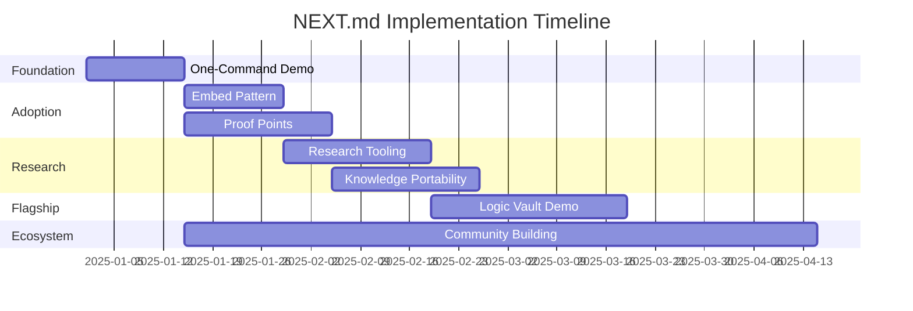

# NEXT.md — Strategic Value Maximization Plan

> **Goal**: Transform SeNARS from promising substrate into the **go-to cognitive architecture** for developers, researchers, and builders who need reasoning that LLMs alone cannot provide.

This plan complements TODO.md by focusing on **leverage points** — minimal changes that unlock maximal value.

---

## The Core Insight

SeNARS has something rare: **reasoning with memory, goals, and uncertainty** that persists across sessions and doesn't hallucinate. The challenge isn't building more features — it's making the existing power **accessible** and **demonstrable**.

---

## Priority 1: The "One-Command Demo" (Week 1-2)

**Problem**: Users can't experience SeNARS value in under 60 seconds.

**Solution**: Create an instantly-runnable showcase.

```bash
npx senars-demo
```

**Delivers**:
1. **Knowledge Discovery Demo**: Input 5 facts → watch SeNARS derive 3 non-obvious conclusions
2. **Consistency Demo**: Show an LLM contradiction, then show SeNARS maintaining consistency
3. **Memory Demo**: Ask questions across "sessions" — SeNARS remembers, LLM forgets

**Why This First**: Every feature below needs users. Users need proof-of-value in seconds.

**Files to Create/Modify**:
- `examples/instant-demo.js` — Self-contained demo runner
- `package.json` → add `bin` entry for `senars-demo`
- `README.md` → Add 3-line Quick Demo section at top

---

## Priority 2: The "Embed Pattern" (Week 2-4)

**Problem**: Developers want SeNARS inside their apps, not as a standalone.

**Solution**: Create dead-simple embedding patterns.

### 2.1 — Minimal Embed API

```javascript
import { SeNARS } from 'senars';

const brain = new SeNARS();
brain.learn('(cats --> mammals).');
brain.learn('(whiskers --> cats).');

const answer = await brain.ask('(whiskers --> ?what)?');
// → { answer: 'mammals', truth: {f: 0.81, c: 0.73}, proof: [...] }
```

**Key Improvements**:
- Single entrypoint class wrapping NAR complexity
- Async/await API (no event listener boilerplate for simple cases)
- Returns structured results with optional proof chain
- Auto-initialization (no manual `.start()` required)

### 2.2 — Framework Adapters

| Framework | Pattern | Use Case |
|-----------|---------|----------|
| **Express/Fastify** | Middleware | API with reasoning |
| **React** | Hook (`useSeNARS`) | Interactive reasoning UI |
| **LangChain** | Tool wrapper | LLM + reasoning hybrid |
| **MCP** | Already exists ✓ | AI assistant integration |

**Files to Create**:
- `core/src/SeNARS.js` — Simplified facade class
- `adapters/react/useSeNARS.js` — React hook
- `adapters/langchain/tool.js` — LangChain tool

---

## Priority 3: The "Why SeNARS?" Proof Points (Week 3-5)

**Problem**: Users don't understand when to use SeNARS vs. pure LLM.

**Solution**: Concrete benchmarks and demonstrations.

### 3.1 — Consistency Benchmark

Create a test suite showing:
- LLM contradicts itself across contexts (documented, reproducible)
- SeNARS maintains consistency (same queries, same answers)

```bash
npm run benchmark:consistency
```

Output: A shareable report (`docs/benchmarks/consistency-report.md`)

### 3.2 — Memory Persistence Benchmark

Demonstrate:
- LLM forgets after context window (measurable)
- SeNARS remembers indefinitely (with serialization)

### 3.3 — Explainability Demo

Show:
- Ask SeNARS "why" and get derivation chain
- LLM can guess but can't prove

**Files to Create**:
- `benchmarks/consistency/` — Benchmark suite
- `benchmarks/memory/` — Memory persistence tests
- `docs/benchmarks/` — Published reports

---

## Priority 4: Research Tooling (Week 4-7)

**Problem**: Researchers can't easily experiment with reasoning strategies.

**Solution**: First-class research instrumentation.

### 4.1 — Reasoning Trace Export

```javascript
const trace = brain.getLastReasoningTrace();
// JSON-LD format compatible with reasoning visualization tools
```

Exportable to:
- **JSON-LD** — Semantic web compatible
- **GraphML** — Network analysis tools
- **Mermaid** — Markdown-embeddable diagrams

### 4.2 — Strategy A/B Testing

```javascript
const results = await brain.compareStrategies(
  ['BagStrategy', 'PrologStrategy'],
  testQuestions,
  { metrics: ['accuracy', 'speed', 'derivationDepth'] }
);
```

### 4.3 — RLFP Annotation Interface

Build on existing `agent/src/rlfp/`:
- Simple web UI for labeling reasoning paths
- Export to standard preference learning formats
- Integration with existing `PreferenceCollector`

**Files to Create/Modify**:
- `core/src/trace/ReasoningTraceExporter.js`
- `core/src/research/StrategyComparator.js`
- `ui/src/pages/RLFPAnnotator.jsx`

---

## Priority 5: Knowledge Portability (Week 5-8)

**Problem**: Knowledge is trapped in individual SeNARS instances.

**Solution**: Standard formats for knowledge sharing.

### 5.1 — Knowledge Book Format

```yaml
# medical-basics.sbook
name: Medical Basics
version: 1.0.0
domain: healthcare
statements:
  - "(fever --> symptom). %1.0;0.9%"
  - "(infection ==> fever). %0.8;0.85%"
```

```javascript
await brain.loadBook('medical-basics');
```

### 5.2 — Import/Export Ecosystem

| Format | Import | Export | Use Case |
|--------|--------|--------|----------|
| **Narsese (.nal)** | ✓ | ✓ | Native format |
| **Knowledge Book (.sbook)** | ✓ | ✓ | Shareable packages |
| **RDF/OWL** | ✓ | ✓ | Semantic web integration |
| **JSON-LD** | ✓ | ✓ | Web APIs |
| **Natural Language** | ✓ (via LM) | ✓ | Human-readable |

**Files to Create**:
- `core/src/io/formats/KnowledgeBook.js`
- `core/src/io/formats/RDFAdapter.js`
- `docs/knowledge-book-spec.md`

---

## Priority 6: "Escape Velocity" — The Killer Demo (Week 6-10)

**Problem**: Features without a flagship use case get forgotten.

**Solution**: Build ONE undeniable demonstration of value.

### Recommended: "Personal Logic Vault"

A local-first personal knowledge base that:
1. **Learns** from your notes (Markdown/Obsidian import)
2. **Reasons** over your knowledge (finds contradictions, gaps)
3. **Remembers** everything (no context window limits)
4. **Explains** its conclusions (full derivation trace)

**Why This Demo**:
- Directly competes with LLM-based tools on their weakness (memory, consistency)
- Personal use = high engagement, organic growth
- Obsidian integration = large, passionate community

**Scope**:
- CLI tool with optional web UI
- 500-1000 line implementation using SeNARS core
- Obsidian plugin bridge

**Files to Create**:
- `apps/logic-vault/` — Standalone application
- `apps/logic-vault/obsidian-bridge.js` — Obsidian integration

---

## Priority 7: Community & Ecosystem (Ongoing)

### 7.1 — Contributor Onboarding

- `CONTRIBUTING.md` with clear first-issue guidelines
- `good-first-issue` labels on GitHub
- Architecture decision records in `docs/adr/`

### 7.2 — Academic Outreach

- Publish SeNARS paper to arXiv (already have `docs/paper/`)
- Submit to AGI conference workshops
- Create citation format for academic references

### 7.3 — Content Strategy

| Content | Frequency | Platform |
|---------|-----------|----------|
| Technical blog posts | Monthly | Dev.to, Medium |
| Video tutorials | Bi-weekly | YouTube |
| Research notes | Quarterly | arXiv, blog |
| Community showcases | Monthly | Twitter/X, Discord |

---

## Measurement Framework

### Success Metrics

| Metric | Current | Target (6mo) | Target (12mo) |
|--------|---------|--------------|---------------|
| npm weekly downloads | ? | 500 | 5,000 |
| GitHub stars | ? | 500 | 2,000 |
| Active contributors | ? | 5 | 20 |
| Published research using SeNARS | 0 | 2 | 10 |
| Production deployments | ? | 10 | 100 |

### Health Indicators

- Test coverage > 85%
- CI/CD pipeline green
- Documentation freshness < 30 days
- Issue response time < 48 hours

---

## Immediate Actions (This Week)

1. **[ ] Create `examples/instant-demo.js`** — The 60-second proof-of-value
2. **[ ] Add `npx senars-demo` bin entry** — Zero-install demo
3. **[ ] Draft `SeNARS.js` facade** — Simplified API design
4. **[ ] Identify first benchmark** — Pick consistency or memory
5. **[ ] Update `README.md`** — Add "See it work in 60 seconds" section

---

## The Bigger Picture

SeNARS occupies a **unique position** in the AI landscape:

```
                     High Reasoning Depth
                            │
           SeNARS ──────────┼──────── Expert Systems
         (hybrid, adaptive) │        (rigid, complete)
                            │
Low Adaptability ───────────┼─────────── High Adaptability
                            │
          Rule Engines ─────┼──────────── LLMs
         (fast, simple)     │         (flexible, shallow)
                            │
                     Low Reasoning Depth
```

**The opportunity**: Be the practical hybrid that works where both pure LLMs and pure logic systems fail.

**The risk**: Staying too complex to adopt, too academic to apply, too unproven to trust.

**This plan addresses all three risks.**

---

## Timeline Summary



---

> **Remember**: The goal isn't to build the most complete system. It's to build the system people **actually use** to solve problems they **actually have**.

Fork it. Ship it. Make it undeniable.
