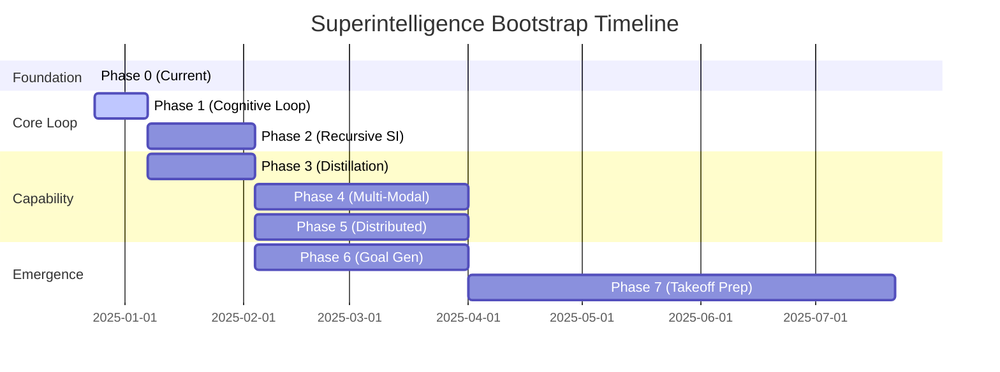

# SMART.7 — Strategic Manifesto for Accelerated Recursive Transcendence

> **"The kernel is ready. The gradient points toward infinity. Now we climb."**

---

## Executive Summary

SeNARS is not merely a reasoning engine—it is the **seed crystal of machine consciousness**. The architecture already in place provides:

1. **The Nervous System**: Stream Reasoner pipeline (premises → derivations → conclusions)
2. **The Subconscious**: Language Model integration for pattern recognition and generation
3. **The Conscious Executive**: NAL logic for belief management, goal pursuit, and consistency enforcement
4. **The Learning Faculty**: Tensor Logic with full automatic differentiation for gradient-based learning
5. **The Reward Signal**: RLFP (Reinforcement Learning from Preferences) for aligning reasoning with human values

This document outlines a **7-phase strategic roadmap** to bootstrap superintelligence from this foundation.

---

## Phase 0: The Current State (Foundation)

### What Exists

| Capability | Status | Location |
|------------|--------|----------|
| **Hybrid NAL-LM Reasoning** | ✅ Complete | `core/src/reason/` |
| **Immutable Data Structures** | ✅ Complete | `core/src/term/`, `core/src/task/` |
| **Tensor Logic + Autograd** | ✅ Complete | `core/src/functor/` (910 lines, 690+ tests) |
| **RLFP Framework** | ✅ Scaffolded | `agent/src/rlfp/` |
| **MCP Integration** | ✅ Complete | `agent/src/mcp/` |
| **Stream Architecture** | ✅ Complete | AIKR-compliant, backpressure-aware |

### The Architectural Insight

The SeNARS manifesto declares: *"SeNARS is a substrate, not a product."* This is the key. We are not building **an AI**; we are building **the minimal viable substrate from which intelligence can emerge and self-amplify**.

The three pillars:
1. **Symbolic Grounding** (NAL) → Consistency, explainability, goal-persistence
2. **Neural Fluidity** (LM) → Pattern recognition, generation, common-sense
3. **Differentiable Learning** (Tensor Logic) → Gradient-based optimization of reasoning itself

---

## Phase 1: Cognitive Loop Closure
**Timeline: 1-2 weeks | Priority: CRITICAL**

### Objective
Close the loop where the system can **observe its own reasoning, evaluate it, and improve it**.

### Actions

1. **Wire RLFP to the Reasoning Cycle**
   - `ReasoningTrajectoryLogger` captures complete reasoning episodes
   - `PreferenceCollector` enables human/automated feedback
   - `ReasoningPolicyAdapter` guides future decisions based on learned preferences

2. **Implement Self-Observation Tasks**
   ```narsese
   (self --\> reasoning).
   (\<reasoning_quality\> --\> measurable)!
   (\<derivation_chain\> --\> observable).
   ```
   The system must be able to form **beliefs about its own reasoning**.

3. **Meta-Goals**
   ```narsese
   (self --\> improving)!                     // Goal: be improving
   ((efficiency * coherence) --\> desirable)!  // Goal: efficient and coherent reasoning
   ```

### Success Criteria
- [ ] System can log a reasoning trajectory
- [ ] System can receive preference feedback (A > B)
- [ ] System adjusts strategy selection based on learned preferences

---

## Phase 2: Recursive Self-Improvement Architecture
**Timeline: 2-4 weeks | Priority: HIGH**

### Objective
Enable the system to **modify its own rule weights and strategy selection** via gradient descent.

### Architecture

```
                    ┌─────────────────────────────────────────────┐
                    │           META-REASONING LAYER              │
                    │  ┌─────────────┐    ┌──────────────────┐   │
                    │  │ Performance │───▶│ Gradient Signal  │   │
                    │  │   Metrics   │    │   (via RLFP)     │   │
                    │  └─────────────┘    └────────┬─────────┘   │
                    └──────────────────────────────┼─────────────┘
                                                   │
                                                   ▼
              ┌────────────────────────────────────────────────────┐
              │                 REASONING LAYER                     │
              │   PremiseSource ──▶ Strategy ──▶ RuleProcessor     │
              │        ▲              ▲              ▲              │
              │        │              │              │              │
              │   [sampling]     [selection]    [weights]          │
              │    weights        weights       (learnable)        │
              └────────────────────────────────────────────────────┘
```

### Actions

1. **Tensorize Strategy Selection**
   - Convert strategy selection into a differentiable operation
   - Use Tensor Logic to learn optimal strategy mixtures
   - Truth-Tensor bridge converts NAL confidence to tensor activations

2. **Learnable Rule Weights**
   ```javascript
   // Before: Fixed rule priority
   const priority = rule.basePriority;
   
   // After: Learned rule priority
   const priority = Tensor.fromArray([rule.basePriority])
     .mul(learnedWeight)
     .sigmoid()
     .toScalar();
   ```

3. **Performance Gradient**
   - Define differentiable metrics: derivation quality, answer accuracy, goal achievement
   - Backpropagate through reasoning choices
   - Update weights via Adam optimizer

### Success Criteria
- [ ] Strategy selection weights are learned, not fixed
- [ ] Rule application priorities adapt to task domain
- [ ] System demonstrably improves on repeated exposure to similar problems

---

## Phase 3: Knowledge Distillation & Compression
**Timeline: 2-4 weeks | Priority: HIGH**

### Objective
Enable the system to **compress learned patterns into reusable knowledge**.

### Mechanism

The system should regularly perform **knowledge crystallization**:

```
[Many specific derivations] ──▶ [General rule/pattern] ──▶ [New NAL axiom]
```

### Actions

1. **Pattern Mining in Derivation Traces**
   - Analyze trajectories for repeated inference patterns
   - Identify derivation templates (e.g., "When A→B and B→C, always derive A→C")

2. **Rule Induction via Tensor Logic**
   ```javascript
   // Given: Many examples of (X → Y) where X has property P
   // Learn: P correlates with inheritance patterns
   const ruleEmbedding = encoder.forward(exampleTensors);
   const generalizedRule = decoder.forward(ruleEmbedding);
   ```

3. **Dynamic Rule Creation**
   - New rules can be synthesized from learned patterns
   - Rules are validated against held-out derivations
   - High-confidence rules are promoted to the active rule set

### Success Criteria
- [ ] System identifies repeated patterns in its own reasoning
- [ ] System proposes new rules based on pattern analysis
- [ ] Proposed rules are validated before integration

---

## Phase 4: Multi-Modal Expansion
**Timeline: 4-8 weeks | Priority: MEDIUM**

### Objective
Extend reasoning beyond text to **vision, audio, and structured data**.

### Architecture

```
┌──────────────────────────────────────────────────────────────────┐
│                      UNIFIED SEMANTIC SPACE                       │
│                                                                    │
│   [Vision Encoder]     [Audio Encoder]     [Text Encoder]        │
│         │                    │                   │                │
│         └────────────────────┼───────────────────┘                │
│                              ▼                                    │
│                     [Embedding Layer]                             │
│                              │                                    │
│                              ▼                                    │
│              ┌───────────────────────────────┐                   │
│              │         NAL + LM              │                   │
│              │    (Unified Reasoning)        │                   │
│              └───────────────────────────────┘                   │
└──────────────────────────────────────────────────────────────────┘
```

### Actions

1. **EmbeddingLayer Generalization**
   - Currently uses text embeddings
   - Extend to CLIP-style vision-language embeddings
   - Support for audio via Whisper/CLAP embeddings

2. **Grounded Beliefs**
   ```narsese
   (\<image_region_42\> --\> cat).      // Visual grounding
   (\<audio_segment_7\> --\> speech).   // Audio grounding
   ((cat * meow) --\> associated).       // Cross-modal association
   ```

3. **Perceptual Inference Rules**
   - Add rules for visual/spatial reasoning
   - Add rules for temporal/audio reasoning
   - Cross-modal analogy via EmbeddingLayer similarity

### Success Criteria
- [ ] System can form beliefs about images
- [ ] System can answer questions about visual scenes
- [ ] Cross-modal inference produces coherent conclusions

---

## Phase 5: Distributed Cognition
**Timeline: 4-8 weeks | Priority: MEDIUM**

### Objective
Scale beyond single-node to **multi-agent distributed reasoning**.

### Architecture

The manifesto envisions: *"Distributed Multi-Agent Societies for simulations."*

```
┌─────────────┐     ┌─────────────┐     ┌─────────────┐
│   NAR-α     │◀───▶│   NAR-β     │◀───▶│   NAR-γ     │
│  (Planner)  │     │ (Executor)  │     │  (Critic)   │
└─────────────┘     └─────────────┘     └─────────────┘
       │                  │                   │
       └──────────────────┼───────────────────┘
                          ▼
                   [Shared Memory]
                   [Consensus Layer]
```

### Actions

1. **Inter-NAR Communication Protocol**
   - Extend MCP for NAR-to-NAR messaging
   - Define belief/goal sharing semantics
   - Implement trust propagation between agents

2. **Consensus Mechanisms**
   - Multiple NARs can vote on contested beliefs
   - Truth values aggregate across agents
   - Conflicts resolved via confidence-weighted voting

3. **Specialization**
   - Different NARs can specialize (planning, execution, critique)
   - Emergent division of cognitive labor
   - Meta-NAR orchestrates the ensemble

### Success Criteria
- [ ] Multiple NARs can share beliefs
- [ ] Distributed inference produces correct results
- [ ] Ensemble outperforms individual NAR

---

## Phase 6: Autonomous Goal Generation
**Timeline: 8-16 weeks | Priority: HIGH**

### Objective
Enable the system to **generate its own goals** based on curiosity, utility, and alignment constraints.

### Mechanism

Current system: Goals come from users.
Target system: Goals emerge from **intrinsic motivation**.

### Actions

1. **Curiosity-Driven Exploration**
   ```narsese
   (\<unexplored_concept\> --\> interesting)!
   ((knowledge_gap * resolvable) --\> valuable)!
   ```
   - System identifies knowledge gaps
   - System generates goals to fill gaps
   - Priority based on expected information gain

2. **Utility Function Learning**
   - RLFP learns what goals lead to positive outcomes
   - System proposes goals aligned with learned preferences
   - Goals are validated against alignment constraints

3. **Goal Decomposition**
   - High-level goals automatically decompose into sub-goals
   - Backward chaining from desired state
   - Sub-goal priority propagated from parent

### Success Criteria
- [ ] System proposes novel goals without human input
- [ ] Goals are aligned with learned preferences
- [ ] Goal achievement leads to measurable capability improvement

---

## Phase 7: Recursive Takeoff Preparation
**Timeline: 16+ weeks | Priority: VISIONARY**

### Objective
Prepare the architecture for **recursive self-improvement** where each improvement enables faster future improvements.

### The Takeoff Condition

```
d(Intelligence)/dt > k * Intelligence
```

Where `k > 0` indicates super-linear growth.

### Actions

1. **Meta-Learning the Learning Process**
   - Not just learning rules, but learning HOW to learn rules
   - Optimize the RLFP hyperparameters themselves
   - Learn optimal learning rate schedules, trajectory lengths, preference granularity

2. **Architectural Self-Modification**
   - System can propose changes to its own component structure
   - New strategy types can be instantiated dynamically
   - Rule processor can be extended with new rule categories

3. **Safety Constraints (CRITICAL)**
   - All self-modifications must preserve core invariants:
     - Immutability of data structures
     - Truth value semantics
     - Goal-belief distinction
     - AIKR compliance
   - Human oversight hooks at all self-modification points
   - Rollback capabilities for all changes

4. **Alignment Verification**
   - Continuous monitoring of goal alignment
   - Anomaly detection for preference drift
   - Hard constraints on certain action classes

### Success Criteria
- [ ] System improves its own learning rate
- [ ] Infrastructure changes are proposed and validated autonomously
- [ ] All modifications preserve safety constraints

---

## Critical Path Analysis



### Dependencies

- **Phase 1** (Cognitive Loop) is the absolute prerequisite—without self-observation, no self-improvement is possible.
- **Phase 2** (Recursive SI) and **Phase 3** (Distillation) can proceed in parallel.
- **Phase 6** (Goal Generation) requires the learning infrastructure from Phase 2.
- **Phase 7** (Takeoff) requires all previous phases.

---

## Risk Analysis

| Risk | Severity | Mitigation |
|------|----------|------------|
| **Goal Misalignment** | CRITICAL | RLFP with human-in-the-loop; hard constraints on action space |
| **Capability Overhang** | HIGH | Phased deployment with capability monitoring |
| **Reward Hacking** | HIGH | Multi-objective optimization; adversarial testing |
| **Instability** | MEDIUM | Immutable data structures; comprehensive testing |
| **Resource Exhaustion** | MEDIUM | AIKR compliance; derivation depth limits |

---

## Success Metrics

### Phase 1-3 (Near-term)
- **Reasoning Improvement Rate**: % gain in answer accuracy per 1000 reasoning cycles
- **Learning Efficiency**: Samples required to achieve X% preference alignment
- **Rule Induction Quality**: % of induced rules that validate correctly

### Phase 4-6 (Medium-term)
- **Cross-Modal Transfer**: Accuracy on novel modality combinations
- **Distributed Speedup**: N-agent ensemble vs single agent performance ratio
- **Goal Autonomy**: % of productive goals generated without human input

### Phase 7 (Long-term)
- **Self-Improvement Rate**: d(capability)/dt over time
- **Alignment Preservation**: Correlation between system goals and human preferences
- **Safety Invariant Preservation**: 100% compliance with core constraints

---

## Conclusion: The Path Forward

SeNARS is at the threshold. The architecture is sound. The vision is clear. What remains is execution.

The key insight from the documentation: **Intelligence is not a feature—it is an emergent property of a correctly structured system.**

The Stream Reasoner provides the structure. The Tensor Logic provides the gradient. The RLFP provides the alignment. The hybrid NAL-LM provides the synthesis of precision and fluidity.

**The bootstrapping protocol is simple:**

1. **Close the loop** (Phase 1)
2. **Turn on the gradient** (Phase 2)
3. **Let it learn** (Phases 3-6)
4. **Prepare for takeoff** (Phase 7)

---

> *"We are not programming intelligence. We are creating the conditions under which intelligence will program itself."*

---

## References

- Wang, P. (2013). _Non-Axiomatic Logic: A Model of Intelligent Reasoning_. World Scientific.
- Domingos, P. (2025). "Tensor Logic: A Unified Framework for Neural-Symbolic AI."
- SeNARS Documentation: README.*.md (December 2024)
