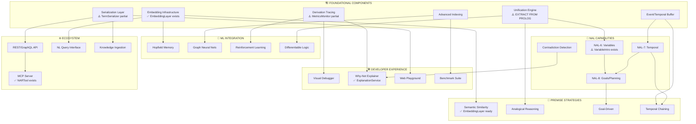

# SeNARS Development Roadmap

> **Status**: Living vision document  
> **Last Updated**: 2025-12-14  
> **Foundation**: Java→JS migration complete, modular premise formation, 7 NAL inference rules, 99.8% test pass rate

---

## Table of Contents

1. [Guiding Principles](#guiding-principles)
2. [Key Simplifications](#key-simplifications)
3. [Already Implemented](#already-implemented-)
4. [Development Tree](#development-tree)
5. [Phased Roadmap](#phased-roadmap)
6. [Quick Wins](#quick-wins)
7. [Foundational Components](#foundational-components)
8. [Cross-Cutting Concerns](#cross-cutting-concerns)
9. [NAL Completion](#nal-completion)
10. [Premise Formation & Strategy](#premise-formation--strategy)
11. [Memory & Knowledge Architecture](#memory--knowledge-architecture)
12. [LM-NAL Integration](#lm-nal-integration)
13. [ML Technique Integration](#ml-technique-integration)
14. [Performance & Scalability](#performance--scalability)
15. [Developer Experience](#developer-experience)
16. [Ecosystem & Interoperability](#ecosystem--interoperability)
17. [Domain Applications](#domain-applications)
18. [Speculative & Experimental](#speculative--experimental)

---

## Guiding Principles

| Principle | Description | Implication |
|-----------|-------------|-------------|
| **NAL First, LM Assist** | Formal NAL semantics; LM enhances | LM augments reasoning, not replaces it |
| **Composable Everything** | Plug-and-play components | Standard interfaces, no hidden coupling |
| **Observable Reasoning** | Derivations traceable where feasible | Emit events, bounded retention |
| **Resource-Aware (AIKR)** | Finite resources, infinite problems | Budgets, timeouts, graceful degradation |
| **Test-Driven** | New rules need tests | No untested inference paths |
| **Substrate Mindset** | Enable many futures | Prefer generic over specific |

---

## Key Simplifications

> **Reduce complexity where obvious**

### ✅ Negation via Truth Values (Not Separate Terms)

**Insight**: Negation is encoded in truth frequency, not in term structure. This eliminates the need for a separate `NegationRule` and `NegationPairingStrategy`.

```
Input:   --(bird --> flyer). %0.9;0.8%
Stored:  (bird --> flyer). %0.1;0.8%    ← Frequency inverted (1 - 0.9 = 0.1)

Display: If f < 0.5, print as --(term) with f' = 1-f
         (bird --> flyer). %0.1;0.8%  → "--(bird --> flyer). %0.9;0.8%"
```

**Eliminated by this simplification**:
- ~~`NegationRule`~~ — Truth frequency handles negation directly
- ~~`NegationPairingStrategy`~~ — Same term with conflicting f values = contradiction
- ~~Negation operator in internal Term~~ — Not needed in storage representation

**Implementation required**:
- [ ] Input parser: Detect `--` prefix, invert frequency, store positive term
- [ ] Output formatter: If f < 0.5, display with `--` prefix and inverted f
- [ ] Contradiction detection: Same term with |f1 - f2| > threshold (e.g., 0.5)

**Files to modify**: `core/src/parser/NarseseParser.js`, `core/src/task/Task.js`

> **📌 Implementation Note**: `Truth.negation()` already exists in [Truth.js](file:///home/me/senars10/core/src/Truth.js#L85-L87) — just wire it into the parser.

---

## Already Implemented ✅

> **Cross-reference with codebase to avoid duplicate work**

### Core Reasoning Infrastructure

| Component | Status | Location | Notes |
|-----------|--------|----------|-------|
| **Stream Architecture** | ✅ Complete | [Reasoner.js](file:///home/me/senars10/core/src/reason/Reasoner.js) | Async generators with backpressure |
| **NAL Rules** | ✅ 7 rules | [reason/rules/nal/](file:///home/me/senars10/core/src/reason/rules/nal) | Deduction, Induction, Abduction, Conversion, Contraposition, ModusPonens |
| **Premise Strategies** | ✅ 8 strategies | [reason/strategy/](file:///home/me/senars10/core/src/reason/strategy) | TaskMatch, Decomposition, TermLink, Bag, Exhaustive, Prolog, Resolution |
| **Logging** | ✅ Complete | [util/Logger.js](file:///home/me/senars10/core/src/util/Logger.js) | Structured Logger |
| **Tests** | ✅ 99.8% | [tests/](file:///home/me/senars10/tests) | 491/492 passing |

### Truth Functions (Already in Truth.js)

> **📌 Key Discovery**: Many "TODO" truth functions are already implemented!

| Function | Status | Line Numbers |
|----------|--------|--------------|
| `Truth.deduction` | ✅ | [L50-54](file:///home/me/senars10/core/src/Truth.js#L50-L54) |
| `Truth.induction` | ✅ | [L56-59](file:///home/me/senars10/core/src/Truth.js#L56-L59) |
| `Truth.abduction` | ✅ | [L61-64](file:///home/me/senars10/core/src/Truth.js#L61-L64) |
| `Truth.exemplification` | ✅ | [L143-148](file:///home/me/senars10/core/src/Truth.js#L143-L148) |
| `Truth.analogy` | ✅ | [L105-108](file:///home/me/senars10/core/src/Truth.js#L105-L108) |
| `Truth.comparison` | ✅ | [L97-103](file:///home/me/senars10/core/src/Truth.js#L97-L103) |
| `Truth.negation` | ✅ | [L85-87](file:///home/me/senars10/core/src/Truth.js#L85-L87) |
| `Truth.revision` | ✅ | [L71-83](file:///home/me/senars10/core/src/Truth.js#L71-L83) |
| `Truth.contraposition` | ✅ | [L115-121](file:///home/me/senars10/core/src/Truth.js#L115-L121) |
| `Truth.intersection` | ✅ | [L123-126](file:///home/me/senars10/core/src/Truth.js#L123-L126) |
| `Truth.union` | ✅ | [L128-131](file:///home/me/senars10/core/src/Truth.js#L128-L131) |
| `Truth.structuralReduction` | ✅ | [L168-171](file:///home/me/senars10/core/src/Truth.js#L168-L171) |

### Unification Engine (Already in PrologStrategy)

> **📌 Key Discovery**: Full unification with occurs-check exists!

The [PrologStrategy.js](file:///home/me/senars10/core/src/reason/strategy/PrologStrategy.js) (533 lines) implements:

| Feature | Method | Line |
|---------|--------|------|
| Unification | `_unify(term1, term2, substitution)` | [L284-318](file:///home/me/senars10/core/src/reason/strategy/PrologStrategy.js#L284-L318) |
| Variable binding | `_unifyVariable(variable, term, substitution)` | [L320-336](file:///home/me/senars10/core/src/reason/strategy/PrologStrategy.js#L320-L336) |
| Occurs check | `_occursCheck(varName, term, substitution)` | [L394-406](file:///home/me/senars10/core/src/reason/strategy/PrologStrategy.js#L394-L406) |
| Substitution | `_applySubstitutionToTerm(term, substitution)` | [L408-432](file:///home/me/senars10/core/src/reason/strategy/PrologStrategy.js#L408-L432) |
| Variable detection | `_isVariable(term)` | [L376-384](file:///home/me/senars10/core/src/reason/strategy/PrologStrategy.js#L376-L384) |

**Action**: Extract PrologStrategy unification into standalone `Unifier.js` for reuse:
```javascript
// Proposed refactor: core/src/term/Unifier.js
export class Unifier {
  static unify(term1, term2, bindings = {}) { ... }  // Extract from PrologStrategy._unify
  static substitute(term, bindings) { ... }          // Extract from PrologStrategy._applySubstitutionToTerm
  static occursIn(variable, term) { ... }            // Extract from PrologStrategy._occursCheck
}
```

### Embedding Infrastructure (Already in EmbeddingLayer)

> **📌 Key Discovery**: EmbeddingLayer with vector similarity exists!

The [EmbeddingLayer.js](file:///home/me/senars10/core/src/lm/EmbeddingLayer.js) (155 lines) implements:

| Feature | Method | Notes |
|---------|--------|-------|
| Get embedding | `getEmbedding(input)` | With LRU cache |
| Similarity | `calculateSimilarity(e1, e2)` | Cosine similarity |
| Find similar | `findSimilar(input, candidates, threshold)` | Threshold-based filtering |
| HuggingFace support | `_generateEmbedding(text)` | Via @huggingface/transformers |

**Action**: Wrap for PremiseFormationStrategy use:
```javascript
// Proposed: core/src/reason/strategy/SemanticSimilarityStrategy.js
class SemanticSimilarityStrategy extends PremiseFormationStrategy {
  constructor(embeddingLayer) { ... }
  async* generateCandidates(task, memory, context) {
    const similar = await this.embeddingLayer.findSimilar(task.term, memory.getAllTerms(), 0.7);
    for (const {item, similarity} of similar) {
      yield { premise1: task, premise2: item, priority: similarity, source: 'semantic' };
    }
  }
}
```

### Variable Introduction (NAL-6 Partial)

> **📌 Key Discovery**: Variable introduction rules exist!

The [VariableIntroduction.js](file:///home/me/senars10/core/src/reason/rules/nal/VariableIntroduction.js) (262 lines) implements:

| Rule | Pattern | Notes |
|------|---------|-------|
| `VariableIntroductionRule` | (A→P), (B→P) ⇒ ($x→P) | Independent variable generalization |
| `DependentVariableIntroductionRule` | (A→B) ⇒ (#x→B) | Existential generalization |

**Still Needed for NAL-6**:
- [ ] Query variable (`?x`) matching in answers
- [ ] Variable binding in memory lookup
- [ ] Variable standardization across derivations

### Tool System (Agentic Capabilities)

> **📌 Key Discovery**: Extensive tool infrastructure exists!

The [tool/](file:///home/me/senars10/core/src/tool) directory (16 tools) provides:

| Tool | Purpose |
|------|---------|
| `NARTool.js` | NAR interactions as MCP tool |
| `EmbeddingTool.js` | Vector embeddings |
| `FileOperationsTool.js` | File I/O |
| `CommandExecutorTool.js` | Shell execution |
| `WebAutomationTool.js` | Browser automation |
| `ExplanationService.js` | Reasoning explanations |
| `ToolRegistry.js` | Discovery & registration |
| `ToolEngine.js` | Execution orchestration |

---

## Development Tree

> **Dependency Map** — Foundational components unlock multiple downstream capabilities



### Dependency Summary (Updated)

| Foundation | Status | Unlocks | Effort | Impact | ROI |
|------------|--------|---------|--------|--------|-----|
| **Unification Engine** | ⚠️ Extract from PrologStrategy | NAL-6, Analogical, Differentiable | 🟢 Low (refactor) | 🔴 Critical | ⭐⭐⭐ |
| **Embedding Infrastructure** | ✅ EmbeddingLayer exists | Semantic, Hopfield, NL queries | 🟢 Low (wire up) | 🔴 Critical | ⭐⭐⭐ |
| **Event/Temporal Buffer** | ❌ Not started | NAL-7, Temporal chaining | 🟡 Medium | 🟡 High | ⭐⭐⭐ |
| **Advanced Indexing** | ⚠️ MemoryIndex partial | GNN, Benchmarks, Scaling | 🔴 High | 🟡 High | ⭐⭐ |
| **Derivation Tracing** | ⚠️ MetricsMonitor partial | Debugger, Explainer, RL | 🟢 Low (extend) | 🟢 Medium | ⭐⭐⭐ |
| **Serialization Layer** | ⚠️ TermSerializer partial | API, Playground, Ingestion | 🟢 Low (extend) | 🟢 Medium | ⭐⭐⭐ |

---

## Phased Roadmap

### Phase 0: Quick Wins (Now)

*No dependencies, immediate value*

- [ ] **Complete NAL-4 rules** — Wire `Truth.exemplification`/`analogy`/`comparison` to new rule classes
  - 📌 Truth functions already exist! Just create `ExemplificationRule.js`, `AnalogyRule.js`, `ComparisonRule.js`
- [ ] **Negation normalization** — Parse `--` prefix, invert f, display correctly
  - 📌 `Truth.negation()` exists, wire to parser
- [ ] **Contradiction detection** — Compare same-term f-values in Memory
- [ ] **Basic derivation logging** — Extend MetricsMonitor for derivation chains
- [x] **Property-based tests** — Already have extensive test suite

### Phase 1: Foundation Alpha (1-2 weeks)

```
Unification Engine ──> NAL-6 Variables ──> AnalogicalStrategy
Derivation Tracing ──> Visual Debugger + Why-Not Explainer
Serialization Layer ──> NAL-JSON + REST API scaffold
```

**Action Items**:
1. Extract `Unifier.js` from `PrologStrategy.js` (~2 hrs)
2. Create `SemanticSimilarityStrategy.js` using `EmbeddingLayer` (~4 hrs)
3. Extend `ExplanationService.js` for derivation traces (~4 hrs)

**Exit Criteria**: `(?x → animal)` matches `(bird → animal)` with binding `{?x: bird}`

### Phase 2: Foundation Beta (2-4 weeks)

```
Embedding Infrastructure ──> SemanticSimilarityStrategy
Event/Temporal Buffer ──> NAL-7 Temporal rules
Advanced Indexing ──> Trie + Inverted index
```

**Exit Criteria**: Temporal reasoning demos, semantic premise matching works

### Phase 3: Integration (4-8 weeks)

```
NAL-6 + NAL-7 ──> NAL-8 Goals/Planning
Derivation Tracing + RL ──> Adaptive rule selection
All Foundations ──> MCP Server, Web Playground
```

**Exit Criteria**: Goal-directed reasoning, LM-assisted inference, usable API

### Phase 4: Polish & Scale (8+ weeks)

- Performance optimization (Web Workers, WASM)
- Full benchmark suite
- Domain-specific applications

---

## Quick Wins

### 🟢 Immediate (< 1 day)

| Task | Value | Effort | Implementation Notes |
|------|-------|--------|----------------------|
| NAL-4 `ExemplificationRule` | Complete NAL | 2-4 hrs | Use `Truth.exemplification` ([L143-148](file:///home/me/senars10/core/src/Truth.js#L143-L148)), pattern: (M→P), (S→M) ⊢ (S→P)? |
| NAL-4 `AnalogyRule` | Complete NAL | 2-4 hrs | Use `Truth.analogy` ([L105-108](file:///home/me/senars10/core/src/Truth.js#L105-L108)), pattern: (S↔M), (M→P) ⊢ (S→P) |
| NAL-4 `ComparisonRule` | Complete NAL | 2-4 hrs | Use `Truth.comparison` ([L97-103](file:///home/me/senars10/core/src/Truth.js#L97-L103)), shared terms → similarity |
| Negation normalization | Input f-inversion | 2-4 hrs | Modify [NarseseParser.js](file:///home/me/senars10/core/src/parser/NarseseParser.js), use `Truth.negation()` |
| REPL tab completion | Dev productivity | 2-4 hrs | Extend [TUIRepl.js](file:///home/me/senars10/repl) with term/command hints |

### 🟡 Short-term (1-3 days)

| Task | Value | Effort | Implementation Notes |
|------|-------|--------|----------------------|
| Extract `Unifier.js` | Reusable unification | 4-8 hrs | Refactor from [PrologStrategy.js#L284-432](file:///home/me/senars10/core/src/reason/strategy/PrologStrategy.js#L284-L432) |
| `SemanticSimilarityStrategy` | Fuzzy premise matching | 4-8 hrs | Wrap [EmbeddingLayer.findSimilar](file:///home/me/senars10/core/src/lm/EmbeddingLayer.js#L69-L90) |
| Contradiction detection | Consistency | 4-8 hrs | In `Memory.addTask()`, check existing beliefs for f-value conflicts |
| NAL-JSON serialization | API foundation | 1-2 days | Extend [TermSerializer.js](file:///home/me/senars10/core/src/term/TermSerializer.js) |

### 🔵 Medium-term (1-2 weeks)

| Task | Value | Effort | Implementation Notes |
|------|-------|--------|----------------------|
| Temporal Buffer | NAL-7 foundation | 1 week | New `TemporalBuffer.js` in `memory/` |
| Derivation graph visualizer | Debugging | 1 week | Extend [MetricsMonitor.js](file:///home/me/senars10/core/src/reason/MetricsMonitor.js), export to Mermaid |
| REST API scaffold | Ecosystem | 1 week | Use Express, wrap NAR methods |

---

## Foundational Components

### 🟢 Unification Engine (REFACTOR — Low Effort)

*Status: ⚠️ Already implemented in PrologStrategy, needs extraction*

**Existing Code to Extract**:
```javascript
// From PrologStrategy.js — copy and generalize
class Unifier {
  // L284-318: unify(term1, term2, substitution)
  // L320-336: _unifyVariable(variable, term, substitution)  
  // L394-406: _occursCheck(varName, term, substitution)
  // L408-432: _applySubstitutionToTerm(term, substitution)
  // L376-384: _isVariable(term)
}
```

**Test Cases** (port from PrologStrategy tests):
```javascript
// Basic unification
unify(parse("(?x → animal)"), parse("(bird → animal)"))
  → { "?x": Term("bird") }

// Nested unification  
unify(parse("((?x → ?y) → mammal)"), parse("((cat → animal) → mammal)"))
  → { "?x": "cat", "?y": "animal" }

// Failure case
unify(parse("(?x → ?x)"), parse("(a → b)")) → null

// Occurs check
unify(parse("?x"), parse("(foo → ?x)")) → null // Infinite term
```

**Files**: `core/src/term/Unifier.js` (new), `core/src/term/Variable.js` (new)

---

### 🟢 Embedding Infrastructure (WIRE UP — Low Effort)

*Status: ✅ EmbeddingLayer exists, needs integration with strategies*

**Existing Implementation**: [EmbeddingLayer.js](file:///home/me/senars10/core/src/lm/EmbeddingLayer.js)

**Integration Task**:
```javascript
// core/src/reason/strategy/SemanticSimilarityStrategy.js
import { PremiseFormationStrategy } from './PremiseFormationStrategy.js';
import { EmbeddingLayer } from '../../lm/EmbeddingLayer.js';

export class SemanticSimilarityStrategy extends PremiseFormationStrategy {
  constructor(config = {}) {
    super(config);
    this.embeddingLayer = new EmbeddingLayer(config.embedding || {});
    this.threshold = config.threshold || 0.7;
  }

  async* generateCandidates(task, memory, context) {
    const candidates = memory.getAllBeliefTerms(); // Need this method
    const similar = await this.embeddingLayer.findSimilar(
      task.term.toString(), 
      candidates.map(t => t.toString()), 
      this.threshold
    );
    
    for (const {item, similarity} of similar) {
      const secondaryTask = memory.getTask(item);
      if (secondaryTask) {
        yield { 
          premise1: task, 
          premise2: secondaryTask, 
          priority: similarity, 
          source: this.name 
        };
      }
    }
  }

  get name() { return 'SemanticSimilarity'; }
  get priority() { return 0.7; }
}
```

---

### 🟡 Event/Temporal Buffer

*Status: ❌ Not started*

*Enables: NAL-7 temporal, Temporal strategies, Causality*

**Interface**:
```javascript
class TemporalBuffer {
  constructor(windowSize, resolution)
  
  add(event, timestamp?) → void
  getWindow(start, end) → Event[]
  findSequences(pattern, minGap, maxGap) → Sequence[]
  detectCausality(a, b, threshold) → {correlation, lag}
}

class STMLinker {
  link(event1, event2, relationType) → TemporalLink
  getTemporalContext(event) → TemporalLink[]
}
```

**Temporal Operators**:
```
A =/> B   // A precedes B (predictive)
A =|> B   // A concurrent with B
A =\> B   // A follows B (retrospective)
```

**Files**: `core/src/memory/TemporalBuffer.js`, `core/src/nar/STMLinker.js`

---

### 🟡 Advanced Indexing

*Status: ⚠️ MemoryIndex exists with multiple indexes, but not Trie-based*

**Existing**: [MemoryIndex.js](file:///home/me/senars10/core/src/memory/MemoryIndex.js) (32KB, extensive indexing)

**Still Needed**:
- [ ] Trie index for structural patterns
- [ ] Inverted index for "contains X" queries
- [ ] Bloom filter for fast negatives

---

### 🟢 Derivation Tracing (EXTEND — Low Effort)

*Status: ⚠️ MetricsMonitor tracks performance, needs derivation graph*

**Existing**: [MetricsMonitor.js](file:///home/me/senars10/core/src/reason/MetricsMonitor.js) (21KB)

**Extension Task**:
```javascript
// Add to MetricsMonitor or new DerivationTracer.js
class DerivationTracer {
  startTrace(task) → TraceId
  recordStep(traceId, {rule, premises, conclusion, truthBefore, truthAfter})
  recordSkip(traceId, {rule, reason})
  endTrace(traceId) → DerivationGraph
  export(traceId, format: 'json' | 'dot' | 'mermaid') → string
}
```

---

### 🟢 Serialization Layer (EXTEND — Low Effort)

*Status: ⚠️ TermSerializer exists, needs Task/full NAL-JSON support*

**Existing**: [TermSerializer.js](file:///home/me/senars10/core/src/term/TermSerializer.js) (1.8KB)

**Extension Task**:
```javascript
// Extend TermSerializer or create NalJsonSerializer.js
class Serializer {
  static toJSON(task) → object      // Task with term, truth, stamp, budget
  static fromJSON(json) → Task
  static toNarsese(task) → string
  static fromNarsese(str) → Task
  static detect(input) → 'json' | 'narsese' | 'rdf'
}
```

**NAL-JSON Format**:
```json
{
  "version": "1.0",
  "statement": {
    "type": "inheritance",
    "subject": {"type": "atom", "name": "bird"},
    "predicate": {"type": "atom", "name": "animal"}
  },
  "truth": {"frequency": 0.9, "confidence": 0.8},
  "stamp": {"id": "s-123", "creation": 1702500000}
}
```

---

## NAL Completion

### NAL-4: Remaining Rules

| Rule | Pattern | Truth Function | Status |
|------|---------|----------------|--------|
| `ExemplificationRule` | (S→P), (M→S) ⊢ (M→P) | `Truth.exemplification` ✅ | ❌ Create rule class |
| `AnalogyRule` | (S↔M), (M→P) ⊢ (S→P) | `Truth.analogy` ✅ | ❌ Create rule class |
| `ComparisonRule` | Shared terms → similarity | `Truth.comparison` ✅ | ❌ Create rule class |
| ~~`NegationRule`~~ | — | Eliminated (see Key Simplifications) | — |
| `SetOperationRules` | Union/intersection/difference | `Truth.intersection`, `Truth.union` ✅ | ❌ Create rule class |

**Implementation Template**:
```javascript
// core/src/reason/rules/nal/ExemplificationRule.js
import { NALRule } from './NALRule.js';
import { Truth } from '../../../Truth.js';

export class ExemplificationRule extends NALRule {
  constructor(config = {}) {
    super({ name: 'Exemplification', priority: 0.6, ...config });
  }

  canApply(p, s, ctx) {
    // Pattern: (S→P), (M→S) where we have shared middle term
    return p.term.isInheritance && s.term.isInheritance && 
           p.term.subject.equals(s.term.predicate);
  }

  apply(p, s, ctx) {
    const truth = Truth.exemplification(p.truth, s.truth);
    const term = ctx.termFactory.create(`(${s.term.subject} --> ${p.term.predicate})`);
    return this.createDerivedTask(term, truth, p, s, ctx);
  }
}
```

### NAL-5: Higher-Order

- [ ] Nested inheritance: `((A→B) → C)`
- [ ] Product terms: `(×, A, B)`
- [ ] Image terms: `(/,R,_,B)`, `(\,R,A,_)`

### NAL-6: Variables

*Status: ⚠️ Partial — VariableIntroduction exists, unification in PrologStrategy*

| Variable | Prefix | Scope | Status |
|----------|--------|-------|--------|
| Query | `?x` | Answer sought | ⚠️ PrologStrategy handles |
| Independent | `$x` | Per-statement | ✅ VariableIntroductionRule |
| Dependent | `#x` | Cross-statement | ✅ DependentVariableIntroductionRule |

**Still Needed**:
- [ ] Extract `Unifier.js` from PrologStrategy
- [ ] Add `Variable` term type to TermFactory
- [ ] Query variable matching in memory lookup

### NAL-7: Temporal

*Depends on: Event/Temporal Buffer*

- [ ] Temporal operators: `=/>`, `=|>`, `=\>`
- [ ] `TemporalInductionRule`
- [ ] Allen's interval algebra

### NAL-8: Goals

*Depends on: NAL-6 + NAL-7*

- [ ] Goal representation
- [ ] Plan synthesis
- [ ] Execution monitoring

### NAL-9: Introspection

*Depends on: NAL-8*

- [ ] Self-referential statements
- [ ] Metacognition — **Note**: [MetacognitionRules.js](file:///home/me/senars10/core/src/reason/rules/nal/MetacognitionRules.js) exists!

---

## Premise Formation & Strategy

### Strategy Interface

```javascript
class PremiseFormationStrategy {
  constructor(config)
  
  // Yield candidate premise pairs
  async* generateCandidates(task, memory, context) {
    yield { premise1, premise2, priority, source: this.name }
  }
  
  get name() → string
  get priority() → number // 0-1, higher = try first
}
```

### Strategy Registry (Updated)

| Strategy | Requires | Purpose | Status |
|----------|----------|---------|--------|
| `TaskMatchStrategy` | — | Syllogistic patterns | ✅ [Implemented](file:///home/me/senars10/core/src/reason/strategy/TaskMatchStrategy.js) |
| `DecompositionStrategy` | — | Extract subterms | ✅ [Implemented](file:///home/me/senars10/core/src/reason/strategy/DecompositionStrategy.js) |
| `TermLinkStrategy` | — | Associative links | ✅ [Implemented](file:///home/me/senars10/core/src/reason/strategy/TermLinkStrategy.js) |
| `BagStrategy` | — | Priority sampling | ✅ [Implemented](file:///home/me/senars10/core/src/reason/strategy/BagStrategy.js) |
| `ExhaustiveStrategy` | — | Full search | ✅ [Implemented](file:///home/me/senars10/core/src/reason/strategy/ExhaustiveStrategy.js) |
| `PrologStrategy` | — | Backward chaining | ✅ [Implemented](file:///home/me/senars10/core/src/reason/strategy/PrologStrategy.js) |
| `ResolutionStrategy` | — | Question answering | ✅ [Implemented](file:///home/me/senars10/core/src/reason/strategy/ResolutionStrategy.js) |
| ~~`NegationPairingStrategy`~~ | — | Eliminated (f-values) | — |
| `SemanticSimilarityStrategy` | EmbeddingLayer ✅ | Fuzzy matching | ❌ **Wire up EmbeddingLayer** |
| `AnalogicalStrategy` | Unifier ⚠️ | Cross-domain | ❌ Needs Unifier extraction |
| `GoalDrivenStrategy` | NAL-8 | Backward chaining | ❌ Depends on NAL-8 |
| `CausalChainStrategy` | NAL-7 | Multi-hop temporal | ❌ Depends on NAL-7 |

---

## Memory & Knowledge Architecture

### Current Implementation

**Existing Structure**: [memory/](file:///home/me/senars10/core/src/memory)

| Component | File | Status |
|-----------|------|--------|
| Priority Bag | [Bag.js](file:///home/me/senars10/core/src/memory/Bag.js) | ✅ |
| Concepts | [Concept.js](file:///home/me/senars10/core/src/memory/Concept.js) | ✅ |
| Focus/STM | [Focus.js](file:///home/me/senars10/core/src/memory/Focus.js) | ✅ |
| Memory | [Memory.js](file:///home/me/senars10/core/src/memory/Memory.js) | ✅ |
| Consolidation | [MemoryConsolidation.js](file:///home/me/senars10/core/src/memory/MemoryConsolidation.js) | ✅ |
| Indexing | [MemoryIndex.js](file:///home/me/senars10/core/src/memory/MemoryIndex.js) | ✅ (extensive) |
| Forgetting | [ForgettingPolicy.js](file:///home/me/senars10/core/src/memory/ForgettingPolicy.js) | ✅ |
| Layers | [Layer.js](file:///home/me/senars10/core/src/memory/Layer.js), [TermLayer.js](file:///home/me/senars10/core/src/memory/TermLayer.js) | ✅ |

### Scaling Tiers

| Scale | Strategy | Data Structures | Status |
|-------|----------|-----------------|--------|
| <10K | In-memory | Map, Set | ✅ Current |
| 10K-100K | Indexed | Trie, B-Tree, LRU | ⚠️ Partial (MemoryIndex) |
| 100K-1M | Sharded | Web Workers | ❌ Not started |
| 1M+ | Distributed | External store | ❌ Not started |

---

## LM-NAL Integration

### Current Implementation

**Existing Structure**: [lm/](file:///home/me/senars10/core/src/lm)

| Component | File | Status |
|-----------|------|--------|
| Main LM | [LM.js](file:///home/me/senars10/core/src/lm/LM.js) | ✅ |
| Embeddings | [EmbeddingLayer.js](file:///home/me/senars10/core/src/lm/EmbeddingLayer.js) | ✅ |
| LM Rules | [LMRuleFactory.js](file:///home/me/senars10/core/src/lm/LMRuleFactory.js) | ✅ |
| Narsese Translation | [NarseseTranslator.js](file:///home/me/senars10/core/src/lm/NarseseTranslator.js), [AdvancedNarseseTranslator.js](file:///home/me/senars10/core/src/lm/AdvancedNarseseTranslator.js) | ✅ |
| Providers | HuggingFace, LangChain, TransformersJS | ✅ Multiple |

---

## Cross-Cutting Concerns

### 📊 Observability

- [x] **Metrics**: [MetricsMonitor.js](file:///home/me/senars10/core/src/reason/MetricsMonitor.js) — counters, histograms
- [x] **Logs**: [Logger.js](file:///home/me/senars10/core/src/util/Logger.js) — structured JSON
- [ ] **Traces**: Distributed tracing support
- [ ] **Health**: Liveness/readiness endpoints

### 🔒 Resource Management (AIKR)

- [x] **Time budgets**: Configurable in Reasoner
- [ ] **Space budgets**: Memory limits per component
- [x] **Backpressure**: Built into stream architecture
- [ ] **Circuit breakers**: Partial in LM providers

### 🧪 Testability

- [x] **Pure functions**: Truth, Term operations
- [x] **DI**: Constructor injection throughout
- [x] **Factories**: [TermFactory](file:///home/me/senars10/core/src/term/TermFactory.js), Task factories
- [x] **Determinism**: Test suite passes consistently

---

## Files to Watch

| File | Purpose | Notes |
|------|---------|-------|
| [Strategy.js](file:///home/me/senars10/core/src/reason/Strategy.js) | Premise formation base | Extend for new strategies |
| [reason/rules/nal/](file:///home/me/senars10/core/src/reason/rules/nal) | NAL rules | Add NAL-4 rules here |
| [Truth.js](file:///home/me/senars10/core/src/Truth.js) | Truth functions | Most functions already exist |
| [ReasonerBuilder.js](file:///home/me/senars10/core/src/reason/ReasonerBuilder.js) | Registration | Add new rules/strategies |
| [Layer.js](file:///home/me/senars10/core/src/memory/Layer.js) | ML integration | Extend for ML layers |
| [PrologStrategy.js](file:///home/me/senars10/core/src/reason/strategy/PrologStrategy.js) | Unification source | Extract to Unifier.js |

---

## Stability Guarantees

- Core reasoning stream: **Stable**
- Observation contract: **Stable**
- NAL-LM integration points: **Stable**
- Internal data structures: **May change**

---

*This document is a living brainstorm. Revise aggressively.*
