# SeNARS Development Roadmap

> **Status**: Living vision document  
> **Last Updated**: 2025-12-14  
> **Foundation**: Stream reasoner, modular premise formation, 7 NAL rules, 99.8% test pass rate

---

## Table of Contents

1. [Principles](#principles)
2. [Leverage](#leverage)
3. [Development Tree](#development-tree)
4. [Simplifications](#simplifications)
5. [Rule Engine Architecture](#rule-engine-architecture)
6. [Next Actions](#next-actions)
7. [Roadmap](#roadmap)
8. [NAL](#nal)
9. [Strategies](#strategies)
10. [Memory](#memory)
11. [LM](#lm)
12. [Cross-Cutting](#cross-cutting)
13. [Ecosystem](#ecosystem)
14. [Domain Applications](#domain-applications)
15. [Speculative](#speculative)

---

## Principles

| Principle | Implication |
|-----------|-------------|
| **NAL First** | LM augments, not replaces formal semantics |
| **Declarative** | Logic defined by patterns, not imperative code |
| **Compiled** | Patterns compiled to optimized decision trees |
| **Composable** | Standard interfaces, plug-and-play |
| **Observable** | Emit events, bounded retention |
| **Resource-Aware** | Budgets, timeouts, graceful degradation |

---

## Leverage

> **80/20 Principle**: Maximum impact from what's already built

### Already Have (Use It!)

| Asset | Location | Reuse For |
|-------|----------|----------|
| **Full Unification** | [PrologStrategy.js#L288](file:///home/me/senars10/core/src/reason/strategy/PrologStrategy.js#L288) | Extract → Unifier.js (2 hrs, not 6) |
| **Backward Chaining** | [PrologStrategy.js](file:///home/me/senars10/core/src/reason/strategy/PrologStrategy.js) | GoalDrivenStrategy = thin wrapper |
| **Embeddings** | [EmbeddingLayer.js](file:///home/me/senars10/core/src/lm/EmbeddingLayer.js) | SemanticStrategy = 50 lines |
| **Term Predicates** | [Term.js](file:///home/me/senars10/core/src/term/Term.js) | Stop reimplementing `isVariable`, `equals` |
| **RuleCompiler** | [RuleCompiler.js](file:///home/me/senars10/core/src/reason/rules/compiler/RuleCompiler.js) | ✅ Done |
| **RuleExecutor** | [RuleExecutor.js](file:///home/me/senars10/core/src/reason/rules/executor/RuleExecutor.js) | ✅ Done |
| **Discriminators** | [Discriminator.js](file:///home/me/senars10/core/src/reason/rules/compiler/Discriminator.js) | Extensible pattern matching |

### Shortcuts

| Task | Naive Effort | Shortcut | Actual Effort |
|------|--------------|----------|---------------|
| Unifier.js | 6 hrs (rewrite) | Extract from PrologStrategy | **2 hrs** |
| GoalDrivenStrategy | 1 week (new) | Wrap PrologStrategy | **4 hrs** |
| SemanticStrategy | 4 hrs (design) | Copy snippet, wire EmbeddingLayer | **2 hrs** |
| Query matching | 4 hrs | Unifier + existing ResolutionStrategy | **2 hrs** |
| NAL-8 basics | 1 week | Goal = Task with desire value, reuse planner | **2 days** |

---

## Development Tree

> **Dependency Map** — Foundational components unlock multiple downstream capabilities
> 
> **Note**: Temporal functionality (NAL-7, TemporalBuffer, CausalStrategy) is deferred until temporal representations are specified. All other NAL levels can proceed independently.

```mermaid
graph TD
    subgraph Foundation["🏗️ FOUNDATIONAL COMPONENTS"]
        UNI[Unification Engine]
        EMB[Embedding Infrastructure]
        IDX[Advanced Indexing]
        TRC[Derivation Tracing]
        SER[Serialization Layer]
    end

    subgraph FoundationDeferred["🏗️ DEFERRED FOUNDATION"]
        EVT[Event/Temporal Buffer]
    end

    subgraph NAL["📐 NAL CAPABILITIES"]
        NAL6[NAL-6: Variables]
        NAL8[NAL-8: Goals/Planning]
        NEG[Negation & Contradiction]
    end

    subgraph NALDeferred["📐 DEFERRED NAL"]
        NAL7[NAL-7: Temporal]
    end

    subgraph Strategy["🎯 PREMISE STRATEGIES"]
        SEM[Semantic Similarity]
        ANA[Analogical Reasoning]
        GOAL[Goal-Driven]
    end

    subgraph StrategyDeferred["🎯 DEFERRED STRATEGIES"]
        TEMP[Temporal Chaining]
    end

    subgraph ML["🧠 ML INTEGRATION"]
        HOP[Hopfield Memory]
        GNN[Graph Neural Nets]
        RL[Reinforcement Learning]
        DIFF[Differentiable Logic]
    end

    subgraph DX["🛠️ DEVELOPER EXPERIENCE"]
        VIS[Visual Debugger]
        WHY[Why-Not Explainer]
        PLAY[Web Playground]
        BENCH[Benchmark Suite]
    end

    subgraph Eco["🌐 ECOSYSTEM"]
        API[REST/GraphQL API]
        MCP[MCP Server]
        NL[NL Query Interface]
        INGEST[Knowledge Ingestion]
    end

    UNI --> NAL6
    NAL6 --> NAL8
    EMB --> SEM
    UNI --> ANA
    NAL8 --> GOAL
    EMB --> HOP
    IDX --> GNN
    TRC --> RL
    UNI --> DIFF
    TRC --> VIS
    TRC --> WHY
    SER --> PLAY
    IDX --> BENCH
    SER --> API
    API --> MCP
    EMB --> NL
    SER --> INGEST
    NEG --> WHY
    
    %% Deferred temporal dependencies
    EVT -.-> NAL7
    NAL7 -.-> NAL8
    EVT -.-> TEMP
    NAL7 -.-> TEMP
```



### Dependency Summary

| Foundation | Status | Unlocks | ROI |
|------------|--------|---------|-----|
| **Unification Engine** | ✅ In PrologStrategy | NAL-6, Analogical, Differentiable | ⭐⭐⭐ |
| **Embedding Infrastructure** | ✅ EmbeddingLayer | Semantic, Hopfield, NL queries | ⭐⭐⭐ |
| **Rule Compiler** | ✅ Done | Pattern matching, NAL-4+ | ⭐⭐⭐ |
| **Derivation Tracing** | 🟡 Needed | Debugger, Explainer, RL | ⭐⭐⭐ |
| **Serialization Layer** | 🟡 Needed | API, Playground, Ingestion | ⭐⭐⭐ |
| **Advanced Indexing** | Phase 4 | GNN, Benchmarks, Scaling | ⭐⭐ |
| **Event/Temporal Buffer** | Deferred | NAL-7, Temporal chaining | ⭐⭐⭐ |

---

## Simplifications

### 1. Negation via Truth (Not Term)

Negation = frequency inversion. Eliminates `NegationRule`, `NegationPairingStrategy`, negation operator.

```
Input:   --(bird --> flyer). %0.9%
Stored:  (bird --> flyer). %0.1%    ← f' = 1 - f
Display: f < 0.5 → show as --(term)
```

**Implementation**:
1. [NarseseParser.js](file:///home/me/senars10/core/src/parser/NarseseParser.js): Detect `--` prefix
2. Call `Truth.negation()` → [Truth.js#L85](file:///home/me/senars10/core/src/Truth.js#L85)
3. Store positive term with inverted frequency
4. `Task.toString()`: If f < 0.5, display with `--` prefix

---

### 2. Use Existing Term Predicates

Term.js already provides these — replace all reimplementations:

| Method | Location | Use Instead Of |
|--------|----------|----------------|
| `term.isVariable` | [Term.js#L105](file:///home/me/senars10/core/src/term/Term.js#L105) | `_isVariable(term)` |
| `term.isCompound` | [Term.js#L93](file:///home/me/senars10/core/src/term/Term.js#L93) | `_isCompound(term)` |
| `term.equals(other)` | [Term.js#L165](file:///home/me/senars10/core/src/term/Term.js#L165) | `_termsEqual(t1, t2)` |
| `term.subject` | [Term.js#L49](file:///home/me/senars10/core/src/term/Term.js#L49) | `term.components[0]` |
| `term.predicate` | [Term.js#L53](file:///home/me/senars10/core/src/term/Term.js#L53) | `term.components[1]` |

---

## Rule Engine Architecture

> **Insight**: 72+ `.nal` files imply hundreds of rules. Linear matching is too slow.
> **Solution**: A **Rule Compiler** that transforms declarative patterns into an optimized **Discrimination Tree** (Rete-like).

### 1. Pattern Definitions (JS)

Rules are defined as data, porting logic from `.nal` files:

```javascript
// core/src/reason/rules/nal/definitions/NAL4.js
export const Exemplification = {
  id: 'exemplification',
  pattern: {
    p: { operator: '-->', subject: '$S', predicate: '$M' },
    s: { operator: '-->', subject: '$M', predicate: '$P' }
  },
  conclusion: (b, tf) => tf.inheritance(b.get('$P'), b.get('$S')),
  truth: Truth.exemplification
};
```

### 2. Rule Compiler (The Brain)

Transforms a list of Patterns into an executable Decision Tree.

**Responsibilities**:
1.  **Guard Extraction**: Decompose patterns into atomic checks (e.g., `op==-->`, `arity==2`, `p.pred==s.subj`).
2.  **Ranking**: Order checks by cost (cheap first) and selectivity (fail fast).
    *   *Tier 1*: Operator checks, Literal equality (O(1))
    *   *Tier 2*: Variable absorption/equality (O(1) pointer check)
    *   *Tier 3*: Structural unification (Recursive)
3.  **Deduplication**: Merge common prefixes. If 50 rules check `op==-->`, check it once.
4.  **Tree Construction**: Build the execution graph.

```javascript
// core/src/reason/rules/compiler/RuleCompiler.js
export class RuleCompiler {
  compile(patterns) {
    const root = new DecisionNode();
    for (const pat of patterns) {
      const guards = this.extractGuards(pat);
      this.insertIntoTree(root, guards, pat);
    }
    return root; // Executable strategy pattern
  }

  extractGuards(pattern) {
    // 1. Static Checks
    const checks = [
      { type: 'op', target: 'p', val: pattern.p.operator },
      { type: 'op', target: 's', val: pattern.s.operator }
    ];
    // 2. Variable Topology (Absorption)
    // If $M is in p.pred and s.subj, add equality constraint
    if (pattern.p.predicate === pattern.s.subject) {
      checks.push({ type: 'eq', t1: 'p.pred', t2: 's.subj' });
    }
    return this.rankChecks(checks);
  }
}
```

### 3. Runtime Execution

The `RuleExecutor` traverses the compiled tree.

```javascript
// core/src/reason/rules/RuleExecutor.js
export class RuleExecutor {
  constructor(compiledTree, unifier) {
    this.tree = compiledTree;
    this.unifier = unifier;
  }

  execute(p, s, ctx) {
    // 1. Fast Traversal (Guards)
    const candidates = this.tree.query(p, s); 
    
    // 2. Full Unification (Only on survivors)
    const results = [];
    for (const rule of candidates) {
      const match = this.unifier.match(rule.pattern, p, s);
      if (match.success) {
        results.push(rule.apply(match.bindings, ctx));
      }
    }
    return results;
  }
}
```

**Critical Dependency**: `Unifier.js` (for the final binding step).

> **Future-Proofing**: This architecture naturally extends to NAL-7 (Temporal) by adding temporal constraints to the Decision Tree, and NAL-8 (Goals) by allowing the tree to be traversed in reverse (finding rules that produce a desired conclusion).

---

## Next Actions

> **Focus**: Highest-ROI items that leverage existing infrastructure

### Immediate (< 1 day each)

| # | Task | Effort | How | Unlocks |
|---|------|--------|-----|--------|
| 1 | **Unifier.js extraction** | 2 hrs | Copy `_unify*` from PrologStrategy, add `match()` | NAL-6, AnalogicalStrategy |
| 2 | **SemanticStrategy** | 2 hrs | Wrap EmbeddingLayer (50 lines) | Fuzzy matching |
| 3 | **Negation in parser** | 2 hrs | Detect `--`, call `Truth.negation()` | Simplification |
| 4 | **Wire remaining truth functions** | 2 hrs | Add PatternRules for comparison, analogy, exemplification | NAL-4 completeness |

### Short-term (< 1 week each)

| # | Task | Effort | How | Unlocks |
|---|------|--------|-----|--------|
| 5 | **NAL-6 Query matching** | 4 hrs | Unifier + ResolutionStrategy integration | Questions |
| 6 | **GoalDrivenStrategy** | 4 hrs | Thin wrapper around PrologStrategy backward-chaining | NAL-8 basics |
| 7 | **Derivation Tracing** | 1 day | Wrap rule execution with trace events | Debugger, Explainer |
| 8 | **AnalogicalStrategy** | 3 days | Use Unifier for structure mapping | Cross-domain reasoning |

---

## Roadmap

> **Phasing Rationale**: Temporal functionality (NAL-7) is deferred to Phase 3 because it requires specifying temporal representations. NAL-6 (Variables) and NAL-8 (Goals) can proceed independently.

### Phase 2: Variables & Goals (3-4 weeks)

| Task | Effort | Shortcut | Unlocks |
|------|--------|----------|---------|
| NAL-6 Query matching | 4 hrs | Unifier + ResolutionStrategy | Questions |
| Variable scope handling | 4 hrs | Track scope in bindings Map | Nested quantifiers |
| Goal task handling | 2 days | Task with `desire` field | NAL-8 basics |
| GoalDrivenStrategy | 4 hrs | Wrap PrologStrategy | Backward chaining |
| AnalogicalStrategy | 3 days | Unifier structure mapping | Cross-domain |
| Plan synthesis | 1 week | Chain GoalDrivenStrategy calls | Multi-step goals |

### Phase 3: Temporal (Deferred until representations defined)

> **Prerequisite**: Define temporal representations—timestamps, intervals, temporal operators (`=/>`, `=|>`, `=\>`), event ordering semantics.

| Task | Effort | Unlocks |
|------|--------|---------|
| Temporal representation design | 1 week | Foundation |
| Temporal Discriminators | 2 hrs | NAL-7 support |
| TemporalBuffer | 1 week | Event sequences |
| NAL-7 operators | 1 week | Temporal rules |
| CausalStrategy | 4 hrs | Multi-hop temporal |

### Phase 4: Polish & Scale (Ongoing)

| Task | Effort | Unlocks |
|------|--------|---------|
| Advanced Indexing | 1-2 weeks | 100K+ concepts |
| Web Playground | 1 week | Developer adoption |
| REST API | 3 days | Integration |
| Benchmark Suite | 3 days | Performance validation |

---

## Foundation

### Unification Engine

*Enables: NAL-6, Analogical reasoning, Differentiable logic, Prolog interop*

**Status**: ✅ Exists in [PrologStrategy.js#L288](file:///home/me/senars10/core/src/reason/strategy/PrologStrategy.js#L288) — extract to `Unifier.js` (2 hrs)

### Embedding Infrastructure

*Enables: Semantic similarity, Hopfield memory, NL queries*

**Interface**:
```javascript
class EmbeddingService {
  async embed(text) → Float32Array
  async embedBatch(texts) → Float32Array[]
  async findSimilar(query, k, threshold?) → Array<{term, score}>
}

class VectorIndex {
  add(id, vector) → void
  remove(id) → void
  search(query, k) → Array<{id, distance}>
  size() → number
}
```

### Event/Temporal Buffer (Deferred)

*Enables: NAL-7 temporal, Temporal strategies, Causality*

> **Deferred**: Requires temporal representation design. See [Phase 3](#phase-3-temporal-deferred-until-representations-defined).

**Interface** (Tentative):
```javascript
class TemporalBuffer {
  constructor(windowSize, resolution)
  
  add(event, timestamp?) → void
  getWindow(start, end) → Event[]
  findSequences(pattern, minGap, maxGap) → Sequence[]
  detectCausality(a, b, threshold) → {correlation, lag}
}

class STMLinker {
  link(event1, event2, relationType) → TemporalLink
  getTemporalContext(event) → TemporalLink[]
}
```

### Derivation Tracing

*Enables: Debugger, Explainer, RL rewards*

**Interface**:
```javascript
class DerivationTracer {
  startTrace(task) → TraceId
  recordStep(traceId, {rule, premises, conclusion, truthBefore, truthAfter})
  recordSkip(traceId, {rule, reason})
  endTrace(traceId) → DerivationGraph
  export(traceId, format: 'json' | 'dot' | 'mermaid') → string
}
```

---

## NAL

### Implemented Rules

| Rule | File | Pattern |
|------|------|---------|
| SyllogisticRule | [SyllogisticRule.js](file:///home/me/senars10/core/src/reason/rules/nal/SyllogisticRule.js) | Shared middle |
| InductionRule | [InductionAbductionRule.js](file:///home/me/senars10/core/src/reason/rules/nal/InductionAbductionRule.js) | Shared subject |
| AbductionRule | [InductionAbductionRule.js](file:///home/me/senars10/core/src/reason/rules/nal/InductionAbductionRule.js) | Shared predicate |
| ConversionRule | [ConversionRule.js](file:///home/me/senars10/core/src/reason/rules/nal/ConversionRule.js) | Unary reversal |
| ContrapositionRule | [ConversionRule.js](file:///home/me/senars10/core/src/reason/rules/nal/ConversionRule.js) | Unary negation |
| ModusPonensRule | [ModusPonensRule.js](file:///home/me/senars10/core/src/reason/rules/nal/ModusPonensRule.js) | Detachment |
| VariableIntroduction | [VariableIntroduction.js](file:///home/me/senars10/core/src/reason/rules/nal/VariableIntroduction.js) | Generalization |

### NAL-4+ (Compiled Patterns)

Implement via `PatternRule` definitions in JS, compiled at startup:

- `Comparison`: Shared subject → similarity
- `Exemplification`: p.subject === s.predicate
- `Analogy`: (S↔M), (M→P) ⊢ (S→P)
- `Intersection`/`Union`/`Difference`

### NAL-6: Variables

| Part | Status | Location |
|------|--------|----------|
| Variable terms | ✅ | [Term.js#L105](file:///home/me/senars10/core/src/term/Term.js#L105) |
| VariableIntroduction | ✅ | [VariableIntroduction.js](file:///home/me/senars10/core/src/reason/rules/nal/VariableIntroduction.js) |
| Unification | ⚠️ | [PrologStrategy.js#L288](file:///home/me/senars10/core/src/reason/strategy/PrologStrategy.js#L288) |
| Query matching | ❌ | Needs Unifier extraction |

### NAL-7: Temporal (Deferred)

*Implementation: `PatternRule` definitions compiled by `RuleCompiler`*

> **Deferred**: Requires temporal representation design before implementation. See [Phase 3 Roadmap](#phase-3-temporal-deferred-until-representations-defined).

**Prerequisites**:
- [ ] Temporal representation specification (timestamps, intervals, ordering)
- [ ] Temporal operator semantics (`=/>` predictive, `=|>` concurrent, `=\>` retrospective)

**Implementation Tasks**:
- [ ] Operators: `=/>`, `=|>`, `=\>`
- [ ] TemporalBuffer (Event window)
- [ ] TemporalInductionRule (Pattern: `(A, t1), (B, t2) ⊢ (A =/> B)`)

### NAL-8: Goals
*Implementation: Backward-chaining via `RuleExecutor` or `PrologStrategy`*

- [ ] Goal representation (`Term` with desire value)
- [ ] Plan synthesis (Reverse derivation)
- [ ] Execution monitoring (Feedback loop)

---

## Strategies

### Strategy Interface

```javascript
class PremiseFormationStrategy {
  constructor(config)
  
  // Yield candidate premise pairs
  async* generateCandidates(task, memory, context) {
    yield { premise1, premise2, priority, source: this.name }
  }
  
  get name() → string
  get priority() → number // 0-1, higher = try first
}
```

### Implemented

| Strategy | Base | Purpose |
|----------|------|---------|
| TaskMatchStrategy | PremiseFormationStrategy | Syllogistic patterns |
| DecompositionStrategy | PremiseFormationStrategy | Extract subterms |
| TermLinkStrategy | PremiseFormationStrategy | Associative links |
| BagStrategy | Strategy | Priority sampling |
| ExhaustiveStrategy | Strategy | Full search |
| PrologStrategy | Strategy | Backward chaining + unification |
| ResolutionStrategy | Strategy | Question answering |

### Planned

| Strategy | Depends | Priority | Phase | Purpose | Implementation Note |
|----------|---------|----------|-------|---------|---------------------|
| SemanticStrategy | EmbeddingLayer ✅ | High | 2 | Fuzzy matching | Wrap `EmbeddingLayer.findSimilar()` — 50 lines. |
| AnalogicalStrategy | Unifier | High | 2 | Cross-domain mapping | Uses `Unifier` to map structures between domains `(S↔M)`. |
| GoalDrivenStrategy | NAL-8 | High | 2 | Backward from goals | Thin wrapper around `PrologStrategy` backward-chaining. |
| CausalStrategy | NAL-7 | Low | 3 | Multi-hop temporal | **Deferred**: Requires temporal representations. |

### Composition Pattern

```javascript
// Negation handled via truth inversion, not separate strategy
const composite = new CompositeStrategy([
  { strategy: new TaskMatchStrategy(), weight: 1.0 },
  { strategy: new SemanticStrategy(embeddingLayer), weight: 0.7 },
  { strategy: new AnalogicalStrategy(unifier), weight: 0.5 }
]);
```

---

## Memory

### Scaling Tiers

| Scale | Strategy | Data Structures |
|-------|----------|-----------------|
| <10K | In-memory | Map, Set |
| 10K-100K | Indexed | Trie, B-Tree, LRU |
| 100K-1M | Sharded | Web Workers |
| 1M+ | Distributed | External store |

### Memory Optimizations

| Optimization | Technique | Benefit |
|--------------|-----------|---------|
| Term interning | WeakMap cache | 40-60% memory |
| Flyweight | Shared substructures | 20-30% memory |
| Lazy parsing | Parse on access | Faster load |
| LRU eviction | Bounded caches | Predictable memory |

### Advanced Indexing

**Interface**:
```javascript
class TermIndex {
  // Structure-based lookup
  findByPattern(pattern) → Term[]
  findByOperator(op) → Term[]
  findContaining(subterm) → Term[]
  
  // Priority-based
  topK(k, filter?) → Term[]
}
```

**Needed**:
- VectorIndex — Semantic similarity queries (Phase 2)
- TemporalBuffer — NAL-7 event sequences (Deferred)

---

## LM

### Integration Architecture

```
┌─────────────┐     ┌─────────────┐
│  NAL Core   │◄───►│   Bridge    │◄───►│  LM Service │
└─────────────┘     └─────────────┘     └─────────────┘
     │                    │
     ▼                    ▼
 Derivations         Translation
 Truth values        Calibration
 Consistency         Explanations
```

### Bridge Operations

| Operation | Direction | Implementation |
|-----------|-----------|----------------|
| Premise ranking | LM→NAL | Embed + cosine |
| Truth calibration | LM→NAL | Learned mapping |
| NL explanation | NAL→LM | Template + LM |
| NL ingestion | NL→NAL | LM + parser |

### Components

| Component | Location | Purpose |
|-----------|----------|---------|
| LM | [LM.js](file:///home/me/senars10/core/src/lm/LM.js) | Main orchestrator |
| EmbeddingLayer | [EmbeddingLayer.js](file:///home/me/senars10/core/src/lm/EmbeddingLayer.js) | Vector embeddings |
| LMRuleFactory | [LMRuleFactory.js](file:///home/me/senars10/core/src/lm/LMRuleFactory.js) | LM-based rules |
| Translators | NarseseTranslator, AdvancedNarseseTranslator | NL ↔ Narsese |
| Providers | HuggingFace, LangChain, TransformersJS | Model backends |

---

## Cross-Cutting

### Performance & Scalability

**Optimization Tiers**:

| Tier | Threshold | Techniques |
|------|-----------|------------|
| 0 | Always | Algorithms, caching |
| 1 | 1K ops/s | Object pooling, typed arrays |
| 2 | 10K ops/s | Web Workers |
| 3 | 100K ops/s | WASM, SIMD |
| 4 | Matrix ops | WebGPU |

**Benchmarks to Track**:
- Derivations per second
- Memory per 1K concepts
- Cold start time
- LM call latency

### Observability

- [x] Metrics: [MetricsMonitor.js](file:///home/me/senars10/core/src/reason/MetricsMonitor.js)
- [x] Logs: [Logger.js](file:///home/me/senars10/core/src/util/Logger.js)
- [ ] Traces: Derivation graph export
- [ ] Health: Endpoints

### Resource Management

- [x] CPU throttle: Reasoner config
- [x] Backpressure: Stream architecture
- [x] Derivation depth: `maxDerivationDepth`
- [ ] Memory budgets

### Testability

- [x] Pure functions: Truth, Term
- [x] DI: Constructor injection
- [x] Test suite: 99.8% pass rate

---

## Ecosystem

### Serialization Layer

**Interface**:
```javascript
class Serializer {
  static toJSON(task) → object
  static fromJSON(json) → Task
  static toNarsese(task) → string
  static fromNarsese(str) → Task
  static detect(input) → 'json' | 'narsese' | 'rdf'
}
```

### Components

| Component | Status |
|-----------|--------|
| NARTool | ✅ [tool/NARTool.js](file:///home/me/senars10/core/src/tool/NARTool.js) |
| EmbeddingTool | ✅ [tool/EmbeddingTool.js](file:///home/me/senars10/core/src/tool/EmbeddingTool.js) |
| ExplanationService | ✅ [tool/ExplanationService.js](file:///home/me/senars10/core/src/tool/ExplanationService.js) |
| ToolRegistry | ✅ [tool/ToolRegistry.js](file:///home/me/senars10/core/src/tool/ToolRegistry.js) |
| REST API | ❌ |
| Web Playground | ❌ |
| Obsidian Plugin | ❌ |

---

## Domain Applications

| Domain | Foundation Requirements | Demo | Phase |
|--------|------------------------|------|-------|
| Legal | Unification + Tracing | Precedent search | 2 |
| Education | Tracing + Serialization | Interactive tutor | 2 |
| Medical | Embeddings + Temporal | Diagnosis assistant | 3 (requires Temporal) |
| Game AI | Temporal + Goals | NPC behaviors | 3 (requires Temporal) |

---

## Speculative

### ML Technique Integration

**Layer Interface**:
```javascript
class MLLayer extends Layer {
  constructor(config)
  async addLink(source, target, priority)
  async getLinks(term, limit, minPriority)
  async findSimilar(query, k)
  async train(data)
  async save(path)
  static async load(path)
}
```

**Technique Priority**:
1. **Hopfield** — Associative retrieval, builds on embeddings
2. **Bayesian** — Principled uncertainty, no prerequisites
3. **RL** — Adaptive behavior, builds on tracing
4. **GNN** — Graph learning, requires indexing
5. **Differentiable** — End-to-end, requires mature unification

### Near-Term

- [ ] Belief compression
- [ ] Rule induction from derivations
- [ ] Active learning (knowledge gap detection)

### Long-Term

- [ ] Neuromorphic NARS
- [ ] Embodied reasoning
- [ ] Distributed multi-agent
- [ ] Self-modifying architecture

---

## Key Files

| File | Purpose |
|------|---------|
| [NALRule.js](file:///home/me/senars10/core/src/reason/rules/nal/NALRule.js) | Rule base class |
| [PremiseFormationStrategy.js](file:///home/me/senars10/core/src/reason/strategy/PremiseFormationStrategy.js) | Strategy base |
| [Truth.js](file:///home/me/senars10/core/src/Truth.js) | All truth functions |
| [Term.js](file:///home/me/senars10/core/src/term/Term.js) | Term predicates |
| [TermFactory.js](file:///home/me/senars10/core/src/term/TermFactory.js) | Term construction |
| [PrologStrategy.js](file:///home/me/senars10/core/src/reason/strategy/PrologStrategy.js) | Unification source |
| [EmbeddingLayer.js](file:///home/me/senars10/core/src/lm/EmbeddingLayer.js) | Embeddings |
| [ReasonerBuilder.js](file:///home/me/senars10/core/src/reason/ReasonerBuilder.js) | Registration |

---

## Completeness Checklist

> Ensure nothing is missed across the full NAL hierarchy

| Level | Core | Rules | Strategy | Status |
|-------|------|-------|----------|--------|
| NAL-1 | Inheritance | ✅ Syllogistic | ✅ TaskMatch | Done |
| NAL-2 | Similarity | ✅ Conversion | ✅ TaskMatch | Done |
| NAL-3 | Compounds | ✅ Decomposition | ✅ Decomposition | Done |
| NAL-4 | Relations | 🟡 PatternRule | ✅ RuleCompiler | Phase 2 |
| NAL-5 | Implication | ✅ ModusPonens | ✅ TaskMatch | Done |
| NAL-6 | Variables | 🟡 Unifier | 🟡 Analogical | Phase 2 |
| NAL-7 | Temporal | ❌ Deferred | ❌ Causal | Phase 3 |
| NAL-8 | Goals | 🟡 Planned | 🟡 GoalDriven | Phase 2 |

---

*Living document. Revise aggressively.*
