# SeNARS Development Roadmap

> **Status**: Living vision document  
> **Last Updated**: 2025-12-14  
> **Foundation**: Java→JS migration complete, modular premise formation, 7 NAL inference rules, 99.8% test pass rate

---

## Table of Contents

1. [Guiding Principles](#guiding-principles)
2. [Development Tree](#development-tree)
3. [Phased Roadmap](#phased-roadmap)
4. [Quick Wins](#quick-wins)
5. [Foundational Components](#foundational-components)
6. [Cross-Cutting Concerns](#cross-cutting-concerns)
7. [NAL Completion](#nal-completion)
8. [Premise Formation & Strategy](#premise-formation--strategy)
9. [Memory & Knowledge Architecture](#memory--knowledge-architecture)
10. [LM-NAL Integration](#lm-nal-integration)
11. [ML Technique Integration](#ml-technique-integration)
12. [Performance & Scalability](#performance--scalability)
13. [Developer Experience](#developer-experience)
14. [Ecosystem & Interoperability](#ecosystem--interoperability)
15. [Domain Applications](#domain-applications)
16. [Speculative & Experimental](#speculative--experimental)
17. [What's Already Built](#whats-already-built-)

---

## Guiding Principles

| Principle | Description | Implication |
|-----------|-------------|-------------|
| **NAL First, LM Assist** | Formal NAL semantics; LM enhances | Every LM call must map to NAL constructs |
| **Composable Everything** | Plug-and-play components | Standard interfaces, no hidden coupling |
| **Observable Reasoning** | Every derivation traceable | Emit events, support replay |
| **Resource-Aware (AIKR)** | Finite resources, infinite problems | Budgets, timeouts, graceful degradation |
| **Test-Driven** | New rules need tests | No untested inference paths |
| **Substrate Mindset** | Enable many futures | Prefer generic over specific |

---

## Development Tree

> **Dependency Map** — Foundational components unlock multiple downstream capabilities

```mermaid
graph TD
    subgraph Foundation["🏗️ FOUNDATIONAL COMPONENTS"]
        UNI[Unification Engine]
        EMB[Embedding Infrastructure]
        IDX[Advanced Indexing]
        EVT[Event/Temporal Buffer]
        TRC[Derivation Tracing]
        SER[Serialization Layer]
    end

    subgraph NAL["📐 NAL CAPABILITIES"]
        NAL6[NAL-6: Variables]
        NAL7[NAL-7: Temporal]
        NAL8[NAL-8: Goals/Planning]
        NEG[Negation & Contradiction]
    end

    subgraph Strategy["🎯 PREMISE STRATEGIES"]
        SEM[Semantic Similarity]
        ANA[Analogical Reasoning]
        GOAL[Goal-Driven]
        TEMP[Temporal Chaining]
    end

    subgraph ML["🧠 ML INTEGRATION"]
        HOP[Hopfield Memory]
        GNN[Graph Neural Nets]
        RL[Reinforcement Learning]
        DIFF[Differentiable Logic]
    end

    subgraph DX["🛠️ DEVELOPER EXPERIENCE"]
        VIS[Visual Debugger]
        WHY[Why-Not Explainer]
        PLAY[Web Playground]
        BENCH[Benchmark Suite]
    end

    subgraph Eco["🌐 ECOSYSTEM"]
        API[REST/GraphQL API]
        MCP[MCP Server]
        NL[NL Query Interface]
        INGEST[Knowledge Ingestion]
    end

    UNI --> NAL6
    EVT --> NAL7
    NAL6 --> NAL8
    NAL7 --> NAL8
    EMB --> SEM
    UNI --> ANA
    EVT --> TEMP
    NAL8 --> GOAL
    EMB --> HOP
    IDX --> GNN
    TRC --> RL
    UNI --> DIFF
    TRC --> VIS
    TRC --> WHY
    SER --> PLAY
    IDX --> BENCH
    SER --> API
    API --> MCP
    EMB --> NL
    SER --> INGEST
    NEG --> WHY
    NAL7 --> TEMP
```



### Dependency Summary

| Foundation | Unlocks | Effort | Impact | ROI |
|------------|---------|--------|--------|-----|
| **Unification Engine** | NAL-6, Analogical, Differentiable | 🟡 Medium | 🔴 Critical | ⭐⭐⭐ |
| **Embedding Infrastructure** | Semantic, Hopfield, NL queries | 🟡 Medium | 🔴 Critical | ⭐⭐⭐ |
| **Event/Temporal Buffer** | NAL-7, Temporal chaining | 🟢 Low | 🟡 High | ⭐⭐⭐ |
| **Advanced Indexing** | GNN, Benchmarks, Scaling | 🔴 High | 🟡 High | ⭐⭐ |
| **Derivation Tracing** | Debugger, Explainer, RL | 🟢 Low | 🟢 Medium | ⭐⭐⭐ |
| **Serialization Layer** | API, Playground, Ingestion | 🟢 Low | 🟢 Medium | ⭐⭐⭐ |

---

## Phased Roadmap

### Phase 0: Quick Wins (Now)
*No dependencies, immediate value*

- [ ] Complete NAL-4 rules (Exemplification, Analogy, Comparison, Negation)
- [ ] `NegationPairingStrategy` for contradiction detection
- [ ] Basic derivation logging (precursor to tracing)
- [ ] Property-based tests for existing rules

### Phase 1: Foundation Alpha (1-2 weeks)

```
Unification Engine ──> NAL-6 Variables ──> AnalogicalStrategy
Derivation Tracing ──> Visual Debugger + Why-Not Explainer
Serialization Layer ──> NAL-JSON + REST API scaffold
```

**Exit Criteria**: `(?x → animal)` matches `(bird → animal)` with binding `{?x: bird}`

### Phase 2: Foundation Beta (2-4 weeks)

```
Embedding Infrastructure ──> SemanticSimilarityStrategy
Event/Temporal Buffer ──> NAL-7 Temporal rules
Advanced Indexing ──> Trie + Inverted index
```

**Exit Criteria**: Temporal reasoning demos, semantic premise matching works

### Phase 3: Integration (4-8 weeks)

```
NAL-6 + NAL-7 ──> NAL-8 Goals/Planning
Derivation Tracing + RL ──> Adaptive rule selection
All Foundations ──> MCP Server, Web Playground
```

**Exit Criteria**: Goal-directed reasoning, LM-assisted inference, usable API

### Phase 4: Polish & Scale (8+ weeks)

- Performance optimization (Web Workers, WASM)
- Full benchmark suite
- Domain-specific applications

---

## Quick Wins

### 🟢 Immediate (< 1 day)

| Task | Value | Effort |
|------|-------|--------|
| `NegationRule` | Enables contradictions | 2-4 hrs |
| Basic derivation logger | Precursor to tracing | 2-4 hrs |
| Property-based tests | Find edge cases | 4-8 hrs |
| REPL tab completion | Dev productivity | 2-4 hrs |

### 🟡 Short-term (1-3 days)

| Task | Value | Effort |
|------|-------|--------|
| `ExemplificationRule` + `AnalogyRule` | Complete NAL-4 | 1 day |
| `NegationPairingStrategy` | Contradiction detection | 1 day |
| NAL-JSON serialization | Foundation for API | 1-2 days |
| Term interning | Memory efficiency | 2-3 days |

### 🔵 Medium-term (1-2 weeks)

| Task | Value | Effort |
|------|-------|--------|
| Unification engine | Unlocks NAL-6 | 1 week |
| Derivation graph + visualizer | Debugging breakthrough | 1 week |
| REST API scaffold | Ecosystem foundation | 1 week |

---

## Foundational Components

### 🔴 Unification Engine

*Enables: NAL-6, Analogical reasoning, Differentiable logic, Prolog interop*

**Interface**:
```javascript
class Unifier {
  // Returns binding map or null if unification fails
  static unify(term1, term2, bindings = {}) → Map<string, Term> | null
  
  // Apply bindings to term, replacing variables
  static substitute(term, bindings) → Term
  
  // Check if term contains variable (occurs check)
  static occursIn(variable, term) → boolean
}

class Variable extends Term {
  constructor(name, type) // type: 'query' | 'independent' | 'dependent'
  get prefix() // '?' | '$' | '#'
}
```

**Test Cases**:
```javascript
// Basic unification
unify(parse("(?x → animal)"), parse("(bird → animal)"))
  → { "?x": Term("bird") }

// Nested unification  
unify(parse("((?x → ?y) → mammal)"), parse("((cat → animal) → mammal)"))
  → { "?x": "cat", "?y": "animal" }

// Failure case
unify(parse("(?x → ?x)"), parse("(a → b)")) → null

// Occurs check
unify(parse("?x"), parse("(foo → ?x)")) → null // Infinite term
```

**Files**: `core/src/term/Unifier.js`, `core/src/term/Variable.js`

**Risks**: Variable scoping, performance with deep terms, normalization conflicts

---

### 🔴 Embedding Infrastructure

*Enables: Semantic similarity, Hopfield memory, NL queries*

**Interface**:
```javascript
class EmbeddingService {
  async embed(text) → Float32Array
  async embedBatch(texts) → Float32Array[]
  async findSimilar(query, k, threshold?) → Array<{term, score}>
}

class VectorIndex {
  add(id, vector) → void
  remove(id) → void
  search(query, k) → Array<{id, distance}>
  size() → number
}
```

**Configuration**:
```javascript
{
  embedding: {
    provider: 'transformers' | 'openai' | 'local',
    model: 'all-MiniLM-L6-v2',
    dimensions: 384,
    cacheSize: 10000,
    batchSize: 32
  },
  vectorIndex: {
    type: 'flat' | 'hnsw' | 'lsh',
    efConstruction: 200,  // HNSW param
    M: 16                  // HNSW param
  }
}
```

**Files**: `core/src/lm/EmbeddingLayer.js`, `core/src/memory/VectorIndex.js`

---

### 🟡 Event/Temporal Buffer

*Enables: NAL-7 temporal, Temporal strategies, Causality*

**Interface**:
```javascript
class TemporalBuffer {
  constructor(windowSize, resolution)
  
  add(event, timestamp?) → void
  getWindow(start, end) → Event[]
  findSequences(pattern, minGap, maxGap) → Sequence[]
  detectCausality(a, b, threshold) → {correlation, lag}
}

class STMLinker {
  link(event1, event2, relationType) → TemporalLink
  getTemporalContext(event) → TemporalLink[]
}
```

**Temporal Operators**:
```
A =/> B   // A precedes B (predictive)
A =|> B   // A concurrent with B
A =\> B   // A follows B (retrospective)
```

**Files**: `core/src/memory/TemporalBuffer.js`, `core/src/nar/STMLinker.js`

---

### 🟡 Advanced Indexing

*Enables: GNN, Benchmarks, Scaling to 100K+*

**Interface**:
```javascript
class TermIndex {
  // Structure-based lookup
  findByPattern(pattern) → Term[]
  findByOperator(op) → Term[]
  findContaining(subterm) → Term[]
  
  // Priority-based
  topK(k, filter?) → Term[]
}

class CompositeIndex {
  constructor(indexes: Index[])
  query(queryPlan) → Term[]
  explain(queryPlan) → string // Query plan explanation
}
```

**Index Types**:
| Type | Use Case | Complexity |
|------|----------|------------|
| Trie | Structural patterns | O(k) |
| Inverted | "Contains X" | O(1) |
| Bloom | Fast negatives | O(1) |
| B-Tree | Top-k by priority | O(log n) |

**Files**: `core/src/memory/TrieIndex.js`, `core/src/memory/InvertedIndex.js`

---

### 🟢 Derivation Tracing

*Enables: Debugger, Explainer, RL rewards*

**Interface**:
```javascript
class DerivationTracer {
  startTrace(task) → TraceId
  recordStep(traceId, {rule, premises, conclusion, truthBefore, truthAfter})
  recordSkip(traceId, {rule, reason})
  endTrace(traceId) → DerivationGraph
  export(traceId, format: 'json' | 'dot' | 'mermaid') → string
}

class TraceNode {
  id: string
  rule: string
  premises: Task[]
  conclusion: Task
  children: TraceNode[]
  metadata: { duration, memoryDelta }
}
```

**Export Format (JSON)**:
```json
{
  "id": "trace-123",
  "root": {
    "rule": "Deduction",
    "premises": ["(bird → animal)", "(robin → bird)"],
    "conclusion": "(robin → animal)",
    "truth": {"f": 0.81, "c": 0.73},
    "children": []
  },
  "stats": { "steps": 5, "skips": 12, "duration": 3.2 }
}
```

**Files**: `core/src/reason/DerivationTracer.js`, `core/src/reason/TraceNode.js`

---

### 🟢 Serialization Layer

*Enables: REST API, Playground, Ingestion*

**NAL-JSON Format**:
```json
{
  "version": "1.0",
  "statement": {
    "type": "inheritance",
    "subject": {"type": "atom", "name": "bird"},
    "predicate": {"type": "atom", "name": "animal"}
  },
  "truth": {"frequency": 0.9, "confidence": 0.8},
  "stamp": {"id": "s-123", "creation": 1702500000}
}
```

**Interface**:
```javascript
class Serializer {
  static toJSON(task) → object
  static fromJSON(json) → Task
  static toNarsese(task) → string
  static fromNarsese(str) → Task
  static detect(input) → 'json' | 'narsese' | 'rdf'
}
```

**Files**: `core/src/io/Serializer.js`, `core/src/io/NalJson.js`

---

## Cross-Cutting Concerns

### 📊 Observability
- [ ] **Metrics**: Counters, histograms, gauges
- [ ] **Logs**: Structured JSON with correlation IDs
- [ ] **Traces**: Distributed tracing support
- [ ] **Health**: Liveness/readiness endpoints

### 🔒 Resource Management (AIKR)
- [ ] **Time budgets**: Per-operation timeouts
- [ ] **Space budgets**: Memory limits per component
- [ ] **Backpressure**: Slow consumers signal producers
- [ ] **Circuit breakers**: Protect against cascade failures

### 🧪 Testability
- [ ] **Pure functions**: Isolate logic from effects
- [ ] **DI**: Constructor injection for dependencies
- [ ] **Factories**: Consistent test data generation
- [ ] **Determinism**: No timing-dependent tests

### 📐 Composability
- [ ] **Plugin interface**: `{ name, init, dispose }`
- [ ] **Feature flags**: Runtime enable/disable
- [ ] **Layered config**: Defaults → File → Env → Args

### 🔄 Compatibility
- [ ] **Versioned schemas**: Version field in all formats
- [ ] **Migrations**: Upgrade paths for stored data
- [ ] **Deprecation**: Warn before removal

---

## NAL Completion

### NAL-4: Remaining Rules

| Rule | Pattern | Truth Function |
|------|---------|----------------|
| `ExemplificationRule` | (S→P), (M→S) ⊢ (M→P) | `Truth.exemplification` |
| `AnalogyRule` | (S↔M), (M→P) ⊢ (S→P) | `Truth.analogy` |
| `ComparisonRule` | Shared terms → similarity | `Truth.comparison` |
| `NegationRule` | `(--S)` patterns | `Truth.negation` |
| `SetOperationRules` | Union/intersection/difference | Various |

### NAL-5: Higher-Order
- [ ] Nested inheritance: `((A→B) → C)`
- [ ] Product terms: `(×, A, B)`
- [ ] Image terms: `(/,R,_,B)`, `(\,R,A,_)`

### NAL-6: Variables
*Depends on: Unification Engine*

| Variable | Prefix | Scope |
|----------|--------|-------|
| Query | `?x` | Answer sought |
| Independent | `$x` | Per-statement |
| Dependent | `#x` | Cross-statement |

### NAL-7: Temporal
*Depends on: Event/Temporal Buffer*

- [ ] Temporal operators: `=/>`, `=|>`, `=\>`
- [ ] `TemporalInductionRule`
- [ ] Allen's interval algebra

### NAL-8: Goals
*Depends on: NAL-6 + NAL-7*

- [ ] Goal representation
- [ ] Plan synthesis
- [ ] Execution monitoring

### NAL-9: Introspection
*Depends on: NAL-8*

- [ ] Self-referential statements
- [ ] Metacognition

---

## Premise Formation & Strategy

### Strategy Interface

```javascript
class PremiseFormationStrategy {
  constructor(config)
  
  // Yield candidate premise pairs
  async* generateCandidates(task, memory, context) {
    yield { premise1, premise2, priority, source: this.name }
  }
  
  get name() → string
  get priority() → number // 0-1, higher = try first
}
```

### Strategy Registry

| Strategy | Requires | Purpose |
|----------|----------|---------|
| `TaskMatchStrategy` | — | Syllogistic patterns ✅ |
| `DecompositionStrategy` | — | Extract subterms ✅ |
| `TermLinkStrategy` | — | Associative links ✅ |
| `NegationPairingStrategy` | NegationRule | Contradictions |
| `SemanticSimilarityStrategy` | Embeddings | Fuzzy matching |
| `AnalogicalStrategy` | Unification | Cross-domain |
| `GoalDrivenStrategy` | NAL-8 | Backward chaining |
| `CausalChainStrategy` | NAL-7 | Multi-hop temporal |

### Composition Pattern

```javascript
const composite = new CompositeStrategy([
  { strategy: new TaskMatchStrategy(), weight: 1.0 },
  { strategy: new SemanticSimilarityStrategy(), weight: 0.5 },
  { strategy: new NegationPairingStrategy(), weight: 0.8 }
]);
```

---

## Memory & Knowledge Architecture

### Scaling Tiers

| Scale | Strategy | Data Structures |
|-------|----------|-----------------|
| <10K | In-memory | Map, Set |
| 10K-100K | Indexed | Trie, B-Tree, LRU |
| 100K-1M | Sharded | Web Workers |
| 1M+ | Distributed | External store |

### Memory Optimizations

| Optimization | Technique | Benefit |
|--------------|-----------|---------|
| Term interning | WeakMap cache | 40-60% memory |
| Flyweight | Shared substructures | 20-30% memory |
| Lazy parsing | Parse on access | Faster load |
| LRU eviction | Bounded caches | Predictable memory |

---

## LM-NAL Integration

### Integration Architecture

```
┌─────────────┐     ┌─────────────┐
│  NAL Core   │◄───►│   Bridge    │◄───►│  LM Service │
└─────────────┘     └─────────────┘     └─────────────┘
     │                    │
     ▼                    ▼
 Derivations         Translation
 Truth values        Calibration
 Consistency         Explanations
```

### Bridge Operations

| Operation | Direction | Implementation |
|-----------|-----------|----------------|
| Premise ranking | LM→NAL | Embed + cosine |
| Truth calibration | LM→NAL | Learned mapping |
| NL explanation | NAL→LM | Template + LM |
| NL ingestion | NL→NAL | LM + parser |

---

## ML Technique Integration

### Layer Interface

```javascript
class MLLayer extends Layer {
  constructor(config)
  async addLink(source, target, priority)
  async getLinks(term, limit, minPriority)
  async findSimilar(query, k)
  async train(data)
  async save(path)
  static async load(path)
}
```

### Technique Priority

1. **Hopfield** — Associative retrieval, builds on embeddings
2. **Bayesian** — Principled uncertainty, no prerequisites
3. **RL** — Adaptive behavior, builds on tracing
4. **GNN** — Graph learning, requires indexing
5. **Differentiable** — End-to-end, requires mature unification

---

## Performance & Scalability

### Optimization Tiers

| Tier | Threshold | Techniques |
|------|-----------|------------|
| 0 | Always | Algorithms, caching |
| 1 | 1K ops/s | Object pooling, typed arrays |
| 2 | 10K ops/s | Web Workers |
| 3 | 100K ops/s | WASM, SIMD |
| 4 | Matrix ops | WebGPU |

### Benchmarks to Track

- Derivations per second
- Memory per 1K concepts
- Cold start time
- LM call latency

---

## Developer Experience

### Tool Priority

1. Derivation logging → Why-Not Explainer
2. Property-based tests → Fuzz testing
3. Visual graph → Web Playground

### IDE Integration

- [ ] VSCode extension for Narsese
- [ ] Syntax highlighting
- [ ] Go-to-definition for terms
- [ ] Inline truth value display

---

## Ecosystem & Interoperability

### API Design

```
POST /api/v1/input     # Add statement
GET  /api/v1/beliefs   # Query beliefs
GET  /api/v1/ask       # Ask question
WS   /api/v1/stream    # Real-time derivations
```

### Integration Priority

| Integration | Effort | Reach |
|-------------|--------|-------|
| REST API | Medium | High |
| MCP Server | Low | Medium |
| LangChain | Low | High |
| Obsidian | Medium | Niche |

---

## Domain Applications

| Domain | Foundation Requirements | Demo |
|--------|------------------------|------|
| Legal | Unification + Tracing | Precedent search |
| Medical | Embeddings + Temporal | Diagnosis assistant |
| Game AI | Temporal + Goals | NPC behaviors |
| Education | Tracing + Serialization | Interactive tutor |

---

## Speculative & Experimental

### Near-Term (Phase 2+)

| Experiment | Question |
|------------|----------|
| Belief compression | Minimize KB size preserving reasoning? |
| Rule induction | Learn rules from derivation patterns? |
| Active learning | Identify knowledge gaps? |

### Long-Term Vision

| Vision | Meaning |
|--------|---------|
| **Neuromorphic NARS** | Spiking neural implementation |
| **Embodied NARS** | Robotic reasoning |
| **NARS Network** | Distributed global reasoning |
| **Self-Modifying NARS** | Architecture self-optimization |

### Stretch Goals

- [ ] **Quantum-inspired reasoning** — Superposition of beliefs
- [ ] **Causal discovery** — Learn causal graphs from observations
- [ ] **Theory formation** — Induce abstract principles
- [ ] **Counterfactual reasoning** — "What if X had happened?"
- [ ] **Analogical mapping** — Structure mapping between domains
- [ ] **Conceptual blending** — Creative concept combination
- [ ] **Meta-learning** — Learn to learn new reasoning patterns

---

## Simplification Opportunities

| Target | Current | Goal | Benefit |
|--------|---------|------|---------|
| Rule interface | Multiple | Single `execute()` | Consistency |
| API | Verbose | Fluent builder | Usability |
| Config | Many required | Zero-config | Onboarding |
| Registration | Manual | Auto-discovery | DX |

---

## Files to Watch

| File | Purpose |
|------|---------|
| `core/src/reason/Strategy.js` | Premise formation |
| `core/src/reason/rules/nal/` | NAL rules |
| `core/src/Truth.js` | Truth functions |
| `core/src/reason/ReasonerBuilder.js` | Registration |
| `core/src/memory/Layer.js` | ML integration |

---

## What's Already Built ✅

- **Premise Formation**: TaskMatchStrategy, DecompositionStrategy, TermLinkStrategy
- **NAL Rules**: Deduction, Induction, Abduction, Conversion, Contraposition, ModusPonens
- **Stream Architecture**: Async generators with backpressure
- **Tests**: 491/492 passing (99.8%)
- **Logging**: Structured Logger

### Stability Guarantees

- Core reasoning stream: **Stable**
- Observation contract: **Stable**
- NAL-LM integration points: **Stable**
- Internal data structures: **May change**

---

*This document is a living brainstorm. Revise aggressively.*
