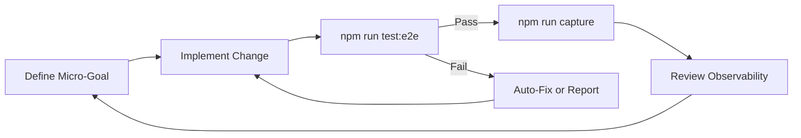

# SeNARS Observable UI Roadmap

> **Vision**: Transform SeNARS into an **observable "neural galaxy"** where the graph is the primary interface for exploring hybrid NAL-LM reasoning.
> **Philosophy**: "The Graph *IS* the Logic."

**Status**: Pre-Alpha (Phase 0 ~80% Complete, Blocking Issues Identified)
**Goal**: Unified Observability Platform (CLI + Web)

---

## 0. Known Issues & Fixes ✅ RESOLVED

> [!NOTE]
> Both blocking issues have been fixed.

### ✅ Issue 1: fcose Layout - FIXED
- **Solution:** Updated `ui/index.html` to load CDN dependencies in correct order: `layout-base` → `cose-base` → `cytoscape-fcose`

### ✅ Issue 2: LM Default Provider - FIXED  
- **Solution:** Changed `agent/src/app/Config.js` default from `'ollama'` to `'transformers'`

---

## 0.1 Automated Development Commands

> [!IMPORTANT]
> These commands enable fully automated UI development without manual testing.

| Command | Purpose | When to Use |
|---------|---------|-------------|
| `npm run test:e2e` | Playwright E2E tests (7 specs) | After any UI change |
| `npm run test:all` | Full unit + integration + e2e | Before committing |
| `npm run dev:workflow --all` | Visual inspection + regression + tuning | Full validation |
| `npm run ai:develop` | Evolutionary parameter tuning | Optimize heuristics |
| `npm run capture` | Generate screenshots/movies | Visual documentation |

### The Self-Improvement Loop



### Test Infrastructure

| Component | Path | Coverage |
|-----------|------|----------|
| **Page Object** | `ui/tests/e2e/utils/NarPage.js` | All UI selectors |
| **E2E Specs** | `ui/tests/e2e/*.spec.js` | golden_path, demos, graph, config, debug, advanced, production |
| **Fixtures** | `ui/tests/e2e/fixtures/` | Mock backend, production backend |
| **Playwright Config** | `ui/playwright.config.js` | Chromium, auto-start server |

### Verification Contract Per Phase

Each phase in this roadmap must define:
1. **Test Script:** Exact `npm run` command
2. **Pass Criteria:** Expected test outcomes  
3. **Observable Metrics:** Screenshots, logs, performance data

---

## 1. Architecture: The "Observability Core"

We unify the CLI (`npm run repl`) and Web UI (`ui/`) around a shared core, ensuring that "if it happens in the reasoner, it appears in the UI."

### Unified Data Flow: The Connection Bridge

We utilize a **Connection Bridge Pattern** to decouple the UI from the execution environment. The UI *only* talks to an elaborate `ConnectionManager` interface, unaware of whether the Core is running in a Web Worker, the main thread, or a remote WebSocket server.

```mermaid
graph TD
    subgraph UI ["Universal UI (Browser)"]
        Components[Graph / REPL / Panels]
        CM[ConnectionManager Interface]
    end

    subgraph Bridges ["Connection Adapters"]
        WSM[WebSocketAdapter]
        LCM[LocalAdapter (Offline)]
    end

    subgraph Execution ["Execution Environments"]
        Remote[Node.js Server (Core)]
        Local[Browser Main Thread (Core Bundled)]
    end

    Components <--> CM
    CM <--> WSM
    CM <--> LCM
    
    WSM <-->|JSON/WS| Remote
    LCM <-->|Direct Calls/EventBus| Local
```

### 1.1 Connection Modes & Feature Parity

To ensure the "SeNARS on the Edge" (Offline) experience matches the "Power User" (Server) experience, we map features to their specific implementations in each mode.

| Feature | Browser-Only (Offline) | WebSocket Server (Online) |
| :--- | :--- | :--- |
| **REPL Access** | Direct function calls to `MeTTa` / `NAR` instances via `LocalConnectionManager`. | Asynchronous JSON messages via `WebSocketClient`. |
| **Logic Graph** | Direct `EventBus` subscription. | Subscriptions to `ws` event stream. |
| **Filesystem / IDE** | **VirtualFS**: In-memory Map, `localStorage`, or Drag-and-Drop simple file loading. | **NativeFS**: Full read/write access to user's disk. |
| **Demos** | **Universal Demos**: Static `.metta` / `.nars` files fetched via HTTP or bundled. | Server-side execution of scripts. |
| **Persistence** | Export/Import State (JSON Download). | Native File Save. |

#### 1.1.1 Offline Constraints & Mitigations
*   **Single Thread**: Heavy reasoning blocks UI. *Mitigation*: Future move to Web Workers.
*   **No Native FS**: Workspace is ephemeral. *Mitigation*: Support Upload/Download of JSON state.
*   **Mocked Environment**: `STDIN`/`STDOUT` are routed to UI panels; `process.exit()` is a no-op.

#### Specifications
1.  **Entry Point**: `ui/src/browser-init.js` initializes the `LocalConnectionManager` instead of `WebSocketClient`.
2.  **Build System**: `esbuild` injects `ui/src/shims/mock-node.js` and `process-shim.js` to replace `fs`, `path`, `crypto`, etc.
3.  **Storage**: Ephemeral (in-memory) or `localStorage`/`IndexedDB` for simplified "filesystem" persistence.
4.  **Networking**: Loopback only. Components communicate via the in-memory `EventBus`.

#### Constraints & Mitigations
*   **No Native FS**: Workspace is ephemeral. *Mitigation*: Support Upload/Download of JSON state.
*   **Single Thread**: Heavy reasoning blocks UI. *Mitigation*: Future move to Web Workers.
*   **Mocked Environment**: `STDIN`/`STDOUT` are routed to UI panels; `process.exit()` is a no-op.

### Key Integration Points
1.  **Event Ontology**: [`core/src/util/IntrospectionEvents.js`](file:///home/me/senars10/core/src/util/IntrospectionEvents.js) is the single source of truth.
    *   *Rule*: A feature exists only if an event exists for it.
2.  **Visual Language**: [`core/src/util/DesignTokens.js`](file:///home/me/senars10/core/src/util/DesignTokens.js) defines shared colors, timings, and semantic meanings.
    *   *Usage*: Direct imports (`import { DESIGN_TOKENS } from '@senars/core'`) - no CSS variables needed.
3.  **Control Plane**: [`core/src/util/CommandRegistry.js`](file:///home/me/senars10/core/src/util/CommandRegistry.js) unifies input handling across TUI and Web.

---

## 2. Development Methodology: Agentic & Incremental

We utilize an **incremental, agent-driven workflow** focused on **quick wins** and **iterative improvement**.

### The Automated Loop
1.  **Define**: Micro-goal (e.g., "Add pulse animation on derivation").
2.  **Act**: Use Playwright Agents (Planner → Generator → Healer) via MCP tools.
3.  **Verify**:
    *   **Functional**: Use Playwright E2E (gestures, updates).
    *   **Visual**: Regression screenshots with masks for dynamics.
    *   **Perceptual (Future)**: LAION Aesthetics Predictor V2 (Target >7.0).
    *   **Performance**: Maintain >30fps.

### Verification Standards
*   **Performance**: >30fps at 500 nodes.
    *   *Strategy*: Viewport filtering, layout debouncing (already implemented).
*   **Aesthetics**: Clear node labels, semantic edge colors, smooth animations.
    *   *Target*: Saliency on key elements >70%, low clutter.

---

## 3. Implementation Plan: Revised Progression

### ✅ Phase 0: Foundations (80% Complete)

**Already Done:**
1.  ✅ **Command Infrastructure**: [`CommandRegistry.js`](file:///home/me/senars10/core/src/util/CommandRegistry.js) already in core.
2.  ✅ **Event Ontology**: [`IntrospectionEvents.js`](file:///home/me/senars10/core/src/util/IntrospectionEvents.js) has all needed events (`memory:focus:*`, `lm:*`, `reasoning:*`).
3.  ✅ **Design Tokens**: [`DesignTokens.js`](file:///home/me/senars10/core/src/util/DesignTokens.js) exists and used by [`GraphConfig.js`](file:///home/me/senars10/ui/src/config/GraphConfig.js).
4.  ✅ **CLI Logging**: [`useAgentLogs.js`](file:///home/me/senars10/agent/src/cli/hooks/useAgentLogs.js) already exists.

**Remaining (Optional):**
- [ ] **Event Standardization Polish**: Update remaining NAR.js string literals to use IntrospectionEvents constants (30 min, low priority).

---

## 4. Quick Wins: High-Impact, Low-Effort (2-4 hours total)

These provide immediate observable improvements and should be done first:

| Task | Effort | Files Modified | Benefit |
|:-----|:-------|:---------------|:--------|
| **Semantic Edge Coloring** | 15 min | `GraphConfig.js` | Instant visual clarity |
| **Pulse Animation on Derivation** | 1 hour | `GraphManager.js`, `WebSocketManager.js` | See reasoning in real-time |
| **Glow Effect on Focus** | 1 hour | `GraphManager.js`, CSS | Highlight active concepts |
| **ARIA Labels for Nodes** | 30 min | `GraphManager.js` | Basic accessibility |
| **High-Contrast Mode** | 45 min | `DesignTokens.js`, CSS toggle | Better visibility |
| **High-Contrast Mode** | 45 min | `DesignTokens.js`, CSS toggle | Better visibility |
| **Suppress Noisy Metrics** | 15 min | `SeNARSUI.js` | Cleaner logs (inputs/outputs only) |
| **Empty State / Help Overlay** | 30 min | `index.html`, CSS | Orient user when graph is empty |
| **Visual Heartbeat** | 30 min | `SystemMetricsPanel.js` | Visual activity indicator (replaces log noise) |
| **Connection Visuals** | 15 min | `SeNARSUI.js`, CSS | Gray out UI on disconnect |

---

## 5. Phase 1: Visual Foundation (Track B) - 4-6 hours

**Goal**: Beautiful, organic, readable graph (Phases 1-4 of Incremental Sequence).

1.  **Base Canvas** (Phase 1):
    *   Empty full-screen canvas with theme toggle.
    *   Establish aesthetics baseline.

2.  **Styles & Nodes** (Phase 2):
    *   Verify [`GraphConfig.js`](file:///home/me/senars10/ui/src/config/GraphConfig.js) styles (Concept, Task, Question).
    *   Single static node: Clickable; legible at zooms; priority sizing.

3.  **Organic Layout** (Phase 3):
    *   Replace `cose` with `fcose` (force-directed with constraints).
    *   **BLOCKING**: Fix fcose loading error (see Issue 1 above):
        - `cytoscape-fcose` requires `cose-base` and `layout-base` as peer dependencies
        - Current vendored version uses UMD with external requires that fail in browser
        - Solution: Either bundle all dependencies into single file or load them in correct order
    *   Fallback: Random layout works but provides poor visualization quality.
    *   Benefit: No node overlap; harmonious spread of existing concepts.

4.  **Smart Edges** (Phase 4):
    *   Already partially done - enhance with full semantic coloring:
        *   Inheritance → Teal (`#4ec9b0`)
        *   Similarity → Purple (`#9d68f0`)
        *   Implication → Blue
        *   Other relations → Gray

5.  **Keyboard Navigation Basics** (Phase 1+):
    *   Tab-index through graph nodes.
    *   Arrow keys to navigate between connected nodes.
    *   Enter to select/focus node.

---

## 6. Phase 2: Observability (Tracks C + E) - 8-10 hours

**Goal**: See the machine think in real-time (Phases 6 & 8 of Incremental Sequence).

### Track C: Live Deltas & Vital Signs

1.  **Live Deltas** (Phase 6):
    *   Pulse animation on `reasoning:derivation` events.
    *   Fade-in for newly created nodes.
    *   Real-time; eye drawn to changes.

2.  **Focus Effects** (Phase 8):
    *   Glow effect for `memory:focus:promote` events.
    *   Dim nodes on `memory:focus:demote`.
    *   Node size based on priority/activation.

3.  **LM Activity Indicators** (1 hour):
    *   Spinner overlay on graph during `lm:prompt:start`.
    *   Clear spinner on `lm:prompt:complete` or `lm:error`.
    *   Optional: Show LM thinking as particle effects.

### Track E: Enhanced Observability Panels

4.  **Extend SystemMetricsPanel** (2-3 hours):
    *   Add CPU/Cycle rate gauges (leverage existing [`SystemMetricsPanel.js`](file:///home/me/senars10/ui/src/components/SystemMetricsPanel.js)).
    *   Performance overlay: FPS, Latency, Event Queue depth.
    *   Memory usage visualization.

5.  **Extend ActivityLogPanel** (2 hours):
    *   Add event filtering by type (leverage existing [`ActivityLogPanel.js`](file:///home/me/senars10/ui/src/components/ActivityLogPanel.js)).
    *   Pause/resume event stream.
    *   Search/highlight functionality.

---

## 7. Phase 3: Interaction (Track D) - 8-12 hours ✅

**Status**: COMPLETE

**Goal**: User agency and feedback (Phases 5 & 7 of Incremental Sequence).

1.  ✅ **Enhanced Command Input** (4-6 hours):
    *   Backtick (`` ` ``) keyboard shortcut to focus input
    *   Command history navigation (⬆️/⬇️ arrows)
    *   Command autocomplete with Tab completion
    *   New commands: `/goals`, `/beliefs`, `/step`, `/run`, `/stop`

2.  ✅ **Graph Context Menu** (2-4 hours):
    *   Right-click on nodes → Context menu (focus, inspect, expand, copy)
    *   Right-click on edges → Context menu (inspect, remove)
    *   Double-click → Center and zoom to node
    *   ESC to close, click-outside to close

3.  ✅ **Pan/Zoom Controls** (Phase 5):
    *   Zoom in/out buttons (+/-)
    *   Fit-to-screen button
    *   Smooth zoom with limits (0.3x-3x)
    *   Labels remain readable at all zoom levels

---

## 8. Post-MVP: Advanced Features

**Deferred for user feedback and iterative development:**

### Timeline Scrubber (Phase 9) - 8-12 hours
*   Snapshot GraphManager state every N cycles into RingBuffer.
*   UI slider to rewind/replay system state.
*   Export/import timeline data for offline analysis.

### RLFP Teacher Mode (Phase 10) - 12-16 hours
*   Backend: Implement feedback ingestion API.
*   UI: Drag-to-rank derivation paths; Adaptive styling.
*   Emit `reasoning:feedback` events to training pipeline.

### Advanced Optimizations - 4-8 hours
*   Web Worker for layout calculations (if performance needed).
*   LOD culling for massive graphs (>1000 nodes).
*   Virtual scrolling for log panels.

### Additional A11y Features - 2-4 hours
*   Screen reader announcements for graph updates.
*   Multiple high-contrast themes.
*   Reduced motion mode (disable animations).

---

## 8b. Future Vision (Long-Term)

*Moved from original plan - these represent long-term vision items:*

*   **Perceptual Scoring**: Use CLIP/SigLIP to automate "beauty" scores for layout optimization.
*   **3D Visualization**: Three.js renderer for massive graphs (>10k nodes).
*   **Plugin System**: Allow community custom renderers and visualizations.
*   **Offline Mode**: Load/Save event streams for offline analysis and replay.

---

## 9. File Impact Analysis (Revised)

| Phase | Key Files Modified | New Files Created | Existing Files Leveraged |
| :--- | :--- | :--- | :--- |
| **Quick Wins** | `GraphConfig.js`, CSS | — | `DesignTokens.js` |
| **Phase 1 (Visuals)** | `GraphManager.js` | — | `GraphConfig.js` |
| **Phase 2 (Observe)** | `WebSocketManager.js` | CSS animations | `SystemMetricsPanel.js`, `ActivityLogPanel.js` |
| **Phase 3 (Interact)** | — | `WebRepl.js` | `CommandRegistry.js` |
| **Post-MVP** | `GraphManager.js` | `TimeTravelManager.js`, RLFP components | — |

---

## 10. Risk Register (Updated)

| Risk | Likelihood | Impact | Mitigation |
| :--- | :--- | :--- | :--- |
| **Cytoscape Performance** | Medium | High | Already mitigated: layout debouncing, viewport filtering. Monitor >500 nodes. |
| **Event Storms** | Low | Medium | Already mitigated: batching in WebSocketMonitor, time-sliced processing. |
| **Layout Instability** | Low | Low | Use deterministic seeds, incremental layouts. |
| **Scope Creep** | High | Medium | Strict adherence to Quick Wins → Phases → Post-MVP sequence. Defer Timeline/RLFP. |
| **Over-Engineering** | Medium | Low | Use direct imports, extend existing components, avoid unnecessary abstractions. |

**Removed Risks:**
- ~~Command Divergence~~ (CommandRegistry already centralized)
- ~~Missing Event Ontology~~ (IntrospectionEvents complete)

---

## 11. Success Metrics

### Phase 1 Complete:
- [ ] Graph renders 100+ nodes without lag
- [ ] Semantic edge colors distinguish relation types
- [ ] Keyboard navigation works (tab through nodes)
- [ ] Basic ARIA labels present

### Phase 2 Complete:
- [ ] Derivations show pulse animation in real-time
- [ ] LM activity is visually indicated
- [ ] SystemMetricsPanel shows FPS + latency
- [ ] ActivityLogPanel has filtering

### Phase 3 Complete:
- [ ] WebRepl accepts commands and updates graph
- [ ] Users can interact with nodes (click, right-click)
- [ ] Pan/zoom controls work smoothly

### Overall Success:
- [ ] >30fps with 500 nodes
- [ ] All IntrospectionEvents are visually observable
- [ ] CLI and Web UI feel unified
- [ ] Developers can debug system state via UI panels

---

## 12. Next Steps

1. **Mark Phase 0 complete** - Update status to "Complete" after final polish.
2. **Execute Quick Wins** - 2-4 hours of high-impact work.
3. **Begin Phase 1** - Get graph visuals working beautifully.
4. **Iterate based on feedback** - User testing drives Phase 2 & 3 priorities.
5. **Document patterns** - Create UI component guide for contributors.

---

## Appendix A: Development Reference

### Key Files Quick Reference

| Purpose | File Path | Notes |
|:--------|:----------|:------|
| **Event Types** | [`core/src/util/IntrospectionEvents.js`](file:///home/me/senars10/core/src/util/IntrospectionEvents.js) | All event constants |
| **Design System** | [`core/src/util/DesignTokens.js`](file:///home/me/senars10/core/src/util/DesignTokens.js) | Colors, timing, spacing |
| **Commands** | [`core/src/util/CommandRegistry.js`](file:///home/me/senars10/core/src/util/CommandRegistry.js) | Unified command handling |
| **Graph Config** | [`ui/src/config/GraphConfig.js`](file:///home/me/senars10/ui/src/config/GraphConfig.js) | Cytoscape styles |
| **Graph Manager** | [`ui/src/visualization/GraphManager.js`](file:///home/me/senars10/ui/src/visualization/GraphManager.js) | Graph operations |
| **WebSocket** | [`ui/src/connection/WebSocketManager.js`](file:///home/me/senars10/ui/src/connection/WebSocketManager.js) | Event streaming |
| **Metrics Panel** | [`ui/src/components/SystemMetricsPanel.js`](file:///home/me/senars10/ui/src/components/SystemMetricsPanel.js) | Extend for observability |
| **Activity Log** | [`ui/src/components/ActivityLogPanel.js`](file:///home/me/senars10/ui/src/components/ActivityLogPanel.js) | Extend for filtering |
| **CLI TUI** | [`agent/src/cli/components/TUI.js`](file:///home/me/senars10/agent/src/cli/components/TUI.js) | CLI interface |
| **CLI Hooks** | [`agent/src/cli/hooks/useAgentLogs.js`](file:///home/me/senars10/agent/src/cli/hooks/useAgentLogs.js) | CLI logging |

### Development Commands

```bash
# Start CLI REPL
npm run repl

# Start Web UI (dev server)
npm run web

# Start Browser-Only Mode (Offline)
npm run ui

# Run unit tests
npm run test:unit

# Run E2E tests
npm run test:e2e

# Build for production
npm run build
```

### Code Patterns

**Using DesignTokens:**
```javascript
import { DESIGN_TOKENS } from '@senars/core';

// Apply colors directly
element.style.color = DESIGN_TOKENS.colors.concept;  // Teal
element.style.backgroundColor = DESIGN_TOKENS.colors.task;  // Orange
```

**Listening to Events (Web UI):**
```javascript
// In WebSocketManager or component
this.webSocketManager.subscribe('reasoning:derivation', (payload) => {
    // Trigger pulse animation
    this.graphManager.animateNode(payload.nodeId, 'pulse');
});
```

**Adding Graph Animations (Cytoscape):**
```javascript
// In GraphManager.js
animateNode(nodeId, effect = 'pulse') {
    const node = this.cy.getElementById(nodeId);
    if (!node.length) return;
    
    node.animate({
        style: { 'border-width': 8, 'border-color': DESIGN_TOKENS.colors.highlight },
        duration: 300
    }).animate({
        style: { 'border-width': 2, 'border-color': DESIGN_TOKENS.colors.concept },
        duration: 300
    });
}
```

**Adding ARIA Labels:**
```javascript
// In GraphManager.js addNode()
this.cy.add({
    data: { id: nodeId, label: displayLabel },
    // ARIA support
    ariaLabel: `${nodeType} node: ${displayLabel}`
});
```

### Key Events Reference

| Event | Trigger | UI Response |
|:------|:--------|:------------|
| `reasoning:derivation` | New derivation created | Pulse animation on involved nodes |
| `memory:focus:promote` | Concept gains focus | Glow effect, increase size |
| `memory:focus:demote` | Concept loses focus | Dim effect, decrease size |
| `lm:prompt:start` | LM inference begins | Show spinner overlay |
| `lm:prompt:complete` | LM inference ends | Hide spinner, show result |
| `lm:error` | LM error occurred | Show error indicator |
| `task.input` | New task added | Add node with task styling |
| `concept.created` | New concept created | Add node with fade-in |

### External Dependencies

| Library | Version | Purpose | Docs |
|:--------|:--------|:--------|:-----|
| **Cytoscape.js** | 3.x | Graph visualization | [cytoscape.org](https://js.cytoscape.org/) |
| **cytoscape-fcose** | 2.x | Force-directed layout | [npm](https://www.npmjs.com/package/cytoscape-fcose) |
| **Ink** | 4.x | CLI React framework | [npm](https://www.npmjs.com/package/ink) |

### Testing Checklist

Before merging UI changes:
- [ ] `npm run test:unit` passes
- [ ] `npm run test:e2e` passes (if Playwright tests exist)
- [ ] Manual test: `npm run repl` works
- [ ] Manual test: `npm run web` works
- [ ] Graph renders without console errors
- [ ] No visible performance degradation