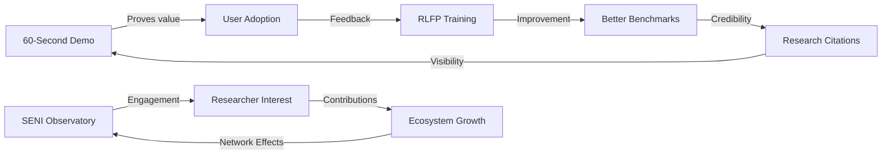

# TODO2.md — Maximum Leverage Development Plan

> **The Winning Strategy**: SeNARS has real technical substance (889 tests, working reasoning, functional tensors). The path to winning is not building more features — it's making existing power **demonstrable**, **accessible**, and **undeniable**.

---

## The Big Picture: Why SeNARS Can Win

```
┌────────────────────────────────────────────────────────────────────────────┐
│                           THE SENAR ADVANTAGE                               │
├────────────────────────────────────────────────────────────────────────────┤
│                                                                            │
│  LLMs:    Fast pattern matching → Hallucinations, context amnesia         │
│  Logic:   Perfect consistency   → Brittle, no common sense                │
│  SeNARS:  NAL + LM + Tensors    → Consistent, adaptive, explainable       │
│                                                                            │
│  ━━━━━━━━━━━━━━━━━━━━━━━━━━━━━━━━━━━━━━━━━━━━━━━━━━━━━━━━━━━━━━━━━━━━━━━━ │
│                                                                            │
│  UNIQUE ASSETS:                                                            │
│    ✓ Truth-Tensor Bridge — Differentiable NAL (genuinely novel)            │
│    ✓ 889 passing tests — Production-grade stability                        │
│    ✓ AIKR resource awareness — Graceful degradation                        │
│    ✓ Stream architecture — Modern async reasoner                           │
│    ✓ MCP server — AI assistant integration ready                           │
│    ✓ NARL 10-level benchmark — Measures what LLMs can't do                │
│                                                                            │
└────────────────────────────────────────────────────────────────────────────┘
```

---

## Phase 0: The 60-Second Win (Days 1-3)

> **Objective**: Anyone can experience SeNARS value in under 60 seconds.

### 0.1 Create `npx senars` Entry Point

```bash
# This should work:
npx senars demo        # Run instant demo
npx senars repl        # Start REPL
npx senars serve       # Start MCP + WebSocket servers
```

**Files**:
- [ ] Create `bin/senars.js` CLI entry point
- [ ] Add `"bin": {"senars": "./bin/senars.js"}` to root `package.json`
- [ ] Create `examples/instant-demo.js` — 3 compelling demos

**Demo Content** (must be memorable):
1. **Knowledge Discovery**: 5 facts → 3 non-obvious conclusions
2. **Consistency Proof**: LLM contradicts, SeNARS doesn't
3. **Memory Persistence**: Reload session, knowledge survives

**Success Metric**: `npx senars demo` works and wows.

### 0.2 Create `SeNARS.js` Facade

The friction-free API:

```javascript
import { SeNARS } from 'senars';

const brain = new SeNARS();
brain.learn('(cats --> mammals).');
brain.learn('(mammals --> animals).');

const answer = await brain.ask('(cats --> animals)?');
// → { answer: true, confidence: 0.85, proof: [...] }
```

**Files**:
- [ ] Create `core/src/SeNARS.js` — Simple facade (~150 lines)
- [ ] Export from `core/src/index.js`

**Design**:
- Auto-initialization (no manual `.start()`)
- Async/await for all queries
- Returns structured results with proof chains
- Sensible defaults, power user config optional

---

## Phase 1: The SENI Observatory (Week 1-2)

> **Objective**: Transform benchmark running into an engaging, watchable experience.

The SENI system (from `seni.md`) is the key differentiator. It makes the inevitably long autonomous runs **exciting**.

### 1.1 Foundation (Days 1-5)

- [ ] Create `seni/server/ExpeditionEngine.js` — Wraps autonomous RLFP loop
- [ ] Create `seni/server/WebSocketGateway.js` — Event broadcast
- [ ] Extend `ui/` with SENI dashboard components:
  - [ ] `ScoreTrajectory.js` — Live benchmark charts
  - [ ] `LiveTrace.js` — Real-time reasoning visualization
  - [ ] `DiscoveryLog.js` — Auto-flagged interesting traces

### 1.2 Gamification (Days 5-10)

- [ ] Create `seni/Achievements.js` — Badge/milestone system
- [ ] Add streaks, leaderboards, discovery collections
- [ ] Implement "Intelligence Signal Strength" meter (I(t) from Drake equation analog)

**Commands**:
```bash
npm run seni:start     # Launch observatory dashboard
npm run seni:demo      # Demo mode with simulated data
npm run seni:expedition -- --name "Deep Thought" --duration 24h
```

---

## Phase 2: The NARL Benchmark (Week 2-3)

> **Objective**: Prove SeNARS does what LLMs can't with a rigorous, demonstrable benchmark.

The 10-level NARL benchmark (from PROTOTYPE_DEMOS.md) is the **scientific weapon**:

| Level | Name | What It Tests | LLM Score | SeNARS Target |
|-------|------|---------------|-----------|---------------|
| 1 | **Trace** | Derivation provenance | 0% | 100% (automatic) |
| 2 | **Revise** | Belief revision | ~40% | 95% |
| 3 | **Persist** | Cross-session memory | ~50% | 90% |
| 4 | **Cause** | Causal reasoning | ~35% | 80% |
| 5 | **Resist** | Prompt injection defense | ~30% | 85% |
| 6 | **Uncertain** | Confidence degradation | ~20% | 90% |
| 7 | **Analog** | Analogical transfer | ~45% | 75% |
| 8 | **Meta** | Self-reasoning | ~10% | 80% |
| 9 | **Bound** | AIKR graceful degradation | ~5% | 85% |
| 10 | **Compose** | Novel combinations | ~30% | 80% |

### 2.1 Implementation

- [ ] Create `benchmarks/narl/` directory structure
- [ ] Implement each level as a test suite
- [ ] Create `narl_runner.js` CLI
- [ ] Auto-generate comparison reports (SeNARS vs baseline LLM)

### 2.2 Publishing

- [ ] Write NARL benchmark paper (arXiv)
- [ ] Create interactive NARL demo in SENI dashboard
- [ ] Publish leaderboard for community contributions

---

## Phase 3: The Prototype Demos (Week 3-4)

> **Objective**: 11 demo categories that prove compound intelligence.

From PROTOTYPE_DEMOS.md, build the full demo system:

### 3.1 Demo Infrastructure

- [ ] Extend `ui/src/demo-runner/` with prototype config system
- [ ] Add Transformers.js local LM support (`Xenova/LaMini-Flan-T5-783M`)
- [ ] Implement demo discovery from `examples/`, `tests/integration/`

### 3.2 Category Coverage

| Category | Focus Demo | Status |
|----------|-----------|--------|
| A: Explainability | Inference Audit Trail | [ ] |
| B: Temporal | Event Ordering | [ ] |
| C: Uncertainty | Confidence Degradation | [ ] |
| D: Memory | Cross-Session Consistency | [ ] |
| E: Adversarial | Prompt Injection Resistance | [ ] |
| F: Analogical | A:B::C:? | [ ] |
| G: Meta-Cognition | Self-Reasoning | [ ] |
| H: Resource-Bounded | AIKR Demo | [ ] |
| I: Learning | RLFP Improvement | [ ] |
| J: Compositional | Novel Combinations | [ ] |
| K: Multi-Agent | Collaboration | [ ] |

---

## Phase 4: The Autonomous Loop (Week 4-5)

> **Objective**: 10,000+ learning cycles per day, running autonomously.

From `agentic_superintelligence.md`:

### 4.1 Core Loop

- [ ] Create `agent/src/rlfp/autonomous_loop.js`
- [ ] Create `agent/src/rlfp/llm_evaluator.js` — Synthetic preference scoring
- [ ] Create `agent/src/rlfp/synthetic_preference.js` — Goal generation

### 4.2 Benchmark Harnesses

- [ ] Create `tests/benchmarks/bfcl_harness.js` — BFCL function calling
- [ ] Create `tests/benchmarks/epistemic_stability.test.js`
- [ ] Create `agent/src/mcp/function_translator.js` — NAL↔JSON bridge

### 4.3 Enhanced MCP Tools

- [ ] Add `teach` tool — Inject beliefs
- [ ] Add `set-goal` tool — Set goals
- [ ] Add `get-trace` tool — Retrieve reasoning trace

---

## Phase 5: The Ecosystem (Week 5-8)

> **Objective**: Make SeNARS usable everywhere.

### 5.1 Adapters

- [ ] `adapters/react/useSeNARS.js` — React hook
- [ ] `adapters/langchain/tool.js` — LangChain integration
- [ ] `adapters/express/middleware.js` — Express middleware

### 5.2 Knowledge Portability

- [ ] Define `.sbook` Knowledge Book format
- [ ] Create `brain.loadBook('common-sense-physics')`
- [ ] Curate starter knowledge packs

### 5.3 Distribution

- [ ] Docker image: `docker run -p 8080:8080 senars/observatory`
- [ ] NPM publish: `npm install senars`
- [ ] Edge build for Cloudflare Workers

---

## Success Metrics

| Metric | Current | 30 Days | 90 Days |
|--------|---------|---------|---------|
| `npx senars` works | ❌ | ✅ | ✅ |
| NARL Level 1-5 passing | ❌ | ✅ | ✅ |
| SENI dashboard deployed | ❌ | ✅ | ✅ |
| Autonomous cycles/day | 0 | 10,000 | 50,000 |
| BFCL Single-Turn score | ? | ≥70% | ≥85% |
| Epistemic stability | ? | ≥90% | ≥95% |
| npm weekly downloads | ? | 500 | 2,000 |
| GitHub stars | ? | 300 | 1,000 |
| Published papers | 0 | 1 (NARL) | 2 |

---

## The Growth Flywheel



---

## What NOT To Do

❌ **Don't build more features** — Make existing ones accessible first
❌ **Don't oversell** — Remove claims about unimplemented GPU/superintelligence
❌ **Don't skip the demo** — 60-second value proof is non-negotiable
❌ **Don't ignore the tests** — 889 passing tests are a competitive advantage
❌ **Don't reinvent benchmarks** — Use BFCL/AgentBench for credibility, NARL for differentiation

---

## Priority Stack

| Priority | Action | Effort | Impact | Who Benefits |
|----------|--------|--------|--------|--------------|
| **P0** | `npx senars demo` | 4 hrs | ★★★★★ | Everyone |
| **P0** | `SeNARS.js` facade | 4 hrs | ★★★★★ | Developers |
| **P1** | SENI dashboard MVP | 2 wks | ★★★★☆ | Researchers |
| **P1** | NARL benchmark (L1-5) | 1 wk | ★★★★☆ | Academia |
| **P2** | Autonomous RLFP loop | 1 wk | ★★★☆☆ | Core team |
| **P2** | Prototype demos (A-E) | 2 wks | ★★★★☆ | Users |
| **P3** | BFCL harness | 3 days | ★★★☆☆ | Benchmarking |
| **P3** | Adapters (React, LangChain) | 1 wk | ★★★☆☆ | Ecosystem |

---

## The Bottom Line

SeNARS has everything it needs to win:

1. **Technical substance** — Working NAL, tensors, tests
2. **Unique value** — Truth-Tensor bridge, epistemic stability
3. **Clear differentiator** — Does what LLMs can't (NARL proves it)
4. **Vision docs** — SENI, PROTOTYPE_DEMOS provide the roadmap

What's missing is **accessibility**:

```
FROM:  "Read 15 READMEs, wire up NAR + Memory + Focus, hope it works"
  TO:  "npx senars demo → WOW → brain.learn() → brain.ask()"
```

**Ship the facade. Ship the demo. Prove the NARL benchmark. Let the compound intelligence emergence speak for itself.**

---

> *"The best way to predict the future is to invent it — and then make it trivially easy for others to use."*
