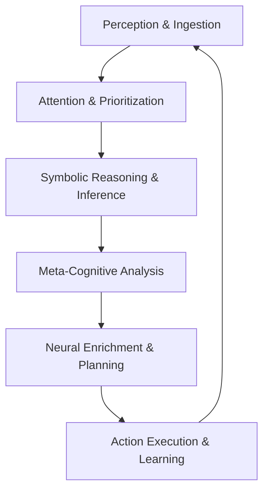

# SeNARS: A Developer's Conceptual Overview 🧠

This document provides a comprehensive and in-depth exploration of SeNARS' core architectural concepts, connecting
high-level design principles to the sophisticated data structures and modules that comprise the codebase. This overview
illuminates the system's realizable potential as a next-generation neuro-symbolic cognitive architecture.

---

## Core Philosophy: A Dynamic Stream of Consciousness

SeNARS embodies a sophisticated **"stream of consciousness"** architecture that operates intelligently under the
constraints of **finite computational resources**. Unlike traditional batch-processing systems, SeNARS functions as a
dynamic, continuously running cognitive agent that makes intelligent, real-time decisions about what to "think" about at
any given moment.

The fundamental principle governing this cognitive process is **Economic Attention**. Given that the system cannot
simultaneously reason about its entire knowledge base, it employs a sophisticated attention mechanism. In each cognitive
**`Cycle`**, the system strategically selects a small, optimized `focusSet` of the most salient `Task`s.

This attention focus is determined by a highly sophisticated **`PriorityManager`** that calculates priority scores using
multiple factors:

- **Goal Relevance**: How closely a task relates to current objectives
- **Temporal Factors**: Recency and time-sensitive importance
- **Truth Value Certainty**: Confidence and evidential support
- **Cognitive Value**: Potential to generate new insights or achieve goals

This intelligent resource allocation ensures that the system's limited computational resources are always directed
toward the most promising and valuable cognitive activities, maximizing the efficiency and effectiveness of the
reasoning process.

---

## The Three Pillars: Term, Task, and Memory

The entire cognitive architecture is built upon three fundamental, interdependent data structures that work in harmony
to enable sophisticated reasoning and learning.

### 🔤 Pillar 1: The `Term` - The Immutable Vocabulary of Thought

A `Term` represents the immutable, atomic foundation of all conceptual knowledge in the system. Defined in
`core/core/Term.js`, it serves as the fundamental building block for all cognitive operations.

**Structural Complexity & Expressiveness:**

* **Atomic Terms**: Simple, indivisible concepts like `cat`, `red`, or `motion`.
* **Compound Terms**: Complex concepts built from other terms using sophisticated Narsese grammar:
    * **Inheritance Relationships**: `(cat --> animal)` representing "cats are animals"
    * **Predictive Implications**: `((&, dark_clouds, wind) =/> rain)` representing "if dark clouds and wind, then rain
      follows"
    * **Complex Conjunctions**: `(&, hungry, food_available, time_evening)` representing multiple concurrent conditions
    * **Negations and Disjunctions**: `(--, (cat --> bird))` representing "not (cats are birds)"
    * **Temporal Relations**: `(<->, morning, evening)` representing bidirectional temporal relationships

**Advanced Design Features:**

* **Immutability**: Once a `Term` is created, its conceptual meaning remains fixed, providing a stable foundation for
  logical reasoning and preventing inconsistencies during complex inference chains.
* **Lazy Parsing**: Complex terms like `(A --> B)` are initially stored as strings. Their internal structure (e.g.,
  `subject: A`, `predicate: B`, `type: Inheritance`) is parsed and cached only on-demand, ensuring optimal memory usage
  and computational efficiency.
* **Semantic Grounding**: Each `Term` can be associated with high-dimensional vector **embeddings** that ground its
  symbolic meaning in semantic space. This enables the neuro-symbolic bridge, allowing the `LM` to calculate semantic
  similarity and support analogical reasoning.
* **Caching & Optimization**: Terms include intelligent caching mechanisms for frequently accessed properties, reducing
  computational overhead during reasoning operations.
* **Validation & Consistency**: All terms undergo rigorous validation to ensure syntactic correctness and logical
  consistency within the overall knowledge base.

### 🎯 Pillar 2: The `Task` - The Dynamic Atom of Cognition

A `Task` represents the stateful, dynamic unit of all cognitive work, embodying a piece of knowledge the system is
actively "thinking" about. Defined in `core/core/Task.js`, a `Task` wraps a `Term` and imbues it with rich contextual
state and temporal dynamics.

**Comprehensive Structure:**

* **Term Reference**: A reference to the immutable `Term` that defines the core concept
* **Punctuation System**: Defines the task's fundamental cognitive type:
    * `.` (Belief): A statement about the world (e.g., `(cat --> mammal).` with confidence 0.9)
    * `!` (Goal): A desired state the system aims to achieve (e.g., `(clean_kitchen)!` with priority 0.8)
    * `?` (Question): An information query seeking specific knowledge (e.g., `(cat_purr_frequency)?`)

**Dynamic State Management:**

* **Truth Value System**: An object `{ frequency, confidence }` representing the system's assessment of the task's
  accuracy:
    * **Frequency**: The evidential support (0.0 to 1.0) indicating how often the statement has been observed to be true
    * **Confidence**: The certainty (0.0 to 1.0) indicating how reliable the frequency estimate is
    * **Bayesian Updates**: Truth values are continuously updated using sophisticated Bayesian revision when new
      evidence is encountered
* **Priority Management**: A dynamic float value (0.0 to 1.0) indicating the task's current importance in the cognitive
  cycle, calculated by the **`PriorityManager`** using algorithms that consider relevance, urgency, and potential impact
* **Temporal Stamps**: Comprehensive timestamping system including:
    * `creationTime`: When the task was first created
    * `lastAccessed`: When the task was last processed
    * `occurrenceTime`: When the represented event occurred (for temporal reasoning)
    * `expirationTime`: When the task becomes obsolete (optional)
* **Cognitive State**: Additional metadata tracking the task's role in ongoing reasoning processes, including whether
  it's part of active inference chains or planning operations
* **Provenance Tracking**: Information about the task's origin, including which rules created it or which external
  sources provided it

### 💾 Pillar 3: The `Memory` - The Intelligent Knowledge Hypergraph

The `Memory` module (`core/memory/Memory.js`) represents the central, sophisticated repository for all `Term`s and
`Task`s. It transcends a simple database to function as a highly structured and dynamically adaptive knowledge
hypergraph with intelligent management capabilities.

**Advanced Dual-Store Architecture:**

* **`shortTermTasks`**: A high-performance map holding new and recently accessed tasks, serving as the primary workspace
  for active cognitive operations. Optimized for rapid access and frequent updates during reasoning cycles.
* **`longTermTasks`**: A comprehensive map for important, high-confidence knowledge that has been consolidated from
  short-term memory. Designed for efficient retrieval of stable, foundational knowledge.
* **Consolidation Mechanisms**: Sophisticated algorithms determine which information should be moved from short-term to
  long-term storage based on importance, frequency of access, and truth value stability.

**Specialized Indexing & Retrieval:**

* **Intelligent Indexing**: The **`MemoryIndexer`** maintains multiple specialized indices to enable lightning-fast
  retrieval during reasoning:
    * `implicationIndex`: Enables the `Reasoner` to instantly find all rules relevant to achieving specific goals
    * `inheritanceIndex`: Facilitates rapid inheritance-based reasoning
    * `temporalIndex`: Supports efficient temporal reasoning operations
    * `similarityIndex`: Enables fast semantic similarity searches using vector embeddings
* **Vector Search Capabilities**: Integration of vector databases allows for semantic search and similarity-based
  retrieval beyond simple symbolic matching
* **Adaptive Query Optimization**: The memory system learns and adapts its indexing strategies based on usage patterns

**Advanced Memory Management:**

* **Adaptive Forgetting**: Sophisticated **`TimeBasedForgettingStrategy`** and **`PriorityBasedForgettingStrategy`**
  mechanisms periodically prune old, low-priority, or low-confidence tasks, ensuring the knowledge base remains focused,
  efficient, and relevant
* **Forgetting Algorithms**: Multiple forgetting strategies including exponential decay, priority-based pruning, and
  relevance-based consolidation
* **Memory Consolidation**: Processes that strengthen important connections while pruning weak ones, similar to how
  human memory operates

---

## The Cognitive Cycle 🔄: The Rhythm of Intelligence

The system "thinks" through a discrete, continuous, and highly optimized loop defined in the **`Cycle`** module. Each
cognitive cycle represents a single moment of integrated "thought," coordinating multiple cognitive processes in
harmonious sequence.

**Detailed Cognitive Cycle Process:**

1. **Perception & Ingestion**: The **`Perception`** module ingests external events, data streams, and user inputs. The
   sophisticated **`TaskFactory`** converts this raw information into structured `Task` objects, applying validation and
   initial processing to ensure coherence.

2. **Attention & Prioritization**: The **`PriorityManager`** updates priority scores for all tasks using comprehensive
   algorithms considering:
    * Goal relevance and strategic importance
    * Temporal urgency and recency factors
    * Truth value certainty and confidence levels
    * Potential for generating valuable insights
    * System resource allocation policies
      The `Cycle`'s `_selectFocusSet` method then selects the top-priority tasks to form the cognitive focus for the
      current cycle.

3. **Symbolic Reasoning & Inference**: The **`Reasoner`** module processes the `focusSet`, applying its extensive
   library of inference rules (from `core/reasoner/rules`) to derive new `Task`s (conclusions). This includes:
    * Logical deduction using multiple rule types
    * Temporal reasoning across time dimensions
    * Causal analysis and pattern detection
    * Strategic planning and goal decomposition

4. **Meta-Cognitive Analysis**: The **`MetaCognition`** module performs comprehensive analysis including:
    * **Contradiction Detection**: The **`ContradictionAnalyzer`** examines newly derived knowledge to detect
      inconsistencies or contradictions with existing beliefs
    * **Reasoning Quality Assessment**: Evaluation of inference chains for logical validity and completeness
    * **Cognitive Resource Management**: Assessment of reasoning efficiency and resource allocation effectiveness

5. **Neural Enrichment & Planning**: The **`LM`** module is invoked for advanced cognitive functions:
    * **Creative Enrichment**: The **`HypothesisGenerator`** suggests novel ideas and hypotheses when symbolic reasoning
      reaches boundaries
    * **Strategic Planning**: The **`Planner`** creates detailed action sequences for actionable goals
    * **Knowledge Integration**: The **`ProactiveEnricher`** discovers new connections and relationships in existing
      knowledge
    * **Plan Repair**: The **`PlanRepairer`** generates alternative strategies when plans encounter obstacles

6. **Action Execution & Learning**: The cognitive cycle concludes with:
    * **Action Execution**: The **`ActionExecutor`** carries out concrete operations based on achieved goals
    * **Learning Integration**: New insights and experiences are integrated back into the memory system
    * **Performance Monitoring**: Assessment of cognitive performance for future optimization

---

## Neuro-Symbolic Synergy 🤝: A Revolutionary Integration

The true transformative power of SeNARS emerges from its seamless, bidirectional integration of symbolic reasoning and
neural processing. This is not a simple connection but a sophisticated, synergistic architecture where each component
enhances and informs the other.

**Advanced LM Services & Capabilities:**

| Service                    | Module (`core/lm/`)       | Purpose                                                                                        | Integration Pattern                                                             |
|----------------------------|---------------------------|------------------------------------------------------------------------------------------------|---------------------------------------------------------------------------------|
| **Hypothesis Generation**  | `HypothesisGenerator.js`  | Provides creative leaps and plausible explanations when symbolic logic encounters limitations. | Symbolic → Neural → Symbolic feedback loop                                      |
| **Plan Repair**            | `PlanRepairer.js`         | Suggests innovative, alternative solutions when logical plans encounter obstacles.             | Symbolic reasoning failure → Neural creativity → Updated symbolic plan          |
| **Proactive Enrichment**   | `ProactiveEnricher.js`    | Discovers and suggests valuable new connections in existing knowledge.                         | Continuous monitoring → Neural insight → Symbolic integration                   |
| **Question Answering**     | `QAService.js`            | Provides natural language responses based on the system's comprehensive knowledge base.        | Symbolic knowledge → Neural fluency → Natural language output                   |
| **Explanation Generation** | `ExplanationGenerator.js` | Translates the system's formal Narsese logic into human-readable, understandable narratives.   | Symbolic reasoning trace → Neural language model → Natural language explanation |
| **Pattern Recognition**    | `NLP.js`                  | Advanced semantic processing and linguistic analysis for complex input understanding.          | Natural language → Narsese transformation                                       |
| **Semantic Similarity**    | Vector operations         | Identifies conceptually related knowledge using high-dimensional embeddings.                   | Vector space operations supporting analogical reasoning                         |

**The Advanced Synergy Architecture:**

The system operates through sophisticated feedback loops that create emergent intelligence:

* **The Reasoning Foundation**: The **🧠 **`Reasoner`** provides a rigorous, structured, and completely explainable
  knowledge base. This serves as high-quality, factual context for the `LM` while ensuring logical consistency and
  traceability.

* **The Neural Enhancement**: The **🤖 **`LM`** provides deep semantic understanding, creative hypothesis generation, and
  natural language processing capabilities. The new knowledge it generates is fed back into the `Reasoner` for logical
  validation, consistency checking, and formal integration.

* **The Learning Loop**: Experiences and outcomes feed back into both systems, with the symbolic system learning through
  logical inference and the neural system learning through pattern recognition and semantic refinement.

* **The Validation Cycle**: All neural insights undergo symbolic validation, while symbolic conclusions can be enriched
  through neural interpretation, creating a self-correcting and continuously improving cognitive system.

---

## Realizable Potential: Transformative Applications

This sophisticated architecture enables SeNARS to tackle problems previously beyond the reach of traditional AI systems:

**Autonomous Intelligence**: The system can operate independently in complex, dynamic environments, making decisions
while maintaining complete transparency about its reasoning process.

**Creative Problem-Solving**: By combining logical rigor with neural creativity, the system can generate innovative
solutions that neither purely symbolic nor purely neural systems could achieve alone.

**Continuous Learning**: The architecture supports lifelong learning without forgetting, adapting to new information
while maintaining a coherent knowledge base.

**Explainable AI**: All decisions follow traceable paths from initial conditions to final conclusions, making the system
trustworthy for critical applications.

**Scalable Cognition**: The architecture efficiently manages cognitive resources, enabling complex reasoning without
performance degradation.

This represents a paradigm shift in AI architecture, providing a foundation for truly intelligent systems that combine
the best of both symbolic and neural approaches.