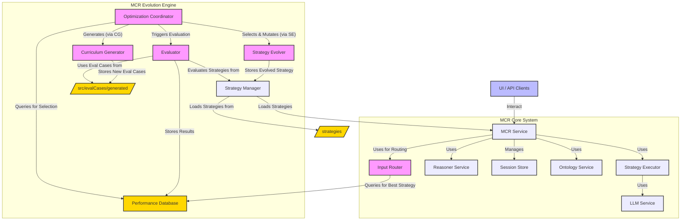

# 🧠 Model Context Reasoner (MCR) ✨

**For a high-level, marketing-oriented overview of MCR, its applications, and benefits, please see
our [OVERVIEW.md](OVERVIEW.md).**

The **Model Context Reasoner (MCR)** is a powerful, API-driven system designed to act as a bridge between Large Language
Models (LLMs) and formal logic reasoners (specifically Prolog). It enables applications to leverage sophisticated
logical reasoning capabilities by translating natural language into formal logic and managing a persistent knowledge
base through stateful sessions.

MCR is built with a "guitar pedal" 🎸 philosophy: a single, plug-and-play unit that adds advanced reasoning to your AI
stack with minimal setup.

## 🌉 The MCR Philosophy: Bridging Worlds

MCR adds **general-purpose reasoning** to Language Model applications. It's a self-contained unit that you can easily "
plug in" to an existing system (via its API) to empower it with logic.

**Vision: The Symbiosis of Language and Logic:**
Large Language Models (LLMs) excel at understanding and generating human language, accessing vast knowledge, and
performing nuanced contextual tasks. Formal logic systems, like Prolog, offer precision, verifiability, and the ability
to perform complex deductive and inductive reasoning over structured knowledge.

MCR's vision is to create a seamless symbiosis between these two powerful paradigms. We believe that the future of
advanced AI applications lies in systems that can:

- **Understand intent** through natural language (LLMs).
- **Structure knowledge** into formal representations (LLMs + MCR).
- **Reason rigorously** over that knowledge (Prolog via MCR).
- **Communicate results** back in an understandable way (MCR + LLMs).

This combination unlocks possibilities for more robust, explainable, and sophisticated AI systems.

## 🔑 Core Concepts

1. **MCR Workbench 🖥️**: MCR is primarily accessed and managed through the **MCR Workbench**, a comprehensive web-based
   user interface. This SPA (Single Page Application) provides modes for interactive reasoning sessions and system-level
   analysis and control.
2. **WebSocket-First API 🔌**: All core interactions with the MCR server happen via a WebSocket connection. This enables
   real-time communication, such as live updates to a session's Knowledge Base.
3. **Stateful Sessions 💾**: Users interact with MCR through sessions, identified by a `sessionId`. Each session
   maintains:
    - **Knowledge Base (KB) 📚**: A collection of symbolic logic clauses (facts and rules, typically in Prolog).
4. **LLM-Powered Translation 🗣️<->🧠**: MCR uses LLMs, guided by configurable Translation Strategies, to translate
   between natural language and formal logic.
5. **Translation Strategies 🧩**: These define the methodology for converting natural language into symbolic assertions
   or queries. They are designed to be interchangeable for comparison and evolution.
6. **Structured Intermediate Representation (SIR) 🤖**: Advanced strategies may use an SIR (e.g., JSON) as an
   intermediate step for more reliable translation to symbolic logic.

## 🚀 Features

- **🧩 Modular Server**: Core logic is well-structured (Config, Logger, LLM Service, Reasoner Service, MCR Service, Tool
  Definitions).
- **💾 Persistent Sessions**: Supports both in-memory and file-based session storage, allowing knowledge bases to persist
  across server restarts. Configurable via `.env`.
- **🤖 Extensible LLM Support**: Supports multiple LLM providers (OpenAI, Gemini, Ollama, etc.), selectable via
  configuration.
- **🧠 Neurosymbolic Capabilities**:
    - **Bidirectional Refinement Loops**: Automatically refines translations between natural language and logic for
      improved accuracy and consistency.
    - **Embeddings and Knowledge Graph Integration**: Enriches reasoning with semantic context from embeddings and
      structured knowledge from a graph database.
    - **Guided Probabilistic Reasoning**: Combines neural guidance with symbolic deduction to produce probabilistic
      answers.
- **📚 Dynamic Lexicon Summary**: Automatically builds a lexicon of known predicates from asserted facts to aid LLM
  translation.
- **🛡️ Robust Error Handling**: Centralized error handling for WebSocket API calls.
- **✅ Configuration Validation**: Validates essential configurations on server startup.
- **🌐 MCR Workbench (UI)**: A React-based Single Page Application for all user interactions, replacing previous CLI/TUI
  tools. Features include:
    - **Interactive Session Mode**: Real-time chat, ontology loading, demo running, live KB view.
    - **System Analysis Mode**: Strategy performance dashboards, curriculum explorer, evolver controls.
- **🕸️ Comprehensive WebSocket API**: A rich API based on a `tool_invoke` / `tool_result` message pattern, including:
    - High-level tools like `mcr.handle` for easy REPL integration.
    - Direct LLM access with `llm.passthrough`.
    - Symbolic import/export tools for fine-grained knowledge base manipulation.

## 🏛️ System Architecture Diagram

The MCR is defined by a multi-layered, service-oriented architecture that promotes modularity and separation of
concerns:

- **Presentation Layer:** Any user-facing application that consumes the MCR's API (e.g., GUI Workbench, CLI, API
  Client).
- **API Layer:** The WebSocket message handlers (`websocketHandlers.js`) define the formal contract for interacting with
  MCR.
- **Service Layer:** The core orchestrator (`mcrService.js`). It manages the business logic of a request (e.g., "assert
  this text") by invoking the currently selected Translation Strategy and the necessary providers. It also directly
  manages session state via a pluggable Session Store.
- **Provider & Strategy Interfaces:** A set of abstract contracts that define the capabilities of key components like
  LLM Providers, Reasoner Providers, Session Stores, and Translation Strategies. This allows for pluggable
  implementations.
- **Implementation Layer:** Concrete implementations of the interfaces (e.g., specific LLM providers like Ollama or
  Gemini, a Prolog Reasoner, various Translation Strategy modules, and Session Stores like `InMemorySessionStore` and
  `FileSessionStore`).

The following diagram illustrates the main components of the MCR system, including the core reasoning services and the
Evolution Engine:



## 🏁 Quick Start

This section guides you through getting MCR up and running quickly for development or local use.

**1. Clone & Install (for Development):**

```bash
git clone http://dumb.ai # Replace with the actual repository URL if different
cd model-context-reasoner
npm install
```

**2. Configure LLM:**
Create a `.env` file in the project root (copy from `.env.example`) and add your chosen LLM provider API key and
settings.

**3. Build the MCR Workbench UI (Production Mode):**
The MCR Workbench is a React application. For production-like deployment, you need to build its static assets.

```bash
cd ui
npm install
npm run build
cd ..
```

This will create a `dist` folder inside the `ui` directory containing the built UI assets. **This step is mandatory for
the MCR server to serve the UI as described below.**

**4. Start the MCR Server (Serves Production UI Build):**
Once the UI is built as described above, the MCR server can serve it.

```bash
node mcr.js
```

The server will start, typically on `http://localhost:8080` (or your configured `MCR_SERVER_PORT`).

**5. Access the MCR Workbench:**
Open your web browser and navigate to `http://localhost:8080` (or your configured server address).
You should see the MCR Workbench interface, which allows you to manage sessions, interact with the reasoner, and access
system analysis tools.

The previous CLI and TUI interfaces (`./cli.js`, `chat.js`) have been **removed** and their functionality is now
integrated into the MCR Workbench.

**Alternative: Running UI in Development Mode (Hot Reloading)**

For UI development, you can run the Vite development server, which provides hot reloading. This requires running two
processes simultaneously:

1. **Start the MCR Backend Server:**
   Open a terminal, navigate to the project root, and run:

   ```bash
   node mcr.js
   ```

   This server will handle API requests (typically on `http://localhost:8080`).

2. **Start the Vite UI Development Server:**
   Open a _separate_ terminal, navigate to the `ui` directory, and run:
   ```bash
   cd ui
   npm install # If you haven't already
   npm run dev
   ```
   Vite will start a development server for the UI, usually on a different port (e.g., `http://localhost:5173` - check
   your terminal output). Access the MCR Workbench through this Vite URL in your browser. UI changes will update
   automatically.

**Note:** The UI development server only serves the UI. The backend server (`node mcr.js`) must still be running for the
UI to function correctly.

## 📦 Using MCR as a Package

(This section might need updates if the package export strategy changes with the UI focus. For now, assuming the server
is the primary export.)

Once MCR is published, you can install it in your Node.js project:

```bash
npm install model-context-reasoner
```

**Running the MCR Server (which includes the Workbench UI):**
The primary way to use MCR is by running its server.

- **From `node_modules`:**

  ```bash
  node ./node_modules/model-context-reasoner/mcr.js
  ```

  Ensure you have a `.env` file configured in your project's root. The UI will be available at the configured server
  port.

- **Via `package.json` script in your project:**
  ```json
  "scripts": {
    "start-mcr": "node ./node_modules/model-context-reasoner/mcr.js"
  }
  ```
  Then run: `npm run start-mcr`

**Programmatic API Interaction:**
Once the MCR server is running, your application interacts with it via WebSockets.
Refer to the **🔌 API Reference** section below for details.

## 🔌 API Reference

The MCR service has transitioned its core API to WebSockets. The server also serves the MCR Workbench UI.

### WebSocket API

Connect to the WebSocket server at `ws://localhost:8080/ws` (or your configured `MCR_SERVER_HOST`:`MCR_SERVER_PORT`/ws).
All messages are JSON strings.

**Key Message Types:**

1. **Client to Server: `tool_invoke`**
    - Used to request an action from the server.
    - Structure: `{ "type": "tool_invoke", "messageId": "...", "payload": { "tool_name": "...", "input": {...} } }`

2. **Server to Client: `tool_result`**
    - The server's response to a `tool_invoke` message.
    - The `payload` contains the result of the tool execution, including a `success` flag and tool-specific data. For
      operations that modify a session's knowledge base (`session.assert`, `session.assert_rules`, `session.set_kb`),
      the payload will also include the `fullKnowledgeBase`.

3. **Server to Client: `connection_ack`**
    - Sent upon successful WebSocket connection, containing the server-assigned `correlationId`.

For a complete and detailed breakdown of all message types and tool payloads, please refer to the *
*[WEBSOCKET_API.md](WEBSOCKET_API.md)** document.

---

**Available Tools (`tool_name`):**

The API provides a rich set of tools. Below is a summary. For detailed `input` and `payload` structures, see *
*[WEBSOCKET_API.md](WEBSOCKET_API.md)**.

- **General Tools:**
    - `mcr.handle`: Smart handler for REPLs; auto-detects if input is an assertion or query.
    - `llm.passthrough`: Sends text directly to the underlying LLM, bypassing the reasoning engine.

- **Session Management:**
    - `session.create`, `session.get`, `session.delete`: Manage reasoning sessions.
    - `session.assert`: Asserts natural language into the knowledge base.
    - `session.assert_rules`: Asserts raw Prolog rules into the knowledge base.
    - `session.set_kb`: Replaces the entire knowledge base with new content.
    - `session.query`: Queries the knowledge base using natural language.
    - `session.explainQuery`: Explains how a query would be interpreted.

- **Symbolic Exchange:**
    - `symbolic.import`, `symbolic.export`: Tools for low-level import and export of Prolog clauses.

- **Ontology Management:**
    - `ontology.create`, `ontology.list`, `ontology.get`, `ontology.update`, `ontology.delete`: Manage global
      ontologies.

- **Direct Translation:**
    - `translate.nlToRules`, `translate.rulesToNl`: Translate between natural language and Prolog without affecting a
      session.

- **Strategy Management:**
    - `strategy.list`, `strategy.setActive`, `strategy.getActive`: Manage and inspect translation strategies.

- **System Analysis & Evolution:**
    - `analysis.*`: A suite of tools for inspecting performance data, strategy definitions, and evaluation curricula.

    * `evolution.*`: Tools to control the Evolution Engine, such as starting/stopping the optimizer and viewing its
      logs.
    * `demo.*`: Tools to list and run predefined demonstration scripts.

- **Utility & Debugging:**
    - `utility.getPrompts`, `utility.debugFormatPrompt`: Inspect and debug prompt templates.

---

### HTTP API Endpoints

With the move to a WebSocket-first architecture, explicit HTTP API endpoints for MCR functionality have been removed.
The server's primary role is to serve the MCR Workbench UI and handle WebSocket connections.

---

**Example (Node.js using `ws` library for WebSockets):**

```javascript
const WebSocket = require('ws');

const ws = new WebSocket('ws://localhost:8080/ws'); // Adjust URL if needed

ws.on('open', function open() {
	console.log('Connected to MCR WebSocket server.');

	// Example: Create a session and assert a fact
	const createSessionMessage = {
		type: 'tool_invoke',
		messageId: 'msg-1',
		payload: { tool_name: 'session.create', input: {} },
	};
	ws.send(JSON.stringify(createSessionMessage));
});

ws.on('message', function incoming(data) {
	const message = JSON.parse(data.toString());
	console.log('Received from server:', message);

	// Example flow: After session is created, assert a fact
	if (
		message.type === 'tool_result' &&
		message.messageId === 'msg-1' &&
		message.payload?.success
	) {
		const sessionId = message.payload.data.id;
		console.log('Session created with ID:', sessionId);

		const assertMessage = {
			type: 'tool_invoke',
			messageId: 'msg-2',
			payload: {
				tool_name: 'session.assert',
				input: {
					sessionId: sessionId,
					naturalLanguageText: 'Socrates is a man.',
				},
			},
		};
		ws.send(JSON.stringify(assertMessage));
	}

	// Log the updated knowledge base after assertion
	if (
		message.type === 'tool_result' &&
		message.messageId === 'msg-2' &&
		message.payload?.success
	) {
		console.log('Assertion successful!');
		console.log(
			'Updated Knowledge Base:\n' + message.payload.fullKnowledgeBase
		);
	}
});

ws.on('error', function error(err) {
	console.error('WebSocket error:', err);
});

ws.on('close', function close() {
	console.log('Disconnected from MCR WebSocket server.');
});
```

**Direct Library Usage (Experimental/Advanced):**
(This section can largely remain, as `mcrService.js` is still available, but emphasize it's for deep embedding, not
typical use.)

```javascript
// main.js in your project
const mcrService = require('model-context-reasoner/src/mcrService'); // Adjust path if needed
// ... rest of the example can stay similar ...
```

## 🛠️ Development Setup and Installation

This section covers setting up MCR for development, including running the backend server and the MCR Workbench UI.

1. **Clone the Repository**:
   ```bash
   git clone http://dumb.ai # Replace with the actual repository URL if different
   cd model-context-reasoner
   ```
2. **Install Server Dependencies**:
   From the project root directory:
   ```bash
   npm install
   ```
3. **Set up the MCR Workbench UI**:
   The UI can be run in two modes:
    - **Production Mode (Served by `node mcr.js`):**
      This involves building the static UI assets which are then served by the main MCR server.

      ```bash
      cd ui
      npm install # Install UI-specific dependencies
      npm run build # Build the static assets into ui/dist
      cd ..
      ```

      After this, running `node mcr.js` from the project root will serve the UI.

    - **Development Mode (Using Vite Dev Server):**
      This mode is ideal for UI development as it provides hot reloading.
        - Ensure server dependencies are installed (Step 2).
        - In a separate terminal, navigate to the `ui` directory:
          ```bash
          cd ui
          npm install # If you haven't already
          npm run dev
          ```
        - This will start the Vite development server (e.g., on `http://localhost:5173`).

    * **Important:** The main MCR server (`node mcr.js`) must also be running in another terminal for the UI dev server
      to make API calls. The UI dev server (Vite) will typically run on a port like `5173`, while the backend MCR server
      defaults to `8080`. The UI will attempt to connect to the WebSocket server at `ws://localhost:8080/ws` by default.
      If your MCR server is running on a different URL, you can set `window.MCR_WEBSOCKET_URL` in your browser's
      developer console before the UI loads, or by embedding a script in `ui/index.html` to define this global variable.

4. **Create and Configure `.env` file**:
   Copy `.env.example` to `.env` in the project root. Edit it to include your LLM API keys and other configurations.
   Refer to `.env.example` for all available options.
    - **LLM Configuration (Mandatory):** The MCR server performs configuration validation on startup. If you select an
      `MCR_LLM_PROVIDER` that requires an API key (e.g., "gemini", "openai"), you **must** provide the corresponding API
      key environment variable (e.g., `GEMINI_API_KEY`). Failure to do so will prevent the server from starting.
    - **Session Storage (Optional):** You can configure how session data is stored.
        - `MCR_SESSION_STORE_TYPE`: Set to `file` to enable persistent, file-based session storage. Sessions will be
          saved in the `.sessions` directory and reloaded on restart.
        - If omitted or set to `memory`, sessions will be stored in-memory and lost on restart.

   Example `.env` configuration:

   ```dotenv
   # --- LLM Configuration (Example for OpenAI) ---
   MCR_LLM_PROVIDER="openai"
   OPENAI_API_KEY="sk-..."
   # MCR_LLM_MODEL_OPENAI="gpt-4o" # Optional

   # --- Session Storage Configuration ---
   # For persistent sessions that survive restarts, use "file".
   # For ephemeral sessions, use "memory" or omit this line.
   MCR_SESSION_STORE_TYPE="file"

   # --- Neurosymbolic Configuration ---
   REASONER_TYPE="ltn" # 'prolog' or 'ltn'
   EMBEDDING_MODEL="all-MiniLM-L6-v2" # Optional
   KG_ENABLED=true # Optional
   LTN_THRESHOLD=0.7 # Required if REASONER_TYPE is 'ltn'
   ```

5. **Run the MCR Server (includes serving the UI)**:
   ```bash
   node mcr.js
   ```
   The server will log its status. Access the MCR Workbench at `http://localhost:8080` (or your configured port).

## 🧪 Testing

MCR uses Jest for backend tests and Vitest for UI tests.

- **Run Backend Tests (Jest):**
  From the project root:

  ```bash
  npm test
  ```

  This will run all tests located in the `tests/` directory.

- **Run UI Tests (Vitest):**
  From the project root:
  ```bash
  npm run test:ui
  ```
  This will run all UI component and service tests located in the `ui/src/` directory. Watch mode and browser mode are
  also available:
  ```bash
  npm run test:ui-watch # For watch mode
  npm run test:ui-browser # To run tests in a browser with Vitest UI
  ```

#### Debugging Configuration

MCR uses an environment variable `MCR_DEBUG_LEVEL` to control the verbosity of debug information in API responses (
specifically within the `debugInfo` field of results from tools like `session.query` or `session.explainQuery`).

- **`MCR_DEBUG_LEVEL`**: Set this in your `.env` file.
    - `none` (Default): No detailed debug information is included in API responses.
    - `basic`: Includes essential debug fields (like the generated Prolog query).
    - `verbose`: Includes full, detailed debug information. **Use with caution.**

Clients can request debug information by including relevant flags in the `input` for specific tools (e.g.,
`"queryOptions": { "debug": true }` for `session.query`). The server's `MCR_DEBUG_LEVEL` ultimately governs the detail
provided.

## 💬 MCR Workbench - Primary Interface

The MCR Workbench is the primary interface for interacting with the MCR system. It replaces the previous CLI and TUI
tools. Access it by running the server (`node mcr.js`) and navigating to the server's address in your web browser.

**Features:**

- **Interactive Session Mode:**
    - Create and manage reasoning sessions.
    - Chat-like interface for assertions and queries.
    - Live view of the session's Knowledge Base.
    - Load global ontologies into sessions.
    - Manage and select translation strategies.
    - (Future: Run predefined demos).
- **System Analysis Mode:**
    - View strategy performance leaderboards.
    - Deep dive into individual strategy performance (TODO).
    - Explore and manage evaluation curricula (TODO).
    - Control and monitor the MCR Evolution Engine (TODO).

## 💻 CLI (`./cli.js`)

The Command Line Interface (`./cli.js` and associated TUI `chat` and `perf-dashboard` commands) has been **deprecated
and removed**. All its functionalities are intended to be covered and enhanced by the **MCR Workbench**.

## 🤖 MCR Evolution Engine

MCR includes a sophisticated **Evolution Engine**, a supervisory control loop designed to autonomously discover,
evaluate, and refine translation strategies. This engine works to continuously improve MCR's performance, accuracy, and
efficiency over time.

The system is bootstrapped with functional, human-authored strategies, ensuring immediate usability. The evolution
process runs asynchronously (typically offline), augmenting the pool of available strategies.

### Core Components:

1. **Optimization Coordinator (`src/evolution/optimizer.js`)**:
    - Orchestrates the entire evolution loop.
    - On first run (or with `--runBootstrap`), it executes all pre-defined strategies against an evaluation curriculum
      to establish baseline performance data in the `Performance Database`.
    - Selects existing strategies for improvement based on performance data.
    - Invokes the `StrategyEvolver` to create new candidate strategies.
    - May invoke the `CurriculumGenerator` to create new, targeted evaluation examples.
    - Evaluates new strategies and persists their performance.

2. **Strategy Evolver (`src/evolution/strategyEvolver.js`)**:
    - Creates new candidate strategies by mutating existing ones.
    - The primary mutation method is "Iterative Critique":
        1. Selects a node in a strategy graph (e.g., an `LLM_Call` node).
        2. Extracts its prompt and identifies failing examples from the `Performance Database`.
        3. Uses an LLM to critique and rewrite the prompt to address these failures.
        4. Creates a new strategy JSON definition with the updated prompt.

3. **Curriculum Generator (`src/evolution/curriculumGenerator.js`)**:
    - Expands the set of evaluation cases to prevent overfitting and ensure strategies are robust.
    - Analyzes performance data to identify weaknesses or gaps in the current curriculum.
    - Uses an LLM to generate new `EvaluationCase` objects targeting these areas. These are saved in
      `src/evalCases/generated/`.

4. **Input Router (`src/evolution/keywordInputRouter.js`)**:
    - **Runtime Optimizer:** Integrated directly into `mcrService.js` to select the optimal strategy for a given live
      input _at the moment of execution_.
    - **Data-Driven Decisions:** It performs a quick analysis of the input text (e.g., using keywords) to classify its
      intent. It then queries the `Performance Database` for the strategy that has historically performed the best (
      based on success metrics, cost, and latency) for that specific input class and the currently configured LLM.
    - **Fallback Mechanism:** If the router cannot find a suitable specialized strategy, it falls back to the default
      configured strategy, ensuring robust operation.

The Evolution Engine also supports:

- **Benchmarking:** Standardized evaluation of strategies against a "golden dataset" of NL-to-Symbolic mappings, using
  metrics for syntactic accuracy, semantic correctness, and resource cost (latency, tokens).
- **Automated Optimization:** The system facilitates an automated loop where the `OptimizationCoordinator` can
  programmatically generate variations of existing strategy prompts (via the `StrategyEvolver`), benchmark them, and
  promote superior versions based on data from the `Performance Database`.

### Performance Database (`performance_results.db`)

This SQLite database is crucial for the Evolution Engine. It stores the detailed results of every evaluation run.

- **Purpose**:
    - Provides data for the `OptimizationCoordinator` to select strategies for evolution.
    - Gives context to the `StrategyEvolver` (e.g., failing examples).
    - Informs the `CurriculumGenerator` about areas needing more test cases.
    - Allows the `InputRouter` to make data-driven decisions at runtime.
    - Serves as a rich dataset for analyzing strategy performance and for potential fine-tuning of models.
- **Schema (`performance_results` table)**:
    - `id` (INTEGER PK): Unique ID for the run.
    - `strategy_hash` (TEXT): SHA-256 hash of the strategy's JSON definition.
    - `llm_model_id` (TEXT): Identifier of the LLM used (e.g., "ollama/llama3").
    - `example_id` (TEXT): ID of the `EvaluationCase` used.
    - `metrics` (JSON TEXT): JSON object of metric scores (e.g., `{ "exactMatchProlog": 1, ... }`).
    - `cost` (JSON TEXT): JSON object of cost metrics (e.g.,
      `{ "prompt_tokens": 120, "completion_tokens": 80, "total_tokens": 200 }`).
    - `latency_ms` (INTEGER): Total time for the execution in milliseconds.
    - `timestamp` (DATETIME): UTC timestamp of the evaluation run.
    - `raw_output` (TEXT): The final string or JSON array output of the strategy.

### Running the Optimizer

The Optimization Coordinator can be run as a standalone script:

```bash
node src/evolution/optimizer.js [options]
```

**Common Options:**

- `--iterations <num>` or `-i <num>`: Number of evolution cycles to run (default: 1).
- `--bootstrapOnly`: Only run the bootstrap/baselining step and exit.
- `--runBootstrap`: Run bootstrap before starting iterations (useful if DB is empty or needs refreshing).
- `--evalCasesPath <path>`: Path to evaluation cases (default: `src/evalCases`).

**Example:**
To run bootstrap and then 3 evolution iterations:

```bash
node src/evolution/optimizer.js --runBootstrap --iterations 3
```

### Performance Dashboard TUI

To explore the `performance_results.db` and view strategy performance, use the Performance Dashboard TUI:

```bash
./cli.js perf-dashboard
```

This interface allows you to:

- List all evaluated strategy hashes.
- Select a strategy to view its individual evaluation runs.
- See detailed metrics, cost, latency, and raw output for each run.
- View overall summary statistics from the database.

### Example Translation Strategy Approaches

MCR's flexibility comes from its use of different Translation Strategies. These strategies define how natural language
is converted to logic. Here are a couple of conceptual approaches:

1. **Direct-to-Symbolic (e.g., `Direct-S1` strategy family):**
    - **Description:** A baseline approach where the LLM is prompted to directly output symbolic logic (e.g., Prolog
      facts/rules or queries).
    - **Assertion Logic:**
        1. Generate a prompt asking the LLM to convert input text into one or more symbolic facts or rules.
        2. Invoke the LLM.
        3. Perform minimal post-processing (e.g., splitting into clauses).
    - **Query Logic:**
        1. Generate a prompt asking the LLM to convert an input question into a symbolic query.
        2. Invoke the LLM.
        3. Clean and return the string.
    - **Pros:** Simpler to implement initially.
    - **Cons:** More prone to LLM-induced syntax errors or inconsistencies.

2. **Structured Intermediate Representation (e.g., `SIR-R1` strategy family):**
    - **Description:** A more robust, multi-stage approach using a Structured Intermediate Representation (SIR) – often
      a JSON object – to ensure syntactic correctness and improve reliability.
    - **Assertion Logic:**
        1. _(Optional)_ **Intent Classification:** LLM classifies input as asserting facts or a rule.
        2. **SIR Generation:** Based on intent (or directly), an LLM generates an SIR object. The prompt includes the
           SIR's schema definition and examples.
        3. **SIR Validation:** The system parses and validates the SIR against its schema.
        4. **Syntactic Translation:** The system programmatically traverses the validated SIR to deterministically
           generate syntactically correct symbolic clauses.
    - **Query Logic (can also use SIR or be direct):**
        1. LLM generates a symbolic query (potentially via an SIR for complex queries).
        2. Clean and return the string.
    - **Pros:** Significantly reduces syntax errors from LLMs; more robust and maintainable.
    - **Cons:** More complex to set up initially, requires defining SIR schemas.

The MCR system allows for these and other strategy types to be defined and managed, with the Evolution Engine working to
find or create the most effective ones for different tasks.

## 🧪 Demos

Predefined demonstrations of MCR's capabilities can be run from the **MCR Workbench** (Interactive Session Mode -> Demos
tab).
(Note: Server-side tools `demo.list` and `demo.run`, and the UI implementation for listing and running demos are
currently TODO items from the refactoring plan.)

The previous standalone demo runner (`demo.js`) has been removed.

## 📊 Evaluation System & Performance Dashboard

The evaluation of translation strategies and exploration of performance results are now intended to be managed via the *
*MCR Workbench's System Analysis Mode**.

- The **Strategy Leaderboard** view provides an overview of performance.
- The **Strategy Deep Dive** view will allow detailed analysis of individual strategies (TODO).
- The **Curriculum Explorer** view will allow management of evaluation cases (TODO).

The previous standalone evaluator script (`src/evaluator.js`) and Performance Dashboard TUI (`perf-dashboard` CLI
command) have been removed. The underlying `performance_results.db` is still used and will be queried by the new
analysis tools.

## 🛠️ Utility Scripts for Development

MCR provides scripts to accelerate development and testing by leveraging LLMs to generate test data and ontologies.

### 1. Generate Evaluation Examples (`generate_example.js`)

- **Purpose:** Automatically creates new evaluation cases (`EvaluationCase` objects) for use with `evaluator.js`.
- **Command:**

  ```bash
  # Using npm script
  npm run generate-examples -- --domain "<domain_name>" --instructions "<detailed_instructions_for_LLM>" [--provider <llm_provider>] [--model <model_name>]

  # Direct node execution
  node ./generate_example.js --domain "chemistry" --instructions "Generate diverse queries about molecular composition and reactions, including some negations and rule-based assertions."
  ```

- **Arguments:**
    - `--domain` (alias `-d`): The subject domain (e.g., "history", "chemistry"). (Required)
    - `--instructions` (alias `-i`): Specific instructions for the LLM on what kind of examples to generate. (Required)
    - `--provider` (alias `-p`): Optional LLM provider (e.g., `openai`, `gemini`, `ollama`). Defaults to
      `MCR_LLM_PROVIDER` in `.env` or `ollama`.
    - `--model` (alias `-m`): Optional specific model name for the chosen provider.
- **Output:** Saves a new JavaScript file (e.g., `chemistryGeneratedEvalCases.js`) containing an array of
  `EvaluationCase` objects to the `src/evalCases/` directory.

### 2. Generate Ontology (`generate_ontology.js`)

- **Purpose:** Automatically generates Prolog facts and rules for a specified domain, creating a new ontology file.
- **Command:**

  ```bash
  # Using npm script
  npm run generate-ontology -- --domain "<domain_name>" --instructions "<detailed_instructions_for_LLM>" [--provider <llm_provider>] [--model <model_name>]

  # Direct node execution
  node ./generate_ontology.js --domain "mythology" --instructions "Generate Prolog facts and rules describing Greek gods, their relationships (parent_of, sibling_of, spouse_of), and their domains (e.g., god_of_sea). Include some basic rules for deducing relationships like grandparent_of."
  ```

- **Arguments:**
    - `--domain` (alias `-d`): The subject domain for the ontology. (Required)
    - `--instructions` (alias `-i`): Specific instructions for the LLM on the content, style, and scope of the
      ontology. (Required)
    - `--provider` (alias `-p`): Optional LLM provider.
    - `--model` (alias `-m`): Optional specific model name.
- **Output:** Saves a new Prolog file (e.g., `mythologyGeneratedOntology.pl`) to the `ontologies/` directory.

## MCP Integration (for AI Clients like Claude Desktop)

MCR can expose its capabilities as tools to AI clients supporting the Model Context Protocol (MCP). Communication for
MCP is handled via the main WebSocket endpoint (`ws://localhost:8080/ws`).

The `src/mcpHandler.js` handles MCP-specific WebSocket messages. When an MCP client sends a message (e.g.,
`mcp.request_tools` or `mcp.invoke_tool`), it's routed to `mcpHandler.js`.

**Available MCR Tools Exposed via MCP (managed by `mcrTools` in `mcpHandler.js`):**
The `mcpHandler.js` defines a mapping from MCP tool names to MCR service functions. Common tools exposed include:

- `create_reasoning_session`
- `assert_facts_to_session` (maps to `mcrService.assertNLToSession`)
- `query_session` (maps to `mcrService.querySessionWithNL`)
- `translate_nl_to_rules` (maps to `mcrService.translateNLToRulesDirect`)
- `translate_rules_to_nl` (maps to `mcrService.translateRulesToNLDirect`)

**Configuring an MCP Client (Example for Claude Desktop - if it supports WebSocket for MCP):**
If the MCP client supports WebSocket connections for MCP:

1. Update the client's configuration to point to the MCR WebSocket endpoint: `ws://localhost:8080/ws`.
2. The client should then use MCP's WebSocket message protocol to interact with the tools listed above.

(Note: The previous `GET /mcp/sse` endpoint for Server-Sent Events is no longer the primary mechanism if MCP interaction
is consolidated over WebSockets. If SSE is still strictly required by some MCP clients, that endpoint would need to be
separately maintained or re-added to `src/app.js` outside the main MCR tool WebSocket flow.)

## Code Guidelines

- Aim for self-documenting code through clear naming and structure.
- Use JSDoc for public functions/modules: document parameters, return values, and purpose.
- Comment complex or non-obvious logic.

## Extensibility

### Adding a New LLM Provider

To add support for a new LLM provider (e.g., "MyNewLLM"):

1. **Create Provider Module**:
    - Add a new file, e.g., `src/llmProviders/myNewLlmProvider.js`.
    - This module must export an object with at least:
        - `name` (string): The identifier for the provider (e.g., `'mynewllm'`).
        - `generate` (async function): A function `async (systemPrompt, userPrompt, options) => { ... }` that interacts
          with the LLM and returns the generated text string.
    - Example:

      ```javascript
      // src/llmProviders/myNewLlmProvider.js
      const logger = require('../logger'); // Assuming logger is available
      // const { SomeApiClient } = require('some-llm-sdk');

      const MyNewLlmProvider = {
   name: 'mynewllm',
   async generate(systemPrompt, userPrompt, options = {}) {
   // const apiKey = config.llm.mynewllm.apiKey; // Get from config
   // const model = config.llm.mynewllm.model;
   // if (!apiKey) throw new Error('MyNewLLM API key not configured');
   logger.debug(
   `MyNewLlmProvider generating text with model: ${model}`,
   { systemPrompt, userPrompt, options }
   );
   // ... logic to call the LLM API ...
   // return generatedText;
   throw new Error('MyNewLlmProvider not implemented yet');
   },
   };
   module.exports = MyNewLlmProvider;
     ```

2. **Register in `src/llmService.js`**:
    - Import your new provider: `const MyNewLlmProvider = require('./llmProviders/myNewLlmProvider');`
    - Add a `case` for `'mynewllm'` in the `switch` statement within the `getProvider()` function to set
      `selectedProvider = MyNewLlmProvider;`.

3. **Update Configuration (`src/config.js`)**:
    - Add a configuration section for your provider under `config.llm`:
      ```javascript
      // In config.js, inside the config object:
      llm: {
        provider: process.env.MCR_LLM_PROVIDER || 'ollama',
        // ... other providers ...
        mynewllm: { // Add this section
          apiKey: process.env.MYNEWLLM_API_KEY,
          model: process.env.MCR_LLM_MODEL_MYNEWLLM || 'default-model-for-mynewllm',
          // ... other specific settings for MyNewLLM
        },
      }
      ```
    - Update `validateConfig()` in `src/config.js` if your provider has mandatory configuration (e.g., API key).

4. **Update `.env.example`**:
    - Add environment variable examples for your new provider (e.g., `MYNEWLLM_API_KEY`, `MCR_LLM_MODEL_MYNEWLLM`).

5. **Documentation**:
    - Briefly mention the new provider in this README if applicable.

### Future Directions and Advanced Capabilities

The MCR architecture is designed to support further enhancements, including:

- **Operational Enhancements:**
    - **Self-Correction:** If a strategy step fails (e.g., an LLM produces an invalid SIR), the system could
      automatically re-prompt the LLM with the context of the error, asking it to correct its previous output.
    - **Knowledge Retraction:** Extending MCR to understand commands for retracting or modifying existing knowledge
      would require changes to intent classification and the generation of retraction clauses.
    - **Explanatory Reasoning:** The underlying reasoner provider could be extended to optionally return a proof trace,
      which an LLM could then translate into a human-readable explanation of reasoning steps.
- **Paradigm Expansion:**
    - **Hybrid Reasoning:** The system could support a fallback mechanism where, if a symbolic query yields no results,
      the query is re-posed to the base LLM for a general, sub-symbolic lookup.
    - **Agentic Tooling:** MCR can be integrated as a "tool" within larger AI agent frameworks, allowing autonomous
      agents to delegate structured reasoning tasks.
