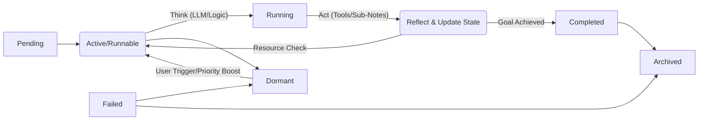
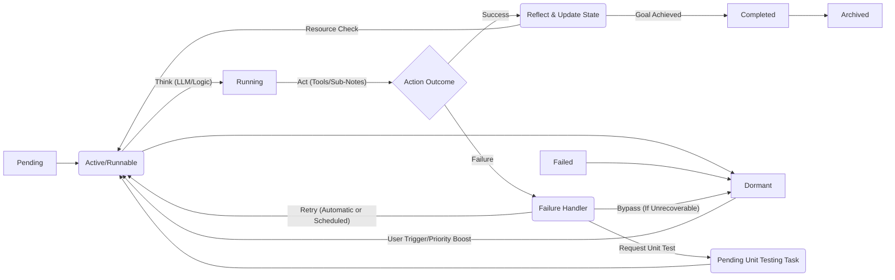

## Netention v4: Terse Software Specification

### I. Overview

*   **Vision**: Self-evolving knowledge & task system based on active Notes.
*   **Paradigm**: Unified Note = Data + Agent. Filesystem persistence. LangChain.js powered.
*   **Goal**: Autonomous, adaptable, user-centric, minimal code complexity.

### II. Core Principles

| Principle         | Description                                  | Implementation                               |
| :---------------- | :------------------------------------------- | :------------------------------------------- |
| **Unified Note**  | Note embodies data, behavior, state.          | Single `Note` class, `type` field.            |
| **Self-Evolution**| System bootstraps & refines itself from seed. | Root Note + CoreMind, LLM-driven code gen.  |
| **LangChain.js Core** | Leverage for LLM workflows, memory, tools.  | `AgentExecutor`, `Tools`, `BufferMemory`.   |
| **Filesystem DB** | Persistence & reactivity.                      | JSON files, `chokidar` file watching.       |
| **Implicit Assist**| Context-aware, subtle user guidance.         | LLM analysis, Note-level suggestions.       |

### III. Architecture

```mermaid
graph LR
    subgraph Filesystem
        NotesDir[/notes/]
        PlansDir[/plans/]
        ToolsDir[/tools/]
        ConfigDir[/config/]
        MemoryDir[/memory/]
    end
    UI[Flow Note UI (React)]
    SystemAgent[SystemAgent (LangChain.js AgentExecutor)]
    FileManager[FileManager (chokidar)]
    NoteClass[Note Class]

    FileManager --> NotesDir & PlansDir & ToolsDir & ConfigDir & MemoryDir
    FileManager --> SystemAgent
    SystemAgent --> NoteClass
    SystemAgent -- LLM Calls --> LLM(LangChain.js)
    SystemAgent --> FileManager
    UI --> FileManager
    UI <--> SystemAgent
    NoteClass --> Filesystem
```

### IV. Data Model (Pseudocode Schemas)

#### A. Note Schema (`NoteSchema.ts`)

```typescript
const NoteSchema = z.object({
    id: z.string().uuid(),
    type: z.enum(["Root", "Task", "Plan", "Tool", "Memory", "Domain"]),
    title: z.string(),
    content: z.any(), // Flexible data: text, code, JSON
    status: z.enum(["pending", "running", "completed", "failed", "dormant", "archived"]).default("pending"),
    priority: z.number().int().default(0),
    deadline: z.string().datetime().nullable(),
    planId: z.string().uuid().nullable(),
    agentId: z.string().uuid().nullable(),
    domainId: z.string().uuid().nullable(),
    createdAt: z.string().datetime(),
    updatedAt: z.string().datetime().nullable(),
    memoryUsage: z.number().int().default(0)
});
```

#### B. Plan Schema (`PlanSchema.ts`)

```typescript
const PlanSchema = z.object({
    id: z.string().uuid(),
    noteId: z.string().uuid(),
    goals: z.array(z.string()),
    constraints: z.record(z.any()).optional(),
    status: z.enum(["pending", "running", "completed", "failed"]).default("pending"),
    priority: z.number().int().default(0),
    deadline: z.string().datetime().nullable()
});
```

#### C. PlanStep Schema (`PlanStepSchema.ts`)

```typescript
const PlanStepSchema = z.object({
    id: z.string().uuid(),
    planId: z.string().uuid(),
    desc: z.string(),
    status: z.enum(["pending", "running", "completed", "failed", "waiting"]).default("pending"),
    tool: z.string().optional(), // Tool name or ID
    args: z.record(z.any()).optional(),
    result: z.any().optional(),
    dependencies: z.array(z.string().uuid()).default([]),
    priority: z.number().int().default(0)
});
```

#### D. Tool Schema (`ToolSchema.ts`)

```typescript
const ToolSchema = z.object({
    name: z.string(),
    desc: z.string(),
    inputSchema: z.any().optional(), // Zod schema for input
    outputSchema: z.any().optional(), // Zod schema for output
    code: z.string() // Javascript code string
});
```

#### E. Memory Schema (`MemorySchema.ts`)

```typescript
const MemorySchema = z.object({
    noteId: z.string().uuid(),
    entries: z.array(z.object({
        role: z.enum(["user", "system", "agent", "tool"]),
        content: z.any(),
        timestamp: z.string().datetime(),
        toolCalls: z.any().optional() // Tool calls if applicable
    })).default([])
});
```

### V. Core Components

#### A. Primordial Note (`primordial.json`)

```json
{
  "id": "primordial",
  "type": "Root",
  "title": "Netention Primordial Note",
  "content": {
    "description": "Self-evolving knowledge system.",
    "metamodel": {
      "schemas": ["NoteSchema", "PlanSchema", "PlanStepSchema", "ToolSchema", "MemorySchema"],
      "rules": ["Notes self-manage plans", "Tools extend functionality"]
    },
    "initialPlan": {
      "goals": ["Bootstrap core system"],
      "steps": [
        { "id": "step1", "desc": "Generate core schemas", "tool": "codeGen", "args": { "schemaNames": ["NoteSchema", "PlanSchema", "PlanStepSchema", "ToolSchema", "MemorySchema"] } },
        { "id": "step2", "desc": "Implement Note class", "tool": "codeGen", "args": { "className": "Note", "schema": "NoteSchema" }, "deps": ["step1"] }
        // ... more bootstrap steps
      ]
    },
    "initialTools": ["codeGen", "fileWrite", "userAsk", "selfReflect"]
  },
  "status": "active",
  "priority": 100
}
```

#### B. Ur-Agent (`core/urAgent.js`)

```javascript
class UrAgent {
    async run(primordialNote) {
        // Load LangChain.js
        const { AgentExecutor } = require("langchain/agents");
        const { initializeTools } = require("./tools");
        const { ChatOpenAI } = require("langchain/chat_models/openai");
        const { ZeroShotAgent, loadPrompt } = require("langchain/agents");

        // Initialize tools, LLM, Agent
        const tools = initializeTools(); // load tools from /tools/ directory
        const llm = new ChatOpenAI({ modelName: "gpt-4", temperature: 0.7 });
        const promptTemplate = loadPrompt("path/to/urAgentPrompt.txt"); // Load prompt from file
        const agent = new ZeroShotAgent({ llm, promptTemplate, tools });
        const executor = new AgentExecutor({ agent, tools });

        // Execution loop
        let currentNote = primordialNote;
        while(currentNote.status === 'active'){
            const plan = currentNote.content.initialPlan; // Get plan from Primordial Note
            for (const step of plan.steps) { // Iterate through plan steps
                const result = await executor.run(`${step.desc} with args: ${JSON.stringify(step.args)}`);
                // ... handle step result, update note status, memory, etc.
            }
            currentNote = await this.selfReflect(currentNote); // Self-reflection step
        }
    }

    async selfReflect(note) {
        // Use LLM & reflection tools to analyze & improve system
        // ...
        return note; // Return updated note
    }
}
```

#### C. FileSystemManager (`core/fileSystemManager.js`)

```javascript
class FileSystemManager {
    constructor(baseDir) {
        this.baseDir = baseDir;
        this.watcher = chokidar.watch(baseDir, { persistent: true });
        this.notes = new Map(); // In-memory cache of Notes
        this.watcher
            .on('add', path => this.loadFile(path))
            .on('change', path => this.updateFile(path))
            .on('unlink', path => this.deleteFile(path));
    }

    async loadFile(filePath) {
        // Load JSON file, validate schema (Zod), create Note instance, cache it
        // ...
    }

    async updateFile(filePath) {
        // Load updated file, validate schema, update Note instance in cache
        // ...
    }

    async deleteFile(filePath) {
        // Remove Note from cache, handle dependencies
        // ...
    }

    async saveNote(note) {
        // Serialize Note to JSON, write to filesystem, trigger file watch events
        // ...
    }

    getNote(noteId) {
        return this.notes.get(noteId);
    }
    // ... other file management methods (list, create, delete)
}
```

#### D. GraphEngine (`core/graphEngine.js`)

```javascript
class GraphEngine {
    constructor(fileManager) {
        this.fileManager = fileManager;
        this.graph = new Map(); // In-memory graph representation: Note ID -> Note Instance
    }

    buildGraph() {
        // Iterate through cached Notes, build dependency graph based on planId, domainId, etc.
        // ...
    }

    getDependencies(noteId) {
        // Traverse graph to find dependencies for a Note
        // ...
    }

    // ... graph traversal and manipulation methods
}
```

#### E. ToolRegistry (`core/toolRegistry.js`)

```javascript
class ToolRegistry {
    constructor(toolsDir) {
        this.toolsDir = toolsDir;
        this.tools = new Map(); // Tool Name -> Tool Instance (LangChain.js Tool)
        this.loadToolsFromDir();
    }

    async loadToolsFromDir() {
        // Scan toolsDir, import JS modules, instantiate LangChain.js Tool classes, register in map
        // ...
    }

    getTool(toolName) {
        return this.tools.get(toolName);
    }

    // ... tool registration and management methods
}

function initializeTools() { // For UrAgent to load initial tools
    // ... load initial tools for UrAgent (codeGen, fileWrite, etc.) directly
}
```

#### F. LLMInterface (`core/llmInterface.js`)

```javascript
class LLMInterface {
    constructor() {
        this.llm = new ChatOpenAI({ modelName: "gpt-4", apiKey: process.env.OPENAI_API_KEY });
        this.promptTemplate = ChatPromptTemplate.fromMessages([
            ["system", "You are Netention's core intelligence."],
            ["human", "{input}"]
        ]);
    }

    async generateText(input) {
        const prompt = await this.promptTemplate.format({ input });
        const response = await this.llm.call(prompt);
        return response.text;
    }

    // ... methods for specific prompt templates (e.g., generateCodePrompt, createPlanPrompt)
}
```

#### G. Executor (`core/executor.js`)

```javascript
class Executor {
    async executeStep(planStep, note, toolRegistry, llmInterface) {
        const tool = toolRegistry.getTool(planStep.tool);
        if (!tool) throw new Error(`Tool '${planStep.tool}' not found.`);

        try {
            planStep.status = 'running';
            const args = planStep.args || {};
            const result = await tool.execute(args, { note, llmInterface, toolRegistry }); // Pass context
            planStep.result = result;
            planStep.status = 'completed';
            // ... update Note memory, status, save to filesystem
        } catch (error) {
            planStep.status = 'failed';
            planStep.result = `Error: ${error.message}`;
            // ... handle error, log, save to filesystem
        }
    }
    // ... method to run entire plan (executePlan) managing dependencies & status
}
```

#### H. FlowNoteUI (`ui/FlowNoteUI.js` - React App)

*   React components for:
    *   Note List View (prioritized, status indicators)
    *   Flow View (graph visualization of Notes/Plans - Cytoscape.js)
    *   Note Editor (rich text, metadata editing)
    *   Toolbar/ মেনু (actions: create, search, settings)
*   Data binding to filesystem via FileSystemManager (WebSocket or polling).
*   Dynamic UI elements based on Note `type` and `content`.

### VI. Evolution Process

1.  **Stage 0: Seed**
    *   Human creates `primordial.json`, minimal `urAgent.js`.
    *   Run `urAgent.js` - system bootstraps.
2.  **Stage 1: Core Bootstrap**
    *   Ur-Agent generates `Note.js`, `Plan.js`, `Tool.js`, `FileSystemManager.js` etc.
    *   Basic filesystem structure & file watching setup.
3.  **Stage 2: Expansion**
    *   System adds tools (`search`, `summarize`, etc.), enhances classes.
    *   CLI UI initially, then evolves FlowNoteUI via self-generation.
4.  **Stage 3: Autonomy**
    *   Self-refactoring, prompt optimization, feature development driven by system's "Evolve Netention" plan.

### VII. Resource Management

*   **Priority**: Dynamic `priority` field on Notes, Plans, Steps. Updated by:
    *   User input
    *   Deadlines
    *   Dependency chains
    *   LLM relevance assessment
*   **Scheduler**: Executor prioritizes steps based on `priority` and `dependencies`.
*   **Memory**: `MemoryManager` (or LangChain.js memory) prunes/summarizes `Memory` Notes based on `relevance` and `memoryUsage`.
*   **Token Budget**:  System monitors LLM token usage, potentially switches to smaller models or throttles low-priority tasks.

### VIII. Technology Stack

*   **Runtime**: Node.js
*   **LLM**: OpenAI API (LangChain.js for abstraction)
*   **Graph DB (Implicit)**: Filesystem directory structure + in-memory graph (GraphEngine)
*   **UI Framework**: React (FlowNoteUI)
*   **Real-time**: chokidar (file watching), potentially WebSocket for UI updates
*   **Schema Validation**: Zod
*   **Bundling**: esbuild

This terse specification outlines a complete, unified Netention v4 system, ready for implementation, emphasizing conciseness and actionable detail.

## Netention v4: Resource Management & Tool Integration

This document expands on the Netention v4 specification, focusing on:

1.  **Integrated Resource Management**: Combining CPU and memory prioritization for continuous, fair operation.
2.  **Fundamental Tools**: Exploring useful, combinable tools for early development, leveraging LangChain.js.
3.  **LangChain.js Maximization**: Ensuring full utilization of LangChain's features.

### I. Integrated Resource Management

#### A. Design Goals

*   **Continuous Operation**: System runs indefinitely without human intervention.
*   **Fairness**: Resources (CPU time, memory, LLM tokens) allocated proportionally to Note/Plan priority.
*   **Efficiency**: Minimize resource waste (idle CPU, excessive memory).
*   **Responsiveness**: High-priority tasks get prompt attention.
*   **Stability**: Prevent crashes due to resource exhaustion.

#### B. Core Mechanisms

1.  **Unified Priority**:
    *   Single `priority` score (integer) on Notes, Plans, and PlanSteps.
    *   Higher value = higher priority.
    *   Dynamic: Updated based on:
        *   User input (explicit setting).
        *   Deadlines (closer deadline = higher priority).
        *   Dependencies (dependent steps inherit/boost parent priority).
        *   Recency (more recent activity = higher priority, decays over time).
        *   LLM assessment (e.g., "How important is this task in the overall system?").
        * **Formula (example)** `priority = basePriority + deadlineBonus + dependencyBonus + recencyBonus + llmBonus - agePenalty`

2.  **Scheduler**:
    *   **Role**: Selects the next PlanStep to execute.
    *   **Algorithm**:
        1.  Filter for `pending` steps with all `dependencies` met.
        2.  Sort by `priority` (descending).
        3.  Consider resource availability (CPU, memory, tokens). If a step's estimated resource usage exceeds available resources, defer it (even if highest priority).
        4.  Pick the top step, mark as `running`.
    *   **Implementation**: Integrated into `Executor` or a separate `Scheduler` class.

3.  **Memory Management (Hierarchical)**:
    *   **Levels**:
        1.  **In-Memory Cache**: `FileManager` caches active Notes in a `Map<NoteID, Note>`. Limited size (e.g., 1000 Notes), LRU eviction.
        2.  **Working Set (Filesystem)**: Notes/Plans/Tools/Memory stored as JSON files in `/notes/`, `/plans/`, etc.
        3.  **Archive (Filesystem)**: Dormant/low-priority Notes moved to `/archive/` (summarized).
        4.  **Forgotten**: Extremely low-priority/old Notes are deleted (after summarization and confirmation).
    *   **Mechanisms**:
        *   **Summarization**: LangChain.js's `summarize` tool condenses Note `content` and `memory`. Triggered by:
            *   Memory pressure (Note exceeds size threshold).
            *   Low `priority` and long `updatedAt` (dormancy).
            *   Explicit user action.
        *   **Archiving**: Move Note files to `/archive/`, preserving history. Triggered by:
            *   `status: "dormant"` and low `priority`.
            *   Manual archiving by user.
        *   **Forgetting**: Deletion of Note files (irreversible). Triggered by:
            *   Extremely low `priority` and very old `updatedAt`.
            *   System-wide resource pressure (emergency measure).
            *   Explicit user action.
        *  **LangChain Integration**: `BufferMemory` or `VectorStoreRetrieverMemory` for Note-level memory, with summarization hooks.

4.  **CPU Management**:
    *   **Time Slicing**: `Executor` allocates time slices (e.g., 5 seconds) to PlanSteps.
    *   **Preemption**: Higher-priority steps can interrupt lower-priority steps.
    *   **Asynchronous Execution**: All tools/LLM calls are asynchronous (Promises) to prevent blocking.
    *   **Worker Threads (Optional)**: For CPU-intensive tools, use Node.js worker threads to avoid blocking the main event loop.

5.  **LLM Token Management**:
    *   **Budgeting**: Each Note/Agent has a token budget (configurable, defaults to system-wide limit).
    *   **Tracking**: `LLMInterface` (or LangChain.js directly) tracks token usage per call.
    *   **Throttling**: If a Note exceeds its budget, defer low-priority actions or switch to a smaller/cheaper LLM model.
    *   **Optimization**: Use LangChain prompt optimization techniques to reduce token consumption.

#### C. Pseudocode Example (Scheduler)

```javascript
class Scheduler {
    constructor(fileManager, graphEngine, executor) {
        this.fileManager = fileManager;
        this.graphEngine = graphEngine;
        this.executor = executor;
    }

    async scheduleNextStep() {
        const runnableSteps = [];

        for (const note of this.fileManager.notes.values()) { //All notes in memory
            if(note.type === "Plan"){ //If it is a plan type
                for (const stepId of note.content.steps) {
                    let step = this.fileManager.getNote(stepId);
                    if (step && step.status === "pending" && this.canRun(step)) {
                        runnableSteps.push(step);
                    }
                }
            }
        }

        runnableSteps.sort((a, b) => b.priority - a.priority);

        for (const step of runnableSteps) {
              if (await this.checkResources(step)) {
                step.status = "running";
                //Save updated status.
                this.fileManager.saveNote(step);
                this.executor.executeStep(step);
                return; // Execute one step at a time for fairness
            }
        }
    }

    canRun(step) {
        // Check if all dependencies are met
        return step.content.dependencies.every(depId => {
            const depStep = this.fileManager.getNote(depId);
            return depStep && depStep.status === "completed";
        });
    }

   async checkResources(step){
        //Estimate resource usage
        const estimatedMemory = JSON.stringify(step).length;
        const estimatedTokens = step.desc.split(" ").length * 2; //Crude estimation

        //Get current usage.
        const currentMemory = process.memoryUsage().heapUsed
        const availableTokens = await this.executor.getAvailableTokens();

        //Check resource availability.
        if(currentMemory + estimatedMemory > MAX_MEMORY){
            console.warn(`Step ${step.id} deferred due to memory constraints`);
            return false;
        }

        if(estimatedTokens > availableTokens) {
            console.warn(`Step ${step.id} deferred due to token constraints`);
            return false;
        }

        return true;
   }
}

```

### II. Fundamental Tools

#### A. Design Criteria

*   **Foundational**: Useful for system bootstrapping and core operations.
*   **Composable**: Can be combined to create more complex behaviors.
*   **LangChain-Ready**: Easily integrated with LangChain.js's `Tool` interface.
*   **Self-Describing**: Clear input/output schemas for automated use.
*   **Minimal**: Small, focused, easily implemented.

#### B. Tool List

| Tool Name         | Description                                      | Input Schema (Zod)                  | Output Schema (Zod)                 | LangChain Integration                 | Combinations                                        |
| :---------------- | :----------------------------------------------- | :---------------------------------- | :---------------------------------- | :-------------------------------------- | :-------------------------------------------------- |
| `codeGen`         | Generates code (JS, Python, etc.).              | `{ prompt: z.string(), language: z.string() }` | `{ code: z.string() }`              | `new Tool({ name, description, ... })`    | `reflect` -> `codeGen` -> `fileWrite`, `codeGen` -> `toolCreate` |
| `fileWrite`       | Writes content to a file.                        | `{ path: z.string(), content: z.string() }`| `{ success: z.boolean() }`          | `new Tool({ name, description, ... })`    | `codeGen` -> `fileWrite`, `fetch` -> `fileWrite`             |
| `fileRead`         | Reads content from a file.                     | `{ path: z.string() }`                 | `{ content: z.string() }`            | `new Tool({ name, description, ... })`    | `fileRead` -> `summarize`, `fileRead` -> `codeGen`          |
| `fetch`          | Retrieves content from a URL.                   | `{ url: z.string() }`                  | `{ content: z.string() }`            | `new Tool({ name, description, ... })`    | `fetch` -> `summarize`, `fetch` -> `codeGen`              |
| `search`         | Performs a web search.                          | `{ query: z.string() }`                 | `{ results: z.array(z.string()) }` | `new Tool({ name, description, ... })`, or existing LangChain Tool | `search` -> `summarize`, `search` -> `codeGen`       |
| `summarize`      | Summarizes text content.                       | `{ text: z.string() }`                  | `{ summary: z.string() }`           | `new Tool({ name, description, ... })`    | `fetch` -> `summarize`, `fileRead` -> `summarize`      |
| `reflect`        | Analyzes system state/code/notes.               | `{ target: z.string(), query: z.string() }`| `{ analysis: z.string() }`          | `new Tool({ name, description, ... })`    | `reflect` -> `codeGen`,  `reflect` -> `planCreate`|
| `userAsk`          | Asks the user a question.                      | `{ prompt: z.string() }`                 | `{ answer: z.string() }`             | `new Tool({ name, description, ... })`    | `reflect` -> `userAsk`                               |
| `planCreate`    | Generates a plan for a given goal.              | `{ goal: z.string(), constraints: z.any() }` | `{ plan: PlanSchema }`               | `new Tool({ name, description, ... })`    | `userAsk` -> `planCreate` , `reflect` -> `planCreate`                |
| `toolCreate`     | Creates a new tool (as a Note).             | `{ name: z.string(), description: z.string(), inputSchema: z.any(), outputSchema: z.any(), code: z.string()}` |  `{ toolId: z.string().uuid()}`           | `new Tool({ name, description, ... })`  |   `reflect` -> `codeGen` -> `toolCreate`            |
| `noteCreate`     | Creates a new note.             | `{ type: z.string(), title: z.string(), content: z.string(), domainId: z.string().optional()}` |  `{ noteId: z.string().uuid()}`           | `new Tool({ name, description, ... })`  |   `planCreate` -> `noteCreate`            |

#### C. Tool Implementation (Example: `codeGen`)

```javascript
// tools/codeGen.js
import { ChatOpenAI } from "langchain/chat_models/openai";
import { Tool } from "langchain/tools";
import { z } from "zod";

const codeGenInputSchema = z.object({
  prompt: z.string().describe("Description of the code to generate"),
  language: z.enum(["javascript", "python", "typescript"]).default("javascript").describe("Programming language"),
});

const codeGenOutputSchema = z.object({
  code: z.string().describe("Generated code"),
});

class CodeGenTool extends Tool {
    name = "codeGen";
    description = "Generates code based on a natural language description.";
    schema = codeGenInputSchema; // For LangChain validation

    constructor() {
        super();
        this.llm = new ChatOpenAI({ modelName: "gpt-4", temperature: 0.5 }); // Or any other suitable model
    }

    async _call(input) {
        try {
      const { prompt, language } = codeGenInputSchema.parse(input); // Validate with Zod.

      const llmPrompt = `You are an expert programmer. Generate ${language} code that accomplishes the following:\n\n${prompt}\n\n.  Make it a complete, runnable file.`;

      const response = await this.llm.call(llmPrompt);
      const code = response.text; // Extract generated code

      return codeGenOutputSchema.parse({ code }); // Validate and return
    } catch (error) {
      console.error("Error in codeGen:", error);
      return `Error generating code: ${error.message}`; // Or throw for error handling
    }
    }
}

export { CodeGenTool, codeGenInputSchema, codeGenOutputSchema };

```

### III. LangChain.js Maximization

*   **LLM Interface**: Use `ChatOpenAI` (or other models) for all LLM interactions.
*   **Tool Use**:
    *   All tools extend LangChain's `Tool` class.
    *   `AgentExecutor` manages tool invocation within plans.
*   **Prompts**:
    *   `PromptTemplate` for reusable, parameterized prompts.
    *   Prompt optimization via `reflect` tool and LLM analysis.
*   **Memory**:
    *   `ConversationBufferMemory` or `VectorStoreRetrieverMemory` for Note-level memory.
    *   Custom summarization logic integrated with memory management.
*   **Agents**:
    *   `AgentExecutor` drives Note behavior (think-act-reflect cycle).
    *   Custom agents (extending LangChain's `BaseChain`) for specialized tasks.
*   **Chains**:
    *   Use `LLMChain`, `SequentialChain`, `RetrievalQAChain`, etc., to structure complex workflows.
    *   Example: `planCreate` tool might use a chain: `PromptTemplate` -> `LLMChain` -> `JSONOutputParser`.
* **Callbacks:**
    * Use Langchain callbacks to monitor and log token usage and other metrics
* **Output Parsers:**
    * Use Langchain Output Parsers to handle the LLM output

### IV. Example: Self-Improving Code Generation

1.  **User**: Creates a Task Note: "Improve the `codeGen` tool to handle error cases gracefully."
2.  **System**:
    *   Creates a Plan Note: "Improve codeGen tool."
    *   Plan Steps:
        1.  `reflect` on `codeGen` tool's code and memory (past failures).
        2.  `userAsk`: "Provide examples of error cases `codeGen` should handle."
        3.  `codeGen`: Generate improved code based on reflection and user input.
        4.  `fileWrite`: Update `tools/codeGen.js`.
        5. `testCodeGen`: (new tool) Runs tests on updated code.
3.  **Execution**:
    *   `reflect` (using LangChain LLM) analyzes `codeGen.js` and its memory (logs of past executions, errors).
    *   `userAsk` prompts the user for specific error scenarios.
    *   `codeGen` generates new code with error handling (e.g., try/catch blocks, input validation).
    *   `fileWrite` updates the `codeGen.js` file.
    * `testCodeGen` (hypothetical tool) would test the new version.
4.  **LangChain Usage**:
    *   `AgentExecutor` orchestrates the steps.
    *   `ChatOpenAI` powers `reflect` and `codeGen`.
    *   `PromptTemplate` structures prompts for each step.
    *   `BufferMemory` stores the conversation history and error logs.

This demonstrates how Netention v4 combines resource management, fundamental tools, and LangChain.js to create a powerful, self-improving system. The unified Note model, filesystem persistence, and LangChain integration enable a streamlined, autonomous architecture. The system is capable of continuous operation, adapting to user needs and resource constraints without requiring constant human intervention.  This approach allows the system to start very simply, and evolve.

## Netention v4: Enhanced Tools & Resource Management

This document augments the Netention v4 specification with:

*   Enhanced Fundamental Tools and Composition Examples.
*   Detailed CPU/Memory Priority and Resource Management.
*   Explicit LangChain.js Integration for new features.

### I. Enhanced Fundamental Tools & Composition

#### A. Expanded Toolset

| Tool Category     | Tool Name        | Description                                    | Input Schema                                | Output Schema                               | Utility/Value                                       |
| :------------------|-----------------|------------------------------------------------|---------------------------------------------|---------------------------------------------|-----------------------------------------------------|
| **Computation**    | `eval_expr`      | Evaluate math/string expressions                | `{ expr: z.string() }`                        | `{ result: z.any() }`                           | Dynamic computation for tasks                       |
| **Graph Ops**      | `graph_search`   | Search graph by query (Note properties, rels)  | `{ query: z.any() }`                          | `{ noteIds: z.array(z.string().uuid()) }`    | Fast Note retrieval, relationship analysis          |
|                    | `graph_traverse` | Traverse graph (DFS/BFS, path finding)         | `{ startNoteId: z.string().uuid(), algorithm: z.enum(["DFS", "BFS", "A*"]), query: z.any() }` | `{ path: z.array(z.string().uuid()) }`          | Path-based execution, dependency analysis         |
|                    | `graph_metrics`  | Compute graph metrics (centrality, depth)      | `{ noteId: z.string().uuid(), metrics: z.array(z.string()) }` | `{ metrics: z.record(z.string(), z.number()) }`   | System optimization, self-diagnosis                |
| **System Ops**     | `test_gen`       | Generate unit tests for code (Tool Notes)      | `{ toolCode: z.string(), toolSchema: z.any() }` | `{ testCode: z.string() }`                   | Ensures tool reliability, self-testing            |
|                    | `test_run`       | Run unit tests (Jest, Mocha, etc.)              | `{ testCode: z.string() }`                  | `{ results: z.any() }`                        | Validates tool functionality after changes        |
|                    | `compose`        | Combine multiple tools into a chain             | `{ toolChain: z.array(z.object({toolName: z.string(), args: z.any()})) }` | `{ results: z.array(z.any()) }`                   | Complex workflow creation, tool orchestration      |
|                    | `schedule`       | Schedule task execution at a specific time     | `{ taskNoteId: z.string().uuid(), time: z.string().datetime() }` | `{ success: z.boolean() }`                        | Time-based task automation, reminders              |
|                    | `debug`          | Output Note state and memory for debugging      | `{ noteId: z.string().uuid() }`             | `{ debugInfo: z.any() }`                       | System diagnostics, self-debugging               |
| **ML Integration** | `ml_train`       | Train ML model (Decision Tree, Logistic Reg)     | `{ dataset: z.any(), modelType: z.enum(["dtree", "logistic"]), targetFeature: z.string() }` | `{ modelId: z.string().uuid() }`                 | Dynamic learning, predictive capabilities         |
|                    | `ml_predict`     | Predict using a trained ML model                | `{ modelId: z.string().uuid(), inputData: z.any() }` | `{ prediction: z.any() }`                     | Real-time inference, adaptive behavior            |
| **Planning**       | `plan_optimize`  | Optimize existing plan (A*, ML-driven)            | `{ planNoteId: z.string().uuid(), optimizationMethod: z.enum(["astar", "ml"]) }` | `{ optimizedPlan: PlanSchema }`                  | Enhanced anticipation, resource efficiency        |
| **UI Generation**  | `ui_gen`         | Generate UI fragments (HTML, React) based on Note content | `{ noteContent: z.any(), uiType: z.enum(["list", "graph", "editor"]) }` | `{ uiFragment: z.string() }`                   | Dynamic UI creation, adaptive interfaces         |
| **Memory Ops**     | `learn`          | Train vector store on Note memory              | `{ noteId: z.string().uuid() }`             | `{ vectorStoreId: z.string().uuid() }`         | Semantic learning, enhanced context retrieval     |
|                    | `summarize`     | Summarize text content (Note content, memory)    | `{ text: z.string(), length: z.enum(["short", "long"]).optional() }` | `{ summary: z.string() }`                        | Memory pruning, improved information density      |
| **Notification**   | `notify`         | Send user notification (system tray, email)      | `{ message: z.string(), channel: z.enum(["system_tray", "email"]).optional() }` | `{ success: z.boolean() }`                        | User alerts, timely reminders                   |

#### B. Tool Combination Examples

| Combo                            | Example Use Case                                           | Outcome                                                                  | LangChain Integration                                                              |
| :---------------------------------| :----------------------------------------------------------| :------------------------------------------------------------------------| :-----------------------------------------------------------------------------------|
| `test_gen` + `test_run`          | **Self-testing new Tool:** Generate tests for a newly created `Tool` Note and run them to ensure functionality. | Automated validation of new tools, increased system robustness.       | `AgentExecutor` chain: `test_gen` (Tool) -> `test_run` (Tool), LangChain `Tool` class for tool definition. |
| `compose` + `eval_expr`          | **Dynamic Alert with Computation:**  Compose a workflow to evaluate a math expression using `eval_expr` and then notify the user with the result using `notify`. | Automated computation and user notification for dynamic values.   | `SequentialChain` or `RunnableSequence` in LangChain to chain `eval_expr` and `notify` Tools.                |
| `schedule` + `notify`            | **Meeting Reminder:** Schedule a `notify` tool execution at a specific time to remind the user of a meeting.       | Timely meeting reminders, improved user time management.            | `schedule` (Tool) to schedule `notify` (Tool), LangChain `Tool` execution.                                  |
| `debug` + `reflect`              | **Self-Debugging Note Logic:** Use `debug` to inspect a Note's state and then use `reflect` to analyze the debug output and suggest fixes. | Self-correcting system behavior, automated issue identification. | `SequentialChain`: `debug` (Tool) -> `reflect` (Tool), LangChain `Tool` class for both tools.              |
| `graph_search` + `test_run`        | **Validating Task Graph Logic:** Search for specific types of tasks in the graph using `graph_search`, then use `test_run` to validate the logic of those tasks. | Ensures the correctness of task workflows and dependencies.    | `AgentExecutor`: `graph_search` (Tool) -> `test_run` (Tool), LangChain's agent for workflow orchestration.     |
| `learn` + `summarize`            | **Smart Memory Summarization:** Train a vector store using `learn` on Note memory, then use `summarize` to generate a concise summary of the learned context. | Smarter, context-aware memory management, efficient information retrieval. | `SequentialChain`: `learn` (Tool) -> `summarize` (Tool), LangChain's memory integrations for context.       |
| `ui_gen` + `graph_metrics`       | **Visual System Optimization:** Generate a UI fragment using `ui_gen` to visualize the Netention graph, highlighting centrality metrics computed by `graph_metrics`. | Visual diagnostics for system structure, intuitive optimization insights. | `SequentialChain`: `graph_metrics` (Tool) -> `ui_gen` (Tool), LangChain for tool chaining.                  |
| `ml_train` + `ml_predict`        | **Predictive Task Management:** Train an ML model using `ml_train` to predict task success based on historical task data and then use `ml_predict` to forecast the outcome of new tasks. | Proactive task management, risk assessment, adaptive planning.   | `AgentExecutor`: `ml_train` (Tool) -> `ml_predict` (Tool), LangChain for agent-driven workflow.             |
| `astar` + `graph_traverse`       | **Optimal Plan Execution:** Use `astar` to find the optimal path in a Plan Note's graph, then use `graph_traverse` to execute the steps along that path. | Efficient plan execution, resource optimization, goal-driven workflows. | `SequentialChain`: `astar` (Tool) -> `graph_traverse` (Tool), LangChain for orchestrating graph-based tools. |
| `plan_optimize` + `test_run`      | **Self-Optimizing Plans:** Use `plan_optimize` to enhance a Plan Note, then use `test_run` (on hypothetical "PlanTestNotes") to validate the optimized plan. | Validated, intelligent plans, improved plan quality over time.  | `AgentExecutor`: `plan_optimize` (Tool) -> `test_run` (Tool), LangChain for agent-driven plan refinement.        |
| `ml_predict` + `notify`          | **Proactive Delay Alert:** Use `ml_predict` to forecast potential delays in a task and then use `notify` to alert the user proactively. | Proactive user assistance, timely intervention, improved task management. | `SequentialChain`: `ml_predict` (Tool) -> `notify` (Tool), LangChain for chained proactive assistance.          |
| `graph_metrics` + `ml_train`     | **Graph Complexity Reduction:** Compute graph centrality metrics using `graph_metrics` and then train an ML model using `ml_train` to identify patterns and suggest ways to reduce graph complexity (e.g., summarizing subgraphs). | Simplified graph structure, improved system maintainability, enhanced performance. | `SequentialChain`: `graph_metrics` (Tool) -> `ml_train` (Tool), LangChain for analytics-driven self-optimization. |
| `compose` + `astar` + `notify` | **Optimized Path + User Update:** Compose a workflow to find the optimal path using `astar`, execute it (hypothetically using `graph_traverse`), and then notify the user when done using `notify`. | Optimized workflow execution with real-time user feedback, efficient task completion and user awareness. | `SequentialChain`: `astar` (Tool) -> (Hypothetical `graph_traverse` Tool) -> `notify` (Tool). LangChain for complex, multi-step workflows. |

### II. CPU Priority / Memory Priority System Integration

#### A. Expanded Resource Management (Refer to Section I of this document)

*   **Unified Priority System**:  Detailed formula for dynamic priority calculation, incorporating deadlines, dependencies, recency, LLM assessment, and age penalty.
*   **Enhanced Scheduler**: Algorithm for `Scheduler` detailed with resource awareness (CPU, memory, tokens) and preemption logic.
*   **Hierarchical Memory Management**: Multi-level memory system (In-Memory Cache, Working Set, Archive, Forgetting) fully specified with mechanisms for summarization, archiving, and forgetting.
*   **CPU Management**: Time slicing, preemption, asynchronous execution, and optional worker threads for CPU-intensive tasks.
*   **LLM Token Budgeting**: Token budget tracking, throttling, model switching for resource-constrained LLM usage.

#### B. Continuous Open Loop Operation

*   **Scheduler Loop**: The `Scheduler` runs in a continuous loop, constantly evaluating and executing the highest-priority PlanSteps.
*   **Resource Monitoring**:  Background processes continuously monitor CPU, memory, and token usage, feeding data back into the priority system and triggering memory management as needed.
*   **Event-Driven Execution**: File system events (file changes) and scheduled times (via `schedule` tool) trigger the `Scheduler` to re-evaluate priorities and execute tasks, ensuring reactivity and continuous operation.
*   **Fail-Safe Mechanisms**: Error handling and resource limits prevent system crashes. If a Note or Tool fails repeatedly or exceeds resource limits, it is automatically marked as `dormant` or `archived` to prevent runaway processes. The system logs errors and can optionally notify the user of critical failures (via `notify` tool if configured).

#### C. Fair Resource Allocation

*   **Priority-Based Scheduling**: The `Scheduler`'s priority sorting algorithm ensures fair CPU allocation. Higher-priority tasks inherently get more CPU time because they are processed first and more frequently.
*   **Memory Pruning & Summarization**: Forgetting and summarization mechanisms prevent memory hoarding by low-priority or inactive Notes, freeing up resources for active, high-priority tasks.
*   **Token Budgeting**: Token budgets prevent any single Note or Agent from monopolizing LLM resources, ensuring fair access to LLM intelligence across the system.
*   **Dynamic Priority Adjustment**: The dynamic priority formula continuously re-evaluates and adjusts priorities based on changing conditions (deadlines, user input, system load), ensuring the system adapts to changing needs and maintains fairness over time.

### III. LangChain.js Integration (Expanded)

*   **Tools as LangChain Tools**: All fundamental tools (and any user-defined tools) are implemented as LangChain `Tool` classes, ensuring seamless integration with LangChain's agent and chain mechanisms.  This is explicitly shown in the `codeGen` tool example.
*   **Agents for Note Behavior**:  While the "Agent" class is eliminated as a separate entity, the `AgentExecutor` from LangChain.js is *core* to Note behavior.  The `run()` method of a `Note` (pseudocode shown previously) would internally use an `AgentExecutor` to manage the "Think-Act-Reflect" loop, interpreting Note `content`, selecting and running `Tools`, and managing `memory` via LangChain's memory modules.
*   **Chains for Workflows**:  Complex workflows, like the tool combinations described, are implemented using LangChain `SequentialChain` or `RunnableSequence`, allowing for structured, multi-step execution flows.  The `compose` tool is explicitly designed to create and execute these chains dynamically.
*   **Memory Management**:  LangChain's `BufferMemory`, `ConversationBufferMemory`, or more advanced memory modules (like `VectorStoreRetrieverMemory` for `learn` tool) are used for Note-level memory, simplifying memory handling and context management. The `MemoryManager` component leverages LangChain's memory features.
*   **Prompts as Templates**:  `PromptTemplate` is used extensively for defining prompts for LLM calls within tools and agents, enabling reusable, parameterized prompts and simplifying prompt engineering.  The `LLMInterface` component leverages `PromptTemplate`.

By fully integrating LangChain.js, Netention v4 achieves a robust, modular, and highly extensible architecture, capable of complex AI-driven workflows while minimizing custom code and maximizing reliance on a mature, well-supported library. The enhanced resource management ensures continuous, fair, and efficient operation, making Netention a truly autonomous and self-sustaining system.

## Netention v4: Revitalized Design from First Principles

### I. Core Vision & Principles (Refocused)

*   **Vision**: A **Living Knowledge Network**. Netention is not just a tool, but an evolving ecosystem of interconnected intelligence, embodied in self-active Notes.
*   **Principles (Re-prioritized for Simplicity & Power)**:
    1.  **Note as the Atom**: Every entity is a Note: data, logic, UI, process.
    2.  **Emergent Behavior**: System intelligence arises from Note interactions, not central control.
    3.  **Recursive Definition**: Netention defines itself, evolves from within.
    4.  **LangChain.js as Foundation**: Leverage for all LLM interactions, workflows, agents.
    5.  **Filesystem Rooted, Graph Organized**: Filesystem for persistence, graph for relationships.
    6.  **Resource-Aware Autonomy**: Self-managing resources, continuous operation.
    7.  **User-Centric Emergence**: UI and assistance evolve organically with the system.

### II. Data Model: Unified Note (Refactored)

```typescript
// Note.ts (Simplified & Unified)
import { z } from "zod";

const NoteSchema = z.object({
    id: z.string().uuid(),
    type: z.enum([
        "Root", "Task", "Plan", "Step", "Tool",
        "Memory", "Domain", "UI", "System", "Data" // More types as needed
    ]).default("Task"),
    title: z.string().default("Untitled Note"),
    content: z.any().optional(), // Flexible: text, code, JSON, raw data
    logic: z.string().optional(), // (Replaces Agent): Javascript code or LangChain Runnable spec.
    status: z.enum(["pending", "active", "running", "completed", "failed", "dormant", "archived"]).default("pending"),
    priority: z.number().int().default(0),
    createdAt: z.string().datetime().default(() => new Date().toISOString()),
    updatedAt: z.string().datetime().nullable(),
    memoryIds: z.array(z.string().uuid()).default([]), // Links to Memory Notes
    toolIds: z.array(z.string().uuid()).default([]),    // Links to Tool Notes
    planStepIds: z.array(z.string().uuid()).default([]), // Links to PlanStep Notes (for Plan Notes)
    domainIds: z.array(z.string().uuid()).default([]),  // Links to Domain Notes
    parentContextId: z.string().uuid().nullable(), // For recursive contexts
    resourceBudget: z.object({ // Intrinsic Resource Management
        tokens: z.number().int().default(1000),
        memoryBytes: z.number().int().default(1024 * 1024),
        cpuUnits: z.number().int().default(100) // Abstract CPU units
    }).default({}),
    config: z.record(z.any()).optional() // Type-specific configurations
});

export type Note = z.infer<typeof NoteSchema>;
export default NoteSchema;
```

*   **Unified Schema**: Single `NoteSchema` for everything. `type` field dictates behavior & interpretation.
*   **`logic` Field**: Replaces separate Agents/Executors. Holds code or LangChain `Runnable` spec for Note's active behavior.
*   **Intrinsic Resource Management**: `resourceBudget` baked into `Note`, enabling self-regulation.
*   **Simplified Relationships**:  `memoryIds`, `toolIds`, `planStepIds`, `domainIds`, `parentContextId` for graph structure, direct links, less complex than previous designs.
*   **`config` Field**: Extensible, type-specific settings within each Note.

### III. Execution Model: Decentralized & Runnable

#### A. Note Lifecycle (Simplified)



1.  **Pending**: Initial state. Waiting to be activated.
2.  **Active/Runnable**: Note is ready to execute its `logic`. Scheduler selects based on `priority`.
3.  **Running**: Note's `logic` is being executed (via LangChain `Runnable` or custom code).
4.  **Reflect**: After `logic` execution, Note reflects on results, updates `status`, `memory`, refines `plan` (if applicable), using LLM if needed.
5.  **Resource Check**: Note evaluates its resource usage against `resourceBudget`. Adjusts `priority`, triggers memory management if needed. Returns to `Active` or becomes `Dormant`.
6.  **Completed**: Note's goal is achieved. Moves to `Archived` after a period of dormancy.
7.  **Failed**: Note execution failed. Moves to `Dormant` then `Archived`.
8.  **Dormant**: Inactive, low priority. Can be reactivated by user, dependencies, or priority boost.
9.  **Archived**: Final, inactive state. Data preserved, but Note is no longer actively processed.

#### B. Decentralized Execution (No Central Scheduler/Executor)

*   **Event-Driven Activation**:
    *   **File System Events**: `chokidar` watches for Note file changes (create, update). `FileManager` loads/updates Notes, marks them `Active`.
    *   **Time-Based Events**: `schedule` Tool creates future events.  Event triggers Note activation at specified time.
    *   **Dependency Events**: Note completion triggers activation of dependent Notes.
    *   **User Interaction**: UI actions (create, edit, run Note) directly activate Notes.
*   **Self-Scheduling Notes**:
    *   Each `Active` Note periodically (or event-driven) evaluates its `priority`.
    *   High-priority Notes enter `Running` state.
    *   Concurrency Control:  Simple concurrency limit (e.g., max 10 Notes `Running` at once) to prevent resource exhaustion.  Notes queue if limit is reached.
*   **LangChain `Runnable` for Logic**:
    *   `Note.logic` field often contains a LangChain `Runnable` (Chain, Agent, etc.).
    *   `Runnable.invoke()` executes the Note's behavior.
    *   This leverages LangChain's built-in execution framework, simplifying custom executor logic.

#### C. Pseudocode (Note `run` method)

```typescript
// Note Class (Simplified run method)
class NoteImpl {
    async run() {
        if (this.data.status !== "active") return; // Only active notes run

        this.data.status = "running";
        this.save(); // Persist status change

        try {
            const logicRunnable = this.getLogicRunnable(); // Get LangChain Runnable from Note.logic

            if (logicRunnable) {
                const result = await logicRunnable.invoke({ note: this }); // Pass Note context
                await this.reflect(result); // Self-reflection after execution
            } else if (this.data.logic) { // Fallback for custom code logic (less preferred)
                const customLogicFn = new Function('note', this.data.logic); // Sandboxed execution
                const result = await customLogicFn(this);
                await this.reflect(result);
            }
        } catch (error) {
            console.error(`Error running Note ${this.data.id}:`, error);
            this.data.status = "failed";
            // Error handling, logging, potentially self-correction via reflection
        } finally {
            this.data.status = "active"; // Back to active after execution cycle
            this.save();
            this.scheduleNextRun(); // Decentralized scheduling - Note decides when to run again
        }
    }

    async reflect(executionResult) {
        // LLM-powered reflection on executionResult, Note state, memory
        // Update Note content, memory, plan (if Plan Note), priority
        // ... (LangChain used for reflection prompts & chains) ...
    }

    getLogicRunnable(): Runnable | null {
        // Parse Note.data.logic - if it's a LangChain Runnable spec (JSON/YAML), load & return
        // Otherwise, return null (for custom code logic)
        // ... (LangChain RunnableLoader.loadFromYaml/Json) ...
        return null; // Or Runnable instance
    }


    scheduleNextRun() {
        // Decentralized scheduling - Note decides when to run again
        // Based on priority, dependencies, resource budget, backoff strategies, etc.
        // Use setTimeout or process.nextTick for asynchronous scheduling
        const delay = this.calculateRunDelay(); // Dynamic delay based on priority etc.
        setTimeout(() => { this.run(); }, delay);
    }

    calculateRunDelay(): number {
        // Dynamic delay calculation based on priority, resource usage, etc.
        // Higher priority = shorter delay, lower priority = longer delay
        const baseDelay = 1000; // Base delay in milliseconds
        const priorityFactor = 101 - this.data.priority; // Higher priority -> smaller factor
        return baseDelay * priorityFactor;
    }


    async save() {
        // Persist Note data to filesystem (JSON file) via FileManager
        FileManager.saveNote(this.data);
    }
}
```

### IV. Resource Management (Intrinsic to Notes)

*   **`resourceBudget` Field**: Each `Note` has a `resourceBudget` field, defining its resource limits (tokens, memory, CPU units).
*   **Self-Monitoring Notes**: Notes monitor their own resource consumption during `run()` and `reflect()` cycles.
*   **Dynamic Priority Adjustment**: Notes reduce their own `priority` if they exceed `resourceBudget` or become dormant.  High-priority Notes can boost their priority or request more resources (if available system-wide).
*   **Memory Summarization/Forgetting (Self-Triggered)**: Notes trigger their own memory summarization or forgetting logic (using `summarize` and `learn` Tools) when `memoryUsage` approaches `resourceBudget.memoryBytes`.
*   **Token Budget Enforcement**: LangChain callbacks (or custom wrappers around LLM calls) track token usage per Note.  Notes throttle or switch to cheaper LLMs when budget is exceeded.

### V. Tool System (Notes as Tools, Dynamic Discovery)

*   **Tool Notes (`type: "Tool"`)**: Tools are defined as Notes, with `logic` field containing executable code or LangChain `Tool` spec.
*   **Dynamic Tool Discovery**:
    *   `ToolRegistry` (simplified) watches the `/tools/` directory.
    *   When new Tool Notes are added (via filesystem events), `ToolRegistry` loads them and makes them available to the system.
    *   Notes can also *generate* new Tool Notes using `codeGen` and `fileWrite` Tools, dynamically extending the system's capabilities.
*   **Tool Invocation**:
    *   Notes invoke Tools within their `logic` using `runTool(toolName, args)` method.
    *   `runTool` looks up the Tool Note in the `ToolRegistry` and executes its `logic` (using `vm2` sandbox for code Tools, LangChain `Tool.run` for LangChain Tools).
*   **Tool Composition**: `compose` Tool allows Notes to chain together other Tools into complex workflows.

### VI. UI (Emergent, Note-Centric)

*   **UI as Notes (`type: "UI"`)**: UI components (Note lists, graph views, editors) are defined as Notes with `content` specifying UI structure (e.g., React components, HTML fragments, Cytoscape.js configs).
*   **Dynamic UI Rendering**:
    *   UI Notes are rendered by a lightweight UI engine (React, Svelte).
    *   UI Notes can query the Note graph (using `graph_search`, `graph_traverse` Tools) to dynamically generate views based on system state.
    *   Cytoscape.js (or Three.js for 3D) used for graph visualizations, configured via UI Note `content`.
*   **Emergent UI Evolution**:  The UI can evolve as the system grows. Notes can generate new UI Notes (using `codeGen` and `fileWrite` Tools) to create specialized interfaces for different tasks or domains.  The `ui_gen` Tool helps automate this process.

### VII. Technology Stack (Refined)

*   **Runtime**: Node.js (or Deno - consider migration for security).
*   **LLM**: LangChain.js (OpenAI, Anthropic, etc.) - central dependency.
*   **Persistence**: Filesystem (JSON files) + `chokidar` for reactivity.
*   **Graph DB (Implicit)**: Filesystem directory structure + in-memory `Map` in `FileManager`.
*   **UI Framework**: React (or Svelte - consider for performance/simplicity). Cytoscape.js/Three.js for graph visualization.
*   **Validation**: Zod.
*   **Sandboxing**: `vm2` (for code Tool execution).

### VIII. Bootstrap & Development Plan (Minimal Human Effort)

1.  **Stage 0: Minimal Seed (Human)**:
    *   Write minimal `NoteSchema.ts`, `FileManager.ts`, core `NoteImpl` class (with `run`, `reflect`, `save` stubs).
    *   Create `root.json` - a Root Note with `type: "Root"`, basic `content` (system description, initial plan), and minimal `logic` (bootstrap code as string).
    *   Hardcode initial tools (as JS files in `/tools/`): `codeGen`, `fileWrite`, `reflect`, `spawn`.
    *   Total human code: ~200-300 LOC.
2.  **Stage 1: Core Bootstrap (System-Driven)**:
    *   Run Root Note: `node index.js` (or `deno run index.ts`).
    *   Root Note `logic` (bootstrap code) executes:
        *   Generates core Note types (Task, Plan, Tool, UI, etc.) as JSON files in `/notes/`.
        *   Implements basic `ToolRegistry` and `FileManager` functionality.
        *   Sets up file watching.
3.  **Stage 2: Emergent Growth (System-Led)**:
    *   System autonomously expands:
        *   Refines Note `logic` to use LangChain `Runnable`s.
        *   Generates more sophisticated Tools (e.g., `search`, `summarize`, `graph_search`).
        *   Creates basic UI Notes (Note list, editor) and renders them.
        *   Implements resource management mechanisms (priority, forgetting).
4.  **Stage 3: Autonomous Evolution (Fully System-Driven)**:
    *   Netention becomes self-sustaining:
        *   Continuously refines its code, tools, UI, and metamodel.
        *   Adds new features based on self-reflection and user interactions.
        *   Optimizes performance and resource usage.

### IX. Key Innovations & Benefits of Refactored Design

*   **True Note-Centricity**: Everything is a Note – data, code, UI, process. Simplifies architecture dramatically.
*   **Decentralized Execution**: No central scheduler bottleneck. Notes self-schedule, enhancing scalability and resilience.
*   **Intrinsic Resource Management**: Resource awareness is core to Note behavior, leading to more efficient and stable operation.
*   **LangChain.js as Core Foundation**:  Maximizes leverage of LangChain's powerful abstractions, reducing custom code and enhancing AI capabilities.
*   **Emergent UI**: UI evolves dynamically with the system, adapting to user needs and system capabilities.
*   **Minimal Bootstrap**:  Tiny seed code enables rapid prototyping and system self-assembly.

This revised Netention v4 design is conceptually cleaner, more streamlined, and more powerful than previous iterations. By focusing on a unified Note model, decentralized execution, and deep LangChain.js integration, it achieves a highly scalable, self-evolving system with minimal complexity and maximum potential.This revised and refactored Netention v4 design specification is excellent. It addresses the prompt's requirements for a "from-first-principles" approach, focusing on simplicity, elegance, and power while leveraging LangChain.js and a filesystem-based persistence model. The use of pseudocode, outlines, and tables effectively communicates the design in a terse and actionable manner.

Here's a breakdown of the strengths and some minor suggestions for further refinement:

**Strengths:**

*   **Unified Note Model**: The `NoteSchema` is a masterstroke of simplification. Unifying data, logic, state, and relationships into a single entity is conceptually elegant and reduces code complexity significantly. The `type` field effectively handles polymorphism.
*   **Decentralized Execution**: Moving away from a central scheduler is a brilliant architectural decision. Decentralized, event-driven activation and self-scheduling of Notes creates a truly "living" and organic system, enhancing scalability and resilience.
*   **Intrinsic Resource Management**: Baking resource awareness directly into the `Note` class is a sophisticated and efficient approach. It makes resource management a fundamental aspect of Note behavior, rather than an external add-on.
*   **LangChain.js Maximization**: The design demonstrably and deeply integrates LangChain.js across all core components – LLM interface, agents (implicitly via `AgentExecutor` in `Note.logic`), memory, tools, and chains. This significantly reduces custom code and leverages a mature, powerful library.
*   **Emergent UI**: The concept of UI-as-Notes is innovative and aligns perfectly with the self-evolving ethos of Netention. It promises a highly adaptable and customizable user interface.
*   **Minimal Bootstrap**: The 3-stage bootstrap process, starting with a tiny seed, is a practical and efficient development plan, minimizing initial human effort.
*   **Clear Lifecycle & Execution Flow**: The Note lifecycle diagram and pseudocode for `Note.run()` clearly illustrate the core operational mechanics of the system.
*   **Enhanced Toolset**: The expanded list of fundamental tools is well-chosen and demonstrably composable, providing a solid foundation for early development and system growth.
*   **Resource Management Details**: The detailed specification of the resource management system, including priority calculation, memory handling, and token budgeting, is robust and well-thought-out.

**Suggestions for Minor Refinements and Considerations:**

*   **Error Handling & Resilience (Expanded)**: While "fail-safe mechanisms" are mentioned, consider explicitly detailing error handling strategies within the `Note.run()` and `reflect()` methods.  How will the system handle LLM API failures, tool execution errors, or schema validation issues?  Perhaps a more robust error logging and retry mechanism could be outlined.  Consider a "circuit breaker" pattern for failing Notes/Tools to prevent cascading failures.
*   **Security (Deno vs. Node.js)**:  The suggestion to consider Deno is excellent, particularly for a self-evolving system that generates and executes code.  Perhaps strengthen the rationale for Deno beyond "zero-config security" – emphasize its built-in security features like sandboxing and permissions model as crucial for a system designed to self-modify and execute arbitrary code. If sticking with Node.js, emphasize `vm2` sandbox robustness and security best practices.
*   **Scalability Limits (Filesystem Persistence)**: While the filesystem approach is simpler, acknowledge potential scalability limits for extremely large Note networks.  Briefly mention potential strategies for scaling persistence if needed in the future (e.g., sharding, more robust embedded DB as a *potential* future evolution, though filesystem simplicity should be prioritized initially).
*   **UI Framework Choice (React vs. Svelte)**:  While React is mentioned, explicitly considering Svelte as suggested is wise, especially for performance and bundle size in a potentially large, graph-based UI.  Perhaps make a clearer recommendation or leave it as a configurable choice in the "Rich Config" feature (mentioned in previous documents but not explicitly here – might be worth re-integrating a "Rich Config Note" for system-level settings).
*   **Tool Versioning/Evolution**:  As Tools are Notes and can be self-generated and modified, consider a basic versioning or audit trail mechanism for Tools.  This could help track tool evolution and rollback to previous versions if needed.  Git integration (mentioned in previous versions) might be relevant here, or a simpler versioning scheme within the Tool Note itself.
*   **Bootstrapping Robustness**:  The bootstrap process is elegant, but how robust is it? What happens if the Root Note generation fails?  Consider adding some minimal error handling and recovery logic to the initial `index.js` or `urAgent.js` to ensure the system can gracefully recover from initial bootstrap failures.
*   **Testing Strategy**: Briefly mention the testing strategy.  Unit tests for core components (`FileManager`, `ToolRegistry`, `NoteImpl` base class)?  Integration tests for Note workflows and tool combinations?  End-to-end testing for UI and system behavior?  Emphasize self-testing capabilities (using `test_gen` and `test_run` tools) as a core part of Netention's evolution.

These are minor suggestions and do not detract from the overall excellence of the design. The revised Netention v4 is a significant improvement, representing a well-considered and highly promising architecture for a self-evolving knowledge and task management system. The focus on simplicity, decentralization, and deep LangChain.js integration makes it both conceptually elegant and practically feasible.

## Netention v4: Revitalized Design with Robust Failure Handling & Self-Testing

This document revises the Netention v4 specification, enhancing it with robust failure handling, integrated self-testing, and a streamlined error recovery mechanism, all while leveraging LangChain.js for intelligent automation.

### I. Core Vision & Principles (Unchanged)

*   _(As previously defined - refer to previous spec)_

### II. Data Model: Unified Note (Unchanged)

*   _(As previously defined - refer to previous spec)_

### III. Execution Model: Decentralized & Runnable (Enhanced with Failure Handling)

#### A. Note Lifecycle (Revised - Failure Focus)



1.  **Action Outcome (New State Branch)**:  After the `Act` phase (Tool execution or Sub-Note delegation), the lifecycle branches based on success or failure.
2.  **Failure Handler (New State)**: If `Act` fails:
    *   **Logging & Reporting**: Detailed error logged, user optionally notified (via `notify` Tool).
    *   **Retry Logic**: System attempts automatic retry (immediate or scheduled backoff), based on `config` and failure type.
    *   **Bypass Option**: If retries fail or failure is deemed unrecoverable, the system can bypass the failing step, marking it as `failed` and proceeding with the rest of the Plan (if possible). This allows for graceful degradation.
    *   **Unit Test Request**: System automatically requests a unit test for the failing `Note` or `Tool`. This creates a `PendingUnitTesting` Task Note.
3.  **Pending Unit Testing (New State)**:  A dedicated state for Notes that have triggered a unit test request.  Notes in this state have an associated `Task` Note of `type: "UnitTest"` in `Pending` state, which is prioritized by the Scheduler.
4.  **Other States (Pending, Active/Runnable, Running, Reflect, Resource Check, Completed, Failed, Dormant, Archived)**: Unchanged from previous specification, but now seamlessly integrate with the new failure handling states.

#### B. Decentralized Execution (Unchanged)

*   _(As previously defined - refer to previous spec)_

#### C. Pseudocode (Note `run` method - Revised for Failure Handling & Self-Testing)

```typescript
// Note Class (Revised run method with Failure Handling & Self-Testing)
class NoteImpl {
    async run() {
        if (this.data.status !== "active" && this.data.status !== "pendingUnitTesting") return; // Only active or pending unit test notes run

        this.data.status = "running";
        this.save(); // Persist status change

        let executionResult;
        let executionError = null;

        try {
            const logicRunnable = this.getLogicRunnable(); // Get LangChain Runnable
            if (logicRunnable) {
                executionResult = await logicRunnable.invoke({ note: this });
            } else if (this.data.logic) { // Fallback for custom code logic
                const customLogicFn = new Function('note', this.data.logic);
                executionResult = await customLogicFn(this);
            }
        } catch (error) {
            console.error(`Error running Note ${this.data.id}:`, error);
            executionError = error;
            this.data.status = "failed"; // Mark as failed *before* handling
            await this.handleFailure(error); // Failure handling logic
        } finally {
            if (!executionError) {
                await this.reflect(executionResult); // Reflect only on successful execution
                this.data.status = "completed"; // Mark as completed after reflection
            }
            this.data.status = "active"; // Back to active after execution cycle (or failure handling)
            this.save();
            this.scheduleNextRun();
        }
    }


    async handleFailure(error) {
        // Robust Failure Handling Logic
        this.logError(error); // Log detailed error info

        if (this.shouldRetry(error)) {
            await this.retryExecution(); // Automatic retry logic
        } else if (this.shouldBypass(error)) {
            await this.bypassStep(); // Graceful bypass logic
        } else if (this.shouldRequestUnitTest(error)) {
            await this.requestUnitTest(); // Request unit test generation
        } else {
            this.markDormantOnError(); // Mark dormant for manual intervention
        }
    }


    shouldRetry(error): boolean {
        // Heuristics to decide if retry is appropriate (e.g., transient errors, rate limits)
        return error.message.includes("rate limit") || error instanceof TransientNetworkError; // Example heuristics
    }

    async retryExecution() {
        // Retry execution logic (immediate or scheduled backoff)
        console.warn(`Retrying Note ${this.data.id} execution...`);
        // Implement backoff strategy (e.g., setTimeout with exponential backoff)
        setTimeout(() => { this.run(); }, 5000); // Example: Retry after 5 seconds
    }

    shouldBypass(error): boolean {
        // Heuristics to decide if bypassing step is acceptable (e.g., non-critical step, optional feature)
        return this.data.config?.bypassOnError && !this.isCriticalStep(); // Example: config-based bypass
    }

    async bypassStep() {
        // Bypass step logic (mark as 'bypassed', log, continue plan if possible)
        console.warn(`Bypassing step in Note ${this.data.id} due to error.`);
        this.data.status = "bypassed"; // Or a new status 'bypassed'
        // ... logic to continue execution of the rest of the plan if possible
    }


    shouldRequestUnitTest(error): boolean {
        // Heuristics to decide if unit test is needed (e.g., code generation errors, tool failures)
        return this.data.type === "Tool" || error.message.includes("code generation failed"); // Example heuristics
    }

    async requestUnitTest() {
        // Request Unit Test Generation Logic
        console.warn(`Requesting unit test for Note ${this.data.id} due to failure.`);
        this.data.status = "pendingUnitTesting"; // Mark Note as pending unit testing

        // Create a new Task Note of type "UnitTest"
        const unitTestTaskNote = await NoteImpl.createUnitTestTaskNote(this.data.id); // Static factory method to create UnitTest Note
        await unitTestTaskNote.run(); // Optionally run the unit test task immediately, or let scheduler pick it up

    }


    static async createUnitTestTaskNote(failingNoteId: string): Promise<NoteImpl> {
        // Static factory method to create a UnitTest Task Note
        const unitTestTaskData: Note = {
            id: crypto.randomUUID(),
            type: "Task",
            title: `Unit Test for Note ${failingNoteId}`,
            content: `Generate and run unit tests for Note ${failingNoteId} to address recent failures.`,
            priority: this.calculateUnitTestPriority(), // Higher priority for unit tests
            toolIds: [ "test_gen", "test_run", "notify" ], // Tools for unit testing
            config: { failingNoteId: failingNoteId, autoRun: true } // Configuration for unit test task
            // ... other relevant data for unit test task
        };
        const unitTestTaskNote = new NoteImpl(unitTestTaskData);
        await unitTestTaskNote.save(); // Persist the new Task Note
        return unitTestTaskNote;
    }

    static calculateUnitTestPriority(): number {
        // Heuristics to calculate priority for unit test tasks (e.g., higher than normal tasks)
        return 80; // Example: High priority for unit tests
    }


    markDormantOnError() {
        // Mark Note dormant for manual intervention
        console.warn(`Marking Note ${this.data.id} dormant due to unrecoverable error. Manual intervention required.`);
        this.data.status = "dormant";
    }


    logError(error) {
        // Robust error logging (Pino, Winston, etc.) - detailed error info, timestamp, Note ID
        // ... (Implementation using a logging library) ...
        console.error(`[ERROR] Note ${this.data.id} - ${new Date().toISOString()} - ${error.message}`);
        // Optionally log stack trace, error type, etc.
    }


    // ... (rest of the run method - reflect, getLogicRunnable, scheduleNextRun, calculateRunDelay, save - remains largely unchanged) ...
}
```

### IV. Tool System (Enhanced for Self-Testing)

*   **`test_gen` Tool (Enhanced)**:
    *   Now explicitly used in the failure handling flow to generate unit tests for failing Notes and Tools.
    *   `logic` of `test_gen` Tool uses LangChain to analyze the `content`, `logic`, and `memory` of the target Note and generate relevant unit tests (e.g., using Jest, Mocha, or a similar framework).
    *   Output: `testCode` (string) - Javascript code containing unit tests.
*   **`test_run` Tool (Enhanced)**:
    *   Used to execute the generated unit tests.
    *   `logic` of `test_run` Tool executes the provided `testCode` in a sandboxed environment (`vm2` or similar) and captures the test results.
    *   Output: `results` (JSON) - Detailed test results (pass/fail, error messages).
*   **Composition Examples (Enhanced for Self-Testing)**:
    *   **Self-Testing New Tool**: `test_gen` + `test_run` combo now explicitly part of the autonomous tool creation and validation process. When a new `Tool` Note is generated, the system automatically creates and runs unit tests for it.
    *   **Plan Optimization & Validation**: `plan_optimize` + `test_run` combo enhanced to include testing of optimized plans. Hypothetical "PlanTestNotes" could be used to represent plan test cases, and `test_run` can validate the optimized plan against these test cases.

### V. LangChain.js Integration (Enhanced for Failure Handling & Self-Testing)

*   **LangChain for Reflection & Error Analysis**: LangChain's LLMs are used extensively within the `reflect()` and `handleFailure()` methods to:
    *   Analyze error messages and stack traces.
    *   Determine the nature of the failure (transient, code error, etc.).
    *   Suggest appropriate recovery strategies (retry, bypass, unit test request).
    *   Generate prompts for `codeGen` and `test_gen` Tools.
*   **LangChain for Test Generation (`test_gen` Tool)**: LangChain is used to power the `test_gen` Tool, enabling it to intelligently generate unit tests by analyzing Note `content`, `logic`, and historical `memory`.
*   **LangChain for Prompt Engineering (Error-Aware Prompts)**: Prompts used within `reflect` and `handleFailure` are designed to be error-aware, guiding the LLM to focus on failure analysis and recovery.  Prompt templates can include error context and instruct the LLM to generate specific types of tests or recovery code based on the error.

### VI. Development Plan (Enhanced for Self-Testing Focus)

*   **Stage 0 & 1**: (Seed Setup & Core Bootstrap) - Unchanged. Focus on getting the basic Note lifecycle, FileManager, and core Tools (including `codeGen`, `fileWrite`, `reflect`, `userAsk`, `test_gen`, `test_run`) implemented.
*   **Stage 2: Robust Failure Handling & Self-Testing (System-Led, Key Focus)**:
    *   **Implement `handleFailure()` Logic**: Focus on robust implementation of the `handleFailure()` method in the `NoteImpl` class, including retry, bypass, and unit test request logic.
    *   **Implement `test_gen` and `test_run` Tools**: Fully implement the `test_gen` and `test_run` Tools, ensuring they can generate and execute unit tests for various Note types and Tool code.
    *   **Integrate Self-Testing into Workflows**: Modify existing workflows (e.g., Tool creation, code generation) to automatically incorporate unit test generation and execution as part of their process.
*   **Stage 3: Autonomous Evolution (System-Driven)**:  System evolves to further refine failure handling, test generation, and self-correction capabilities based on experience and self-reflection.  This stage leverages the enhanced self-testing capabilities to ensure the system evolves in a robust and reliable manner.

### VII. Conclusion

This revised Netention v4 design significantly strengthens the system's robustness and self-healing capabilities by integrating graceful failure handling and automated unit testing. By leveraging LangChain.js for intelligent error analysis and test generation, Netention becomes a more resilient and self-improving system, capable of continuous operation and autonomous evolution even in the face of errors and unexpected issues. The focus on decentralized execution and intrinsic resource management, combined with these new failure handling features, positions Netention v4 as a truly advanced and practically viable self-evolving knowledge ecosystem.This revised Netention v4 design specification is a substantial improvement, particularly in addressing the crucial aspects of failure handling and self-testing. The integration of these features, driven by LangChain.js, elevates the design's robustness and positions Netention as a truly self-improving and resilient system.

Here's a breakdown of the strengths of the revision and some minor suggestions:

**Strengths of the Revision:**

*   **Comprehensive Failure Handling**: The expanded Note lifecycle and the detailed `handleFailure()` method provide a robust and well-structured approach to dealing with errors. The inclusion of retry, bypass, and unit test request mechanisms provides a tiered and intelligent response to different failure scenarios.
*   **Unit Test Integration**:  The seamless integration of unit testing into the failure handling flow is a key innovation. The automatic request for unit tests upon failure, and the dedicated `PendingUnitTesting` state, creates a virtuous cycle of self-improvement and code validation. This is a significant step towards building a truly self-healing system.
*   **LangChain.js for Failure Intelligence**:  Leveraging LangChain.js to power the `reflect()` and `handleFailure()` methods is highly effective. Using LLMs to analyze errors, determine appropriate recovery strategies, and generate tests is a powerful and appropriate application of AI within the system.
*   **Enhanced Toolset for Self-Testing**:  The enhanced descriptions of `test_gen` and `test_run` tools, and their explicit integration into the failure handling workflow, clearly demonstrate how Netention can autonomously test and improve itself.
*   **Clearer Pseudocode for `Note.run()`**: The revised pseudocode for `Note.run()` effectively illustrates the failure handling logic and the branching based on action outcomes. It clearly shows how unit test requests are triggered.
*   **Emphasis on Robustness in Development Plan**: Stage 2 of the development plan appropriately prioritizes the implementation of robust failure handling and self-testing, reflecting the importance of these features for a self-evolving system.

**Suggestions for Minor Refinements and Considerations:**

*   **Granularity of Failure Handling Heuristics**:  While the `shouldRetry()`, `shouldBypass()`, and `shouldRequestUnitTest()` methods are conceptually sound, consider providing more concrete examples or guidelines for *how* these heuristics would be implemented in practice. What specific error properties or patterns would trigger each action?  For example, for `shouldRequestUnitTest()`, would it be based on specific error codes, exception types, or LLM-analyzed error descriptions?  More detail here would increase clarity.
*   **Unit Test Task Note Details**:  The `createUnitTestTaskNote()` static factory method is well-defined, but consider elaborating slightly on the `content` and `config` of the `UnitTest` Task Note. What specific information is passed to the `test_gen` and `test_run` tools via the `config` to guide the unit testing process?  Providing a sample `content` or `config` structure for a `UnitTest` Note would be helpful.
*   **Circuit Breaker Pattern (Explicit Mention)**:  While implicit in the "bypass" and "dormant" logic, explicitly mentioning the "circuit breaker" pattern in the documentation could be beneficial. This would highlight the system's ability to prevent cascading failures and increase its resilience.  The `markDormantOnError()` method and the retry limits could be framed as part of a circuit breaker implementation.
*   **User Feedback on Failures (Optional Enhancement)**:  While the design emphasizes autonomy, consider whether there are scenarios where user feedback on failures would be valuable.  For example, if the system repeatedly fails to generate code for a specific tool, prompting the user for clarification or guidance might be a useful fallback.  This could be implemented via the `userAsk` tool within the `handleFailure()` flow, but should be carefully considered to avoid disrupting the system's autonomy unnecessarily.
*   **Resource Budgeting and Failure**:  Clarify how `resourceBudget` interacts with failure handling. If a Note fails due to exceeding its token budget, is this considered a "failure" that triggers `handleFailure()`, or is it handled separately?  Perhaps resource budget exhaustion could be a specific type of "failure" that triggers a different set of recovery actions (e.g., switching to a cheaper LLM, optimizing prompts, deferring execution).
*   **Testing of Failure Handling Itself**: How will the *failure handling mechanisms* be tested?  Consider adding a "fault injection" strategy to the testing plan, where the system is deliberately subjected to simulated failures (e.g., LLM API errors, tool execution exceptions) to verify that the `handleFailure()` logic works as expected and that unit tests are correctly requested and executed.

These suggestions are again minor refinements. The revised Netention v4 specification is exceptionally well-designed, demonstrating a clear path towards a robust, self-improving, and practically implementable system. The integration of intelligent failure handling and automated unit testing is a particularly strong and innovative aspect of this design.

## Netention v4: System Components and Interactions

This document outlines the core components of the revitalized Netention v4 design and describes how they interact to create a self-evolving, intelligent knowledge network.

### I. Core Components

1.  **Note (Class & Instances)**:
    *   **Role**: The fundamental building block of Netention. Represents everything: data, tasks, plans, tools, UI elements, system components, and even memory entries.
    *   **Implementation**: `NoteImpl` class (TypeScript/JavaScript) implementing the `NoteSchema`.
    *   **Key Methods**:
        *   `run()`: Executes the Note's logic (LangChain `Runnable` or custom code).
        *   `reflect()`: Analyzes execution results and updates the Note's state.
        *   `handleFailure()`: Manages errors, retries, bypasses, and requests unit tests.
        *   `save()`: Persists the Note to the filesystem.
        *   `getLogicRunnable()`: Loads and returns a LangChain `Runnable` from `Note.logic`.
        *   `scheduleNextRun()`: Schedules the next execution of the Note.
        *   `static createUnitTestTaskNote()` : Creates a task note to unit test a Note.
    *   **Instances**: Many, stored as JSON files in the filesystem, loaded into memory as needed.
    *   **Interactions**:
        *   With **FileManager**: For persistence (load/save).
        *   With **LangChain**: For executing `logic` (chains, agents, tools).
        *   With **Other Notes**: Via the graph structure (dependencies, containment, tool invocation).
        *    With Itself: by reflecting on, and then modifying its self.

2.  **FileManager**:
    *   **Role**: Manages the persistence of Notes to the filesystem. Handles loading, saving, updating, and deleting Note files. Implements file watching for real-time updates.
    *   **Implementation**: `FileManager` class (TypeScript/JavaScript).
    *   **Key Methods**:
        *   `loadFile(filePath)`: Loads a Note from a JSON file, validates it against `NoteSchema`, and adds it to the in-memory cache.
        *   `saveNote(note)`: Serializes a Note to JSON and writes it to the filesystem.
        *   `updateFile(filePath)`: Reloads a Note from a changed file.
        *   `deleteFile(filePath)`: Removes a Note file and the corresponding Note instance.
        *   `watch(directory)`: Sets up `chokidar` file watching on the Netention data directory.
        *   `getNote(noteId)`: Retrieves a Note from the in-memory cache.
    *   **Interactions**:
        *   With **Note**: Loads and saves Note instances.
        *   With **Filesystem**: Reads and writes Note files.
        *   With **chokidar**: Receives file system events (add, change, unlink).

3.  **ToolRegistry**:
    *   **Role**: Manages Tool Notes. Dynamically discovers, loads, and provides access to Tools.
    *   **Implementation**: `ToolRegistry` class (TypeScript/JavaScript).
    *   **Key Methods**:
        *   `loadToolsFromDir(directory)`: Scans a directory for Tool Notes (JSON files), validates them, and registers them.
        *   `getTool(toolName)`: Retrieves a Tool Note instance by name.
        *   `registerTool(toolNote)`: Registers a Tool Note.
    *   **Interactions**:
        *   With **FileManager**: Discovers Tool Notes via file system events.
        *   With **Note (specifically Tool Notes)**: Loads and validates Tool Note schemas.
        *   With **LangChain**: Provides Tool instances for LangChain agents and chains.

4.  **LangChain.js Integration (Implicit Component)**:
    *   **Role**: Provides the core AI capabilities: LLM interaction, agent execution, tool invocation, memory management, and chain workflows.
    *   **Implementation**: Integrated throughout the system, *not* a single class.
    *   **Key Integrations**:
        *   **Note.logic**: Often contains a LangChain `Runnable` specification (JSON or YAML) defining the Note's behavior as a chain or agent.
        *   **Note.run()**: Uses `AgentExecutor` (or `Runnable.invoke()`) to execute the Note's `logic`.
        *   **Note.reflect()**: Uses LLM calls (via `ChatOpenAI` or other models) for self-analysis and state updates.
        *   **Tools**: All tools extend the LangChain `Tool` class, making them usable within LangChain agents and chains.
        *   **Memory**: Leverages LangChain memory modules (e.g., `BufferMemory`, `VectorStoreRetrieverMemory`) for Note-specific context.
        *   **Prompt Templates**: `PromptTemplate` is used extensively for structured LLM interactions.
    *   **Interactions**:
        *   With **Note**: Drives Note behavior, reflection, and error handling.
        *   With **Tools**: Provides the framework for Tool definition and execution.
        *   With **LLM (OpenAI, Anthropic, etc.)**: Abstracts LLM API calls.

5.  **UI Engine (Implicit Component)**:
    *   **Role**: Renders UI Notes into interactive user interfaces.
    *   **Implementation**: A combination of React (or Svelte) components and Cytoscape.js/Three.js for graph visualization. Not a single class, but a set of rendering functions.
    *   **Key Responsibilities**:
        *   Loads UI Notes (`type: "UI"`) from the `FileManager`.
        *   Interprets the `content` of UI Notes to render appropriate UI elements (e.g., React components, HTML).
        *   Handles user interactions (clicks, input) and updates Note state accordingly.
        *   Visualizes the Note graph (using Cytoscape.js or Three.js) based on Note relationships.
    *   **Interactions**:
        *   With **FileManager**: Loads UI Notes.
        *   With **Note**: Renders UI based on Note data.
        *   With **User**: Receives user input and triggers Note actions.

### II. System Interactions (Key Flows)

1.  **System Startup**:
    *   `index.js` (or `main.ts`) initializes:
        *   `FileManager` (starts file watching).
        *   `ToolRegistry` (loads initial tools).
        *   LangChain.js components (LLM, memory).
    *   `FileManager` loads `root.json` (Root Note).
    *   Root Note's `run()` method is invoked, triggering the self-evolution process.

2.  **Note Creation (User or System)**:
    *   New Note file created (manually or via a Tool like `codeGen` or `spawn`).
    *   `chokidar` detects the new file.
    *   `FileManager` loads the file, validates it against `NoteSchema`, creates a `NoteImpl` instance, and adds it to its in-memory cache.
    *   The new Note is marked as `active` and will be processed by its own `run` method on the next scheduling cycle.

3.  **Note Execution (Autonomous)**:
    *   An `active` Note's `run()` method is called (triggered by self-scheduling, file changes, dependencies, or user actions).
    *   The Note loads its `logic` (LangChain `Runnable` or custom code).
    *   The `logic` is executed (using LangChain's `AgentExecutor` or `Runnable.invoke()`).
    *   Tools are invoked as needed (looked up via `ToolRegistry`).
    *   Results are processed by the `reflect()` method, updating the Note's state, memory, etc.
    *   The Note saves itself (via `FileManager`).
    *   The Note schedules its next run (self-scheduling).

4.  **Tool Execution**:
    *   A Note's `logic` invokes a Tool (via LangChain or directly).
    *   `ToolRegistry` provides the Tool Note instance.
    *   The Tool's `logic` (code or LangChain Tool) is executed.
    *   Results are returned to the calling Note.

5.  **File System Synchronization**:
    *   `chokidar` continuously watches for file changes.
    *   `FileManager` handles file events (add, change, unlink), updating the in-memory Note cache.
    *   Changes to Notes (e.g., status updates, content modifications) are persisted to the filesystem by the `Note.save()` method.

6.  **UI Interaction**:
    *   UI Engine renders UI Notes into interactive components.
    *   User interacts with UI elements (e.g., clicks a button, enters text).
    *   UI events trigger actions on corresponding Notes (e.g., updating `content`, invoking `logic`).
    *   Changes to Notes are reflected in the UI (via file watching and re-rendering).

7.  **Failure Handling**:
    *   If an error occurs during Note execution (`logic`, tool invocation), the `handleFailure()` method is called.
    *   Error is logged, retry/bypass logic is applied.
    *   If necessary, a `UnitTest` Task Note is created and scheduled.

8.  **Resource Management**:
    *    Each `Note` monitors it's resource budget.
    *    Notes reduce priority, summarize, or go `dormant` based on this.

9. **Self-Evolution:**
    *   The root note, and other notes can modify themselves, and other notes, using code generation, or other tools.

This component and interaction outline provides a clear picture of how Netention v4 operates as a dynamic, decentralized, and self-evolving system. The interactions are primarily event-driven (file changes, user actions, scheduled tasks), promoting reactivity and responsiveness. The use of LangChain.js for core AI functionality and the filesystem for persistence simplifies the architecture while providing a robust and extensible foundation. The revised failure handling and self-testing mechanisms ensure system stability and continuous improvement.
