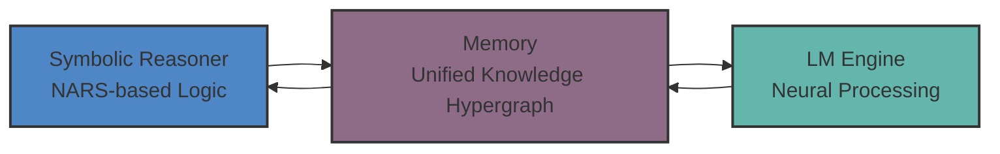
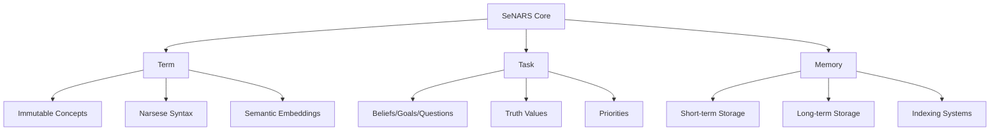
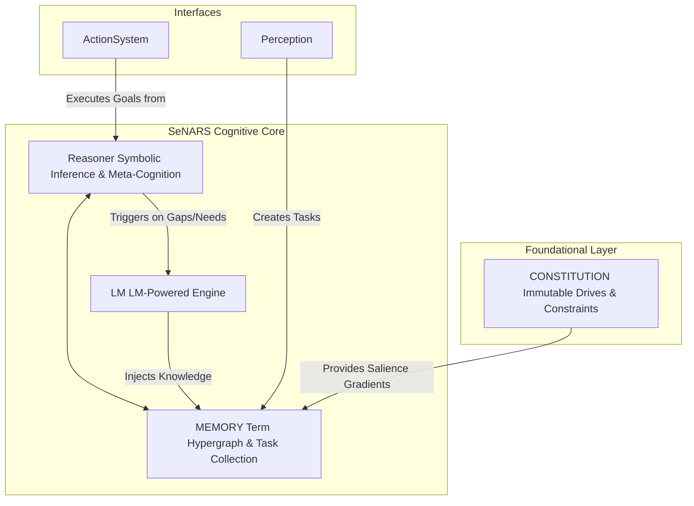
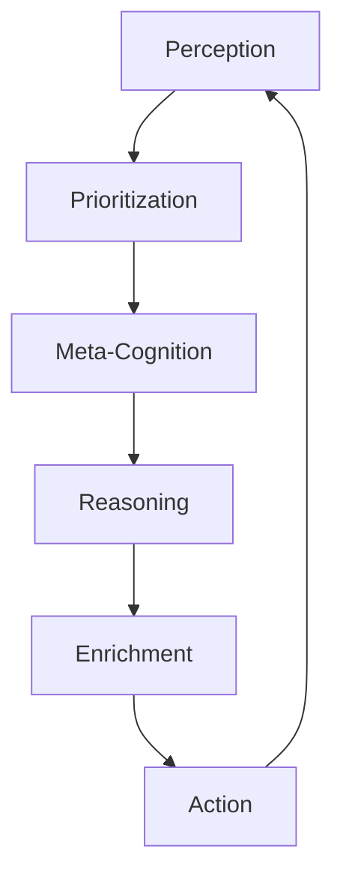
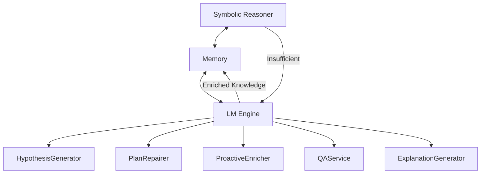
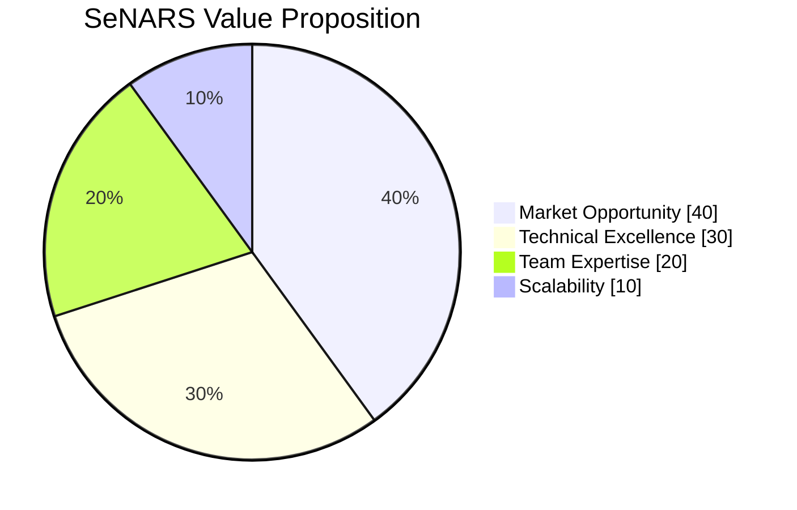

# SeNARS v2

Next-Generation Neuro-Symbolic Cognition

<div class="center text-sm opacity-75">
  Advancing AI Reliability and Power Through Neuro-Symbolic Integration
</div>

---

# SeNARS

Principled and Pragmatic Neuro-Symbolic Cognition

<div class="center text-sm opacity-75">
  Advancing AI Reliability and Power Through Neuro-Symbolic Integration
</div>

---

## Introduction

A complete cognitive architecture designed for a synergistic union of:

- **Formal symbolic reasoning**
- **Semantic power of Large Language Models (LMs)**

Today we'll explore how SeNARS combines the best of both worlds to create a transparent, reliable, and adaptive AI
system.

<div class="center text-sm mt-4">
This presentation is designed to be educational and commercially persuasive,
building understanding from foundational concepts to advanced capabilities.
</div>

---

## The Challenge

Today's powerful AI models often suffer from critical limitations:

- 📦 **Black Box Problem**: "Why did it do that?" is often unanswerable
- 📉 **Instability**: Minor input changes can cause catastrophic failures
- 🧩 **Poor Abstract Reasoning**: Struggles with logic, causality, and long-term planning

These limitations create massive barriers to deploying AI in high-value, regulated industries.

<div class="center text-sm opacity-75 mt-4">
  SeNARS addresses these fundamental limitations through principled design
</div>

---

## What is Neuro-Symbolic AI?

Neuro-symbolic AI combines the best of both worlds:

| Approach            | Strengths                                                    | Limitations                               |
|---------------------|--------------------------------------------------------------|-------------------------------------------|
| **Neural Networks** | Pattern recognition, uncertainty handling, unstructured data | Opaque, unstable, poor abstract reasoning |
| **Symbolic AI**     | Logical reasoning, knowledge representation, explainability  | Rigid, limited creativity, brittle        |

---

## Benefits of Neuro-Symbolic Integration

The integration creates systems that are:

- ✅ More interpretable than pure neural approaches
- ✅ More flexible than purely symbolic systems
- ✅ Better at generalizing from limited examples
- ✅ Capable of both intuitive and logical reasoning

<div class="grid grid-cols-2 gap-4 mt-4">
  <div class="text-center p-4 bg-opacity-20 bg-white rounded">
    <div class="text-2xl mb-2">🧠</div>
    <div class="text-lg font-semibold">Symbolic Reasoning</div>
    <div class="text-sm opacity-75">Logic & Structure</div>
  </div>
  <div class="text-center p-4 bg-opacity-20 bg-white rounded">
    <div class="text-2xl mb-2">🤖</div>
    <div class="text-lg font-semibold">Neural Processing</div>
    <div class="text-sm opacity-75">Pattern Recognition</div>
  </div>
</div>

---

## SeNARS: The Neuro-Symbolic Bridge

SeNARS creates a powerful synergy between formal symbolic reasoning and the semantic power of Large Language Models.



This integration enables:

- **Rigorous logical reasoning** from the symbolic component
- **Creative semantic understanding** from the neural component
- **Bidirectional knowledge exchange** between both systems

---

## Introducing SeNARS

SeNARS is a **neuro-symbolic** architecture that delivers **explainable, robust, and adaptive AI**.

<div class="grid grid-cols-2 gap-2 mt-4 mb-4">
  <div class="text-center text-sm p-2 bg-blue-500 bg-opacity-20 rounded">
    Transparent
  </div>
  <div class="text-center text-sm p-2 bg-green-500 bg-opacity-20 rounded">
    Adaptive
  </div>
  <div class="text-center text-sm p-2 bg-purple-500 bg-opacity-20 rounded">
    Principled
  </div>
  <div class="text-center text-sm p-2 bg-yellow-500 bg-opacity-20 rounded">
    Synergistic
  </div>
</div>

Key difference:

- **Transparent Reasoning**: Trace every conclusion back to its premises
- **Immutable Constitution**: Ensures alignment with core principles
- **Self-Correction**: Reasons about its own failures and improves
- **True Synergy**: Symbolic reasoning + LM creativity ≠ Black box

**SeNARS is built for high-stakes applications where trust is non-negotiable.**

---

## Market Opportunity

Explainable AI (XAI) is the key to unlocking high-value markets:

| Market                         | Value | Why XAI Matters                                          |
|--------------------------------|-------|----------------------------------------------------------|
| **Financial Services**         | $10B+ | Algorithmic trading, credit scoring, compliance          |
| **Healthcare & Life Sciences** | $15B+ | Medical diagnosis, drug discovery, personalized medicine |
| **Autonomous Systems**         | $20B+ | Self-driving vehicles, robotics, industrial automation   |

**SeNARS captures these markets where standard "black-box" solutions are too risky.**

---

## SeNARS Competitive Edge

| Feature            | Pure LLMs                 | Traditional Symbolic AI  | **SeNARS**                   |
|--------------------|---------------------------|--------------------------|------------------------------|
| **Explainability** | ⬛️ Low                    | ✅ High                   | ✅ **High**                   |
| **Adaptability**   | 🟨 Medium                 | ⬛️ Low                   | ✅ **High**                   |
| **Creativity**     | ✅ High                    | ⬛️ Low                   | ✅ **High**                   |
| **Logical Rigor**  | 🟨 Medium                 | ✅ High                   | ✅ **High**                   |
| **Verdict**        | ✨ Creative but Unreliable | 🧱 Rigid but Explainable | ✅ **Transparent & Powerful** |

---

## Why SeNARS Stands Out

<div class="center text-lg p-4 bg-gradient-to-r from-blue-500 to-purple-500 bg-opacity-20 rounded">
SeNARS represents a fundamental advancement in AI architecture,
combining the best of symbolic and neural approaches.
</div>

---

## SeNARS Design Principles

SeNARS is built on five core design principles that ensure robust, transparent, and adaptive cognition:

<div class="grid grid-cols-3 gap-4">
  <div class="p-4 bg-blue-500 bg-opacity-20 rounded text-center">
    <div class="font-bold text-lg">1. Modularity and Decoupling</div>
    <div class="text-2xl mb-2">🧩</div>
    <ul class="text-sm space-y-2">
      <li>Components communicate through EventBus</li>
      <li>Easier maintenance and extension</li>
    </ul>
  </div>
  <div class="p-4 bg-green-500 bg-opacity-20 rounded text-center">
    <div class="font-bold text-lg">2. Explicit State Management</div>
    <div class="text-2xl mb-2">📦</div>
    <ul class="text-sm space-y-2">
      <li>All state in Task objects</li>
      <li>Single source of truth</li>
    </ul>
  </div>
  <div class="p-4 bg-yellow-500 bg-opacity-20 rounded text-center">
    <div class="font-bold text-lg">3. Strategy over Implementation</div>
    <div class="text-2xl mb-2">🎯</div>
    <ul class="text-sm space-y-2">
      <li>Dynamic algorithm selection</li>
      <li>Extensible without core changes</li>
    </ul>
  </div>
</div>

<div class="grid grid-cols-2 gap-4 mt-4">
  <div class="p-4 bg-purple-500 bg-opacity-20 rounded text-center">
    <div class="font-bold text-lg">4. Meta-Cognition</div>
    <div class="text-2xl mb-2">🔄</div>
    <ul class="text-sm space-y-2">
      <li>Self-reflection as core component</li>
      <li>Self-correction mechanisms</li>
    </ul>
  </div>
  <div class="p-4 bg-red-500 bg-opacity-20 rounded text-center">
    <div class="font-bold text-lg">5. Pragmatism under Scarcity</div>
    <div class="text-2xl mb-2">💰</div>
    <ul class="text-sm space-y-2">
      <li>Finite resources assumption</li>
      <li>Economic attention model</li>
    </ul>
  </div>
</div>

---

## Core Components: Term, Task, and Memory

SeNARS is built on three fundamental components:

<div class="grid grid-cols-3 gap-4 mb-4">
  <div class="text-center p-4 bg-blue-500 bg-opacity-20 rounded">
    <div class="text-2xl">🔤</div>
    <div class="font-bold text-lg">Term</div>
    <div class="text-sm">Immutable Concepts</div>
  </div>
  <div class="text-center p-4 bg-green-500 bg-opacity-20 rounded">
    <div class="text-2xl">🎯</div>
    <div class="font-bold text-lg">Task</div>
    <div class="text-sm">Cognitive Atoms</div>
  </div>
  <div class="text-center p-4 bg-purple-500 bg-opacity-20 rounded">
    <div class="text-2xl">💾</div>
    <div class="font-bold text-lg">Memory</div>
    <div class="text-sm">Knowledge Graph</div>
  </div>
</div>

---

## Understanding Terms

**Term** - Immutable representations of concepts:

- **Examples**: `cat`, `(cat --> animal)`, `(cat ==> furry)`
- **Key Properties**:
    - Parses their own structure for efficiency
    - Grounded with semantic embeddings from LMs
    - Serve as the stable vocabulary of the system

```javascript
// Example Term structure
const catTerm = new Term('cat');
const inheritanceTerm = new Term('(cat --> animal)');
```

Terms are the building blocks of all knowledge in SeNARS, providing:

- **Semantic Grounding**: Connected to meaning through LM embeddings
- **Structural Intelligence**: Self-parsing for efficient access to components
- **Stability**: Immutable nature ensures consistency across reasoning

---

## Understanding Tasks

**Task** - Stateful cognitive atoms representing beliefs, goals, or questions:

- **Structure**:
    - `id`: Unique identifier
    - `termKey`: Foreign key to a Term
    - `punctuation`: `.`, `!`, or `?` (Belief, Goal, Question)
- **State**:
    - Truth values (frequency, confidence)
    - Dynamic priorities for attention allocation
    - Temporal stamps (creation, occurrence times)

```javascript
// Example Task structure
const beliefTask = new Task(
    '(cat --> animal)',
    '.',
    {frequency: 1.0, confidence: 0.9}
);
```

Tasks represent the dynamic aspects of cognition:

- **Evidence-Based**: Truth values updated through Bayesian revision
- **Attention-Aware**: Priority scores for economic attention model
- **Time-Conscious**: Temporal stamps for reasoning about events

---

## Understanding Memory

**Memory** - Unified knowledge hypergraph managing Terms and Tasks:

- **Dual Storage System**:
    - Short-term: Active tasks prioritized for immediate processing
    - Long-term: Consolidated tasks with high importance/confidence
- **Specialized Indexes**:
    - Belief Index: For efficient retrieval
    - Implication Index: For planning knowledge
    - Cost Index: For action costs
- **Forgetting Mechanisms**: Time-based pruning of expired tasks



---

## Understanding the SeNARS Architecture

At its core, SeNARS is built on a **Unified Knowledge Hypergraph**:



---

## How SeNARS "Thinks"

Think of SeNARS as a **digital brain** with distinct yet synergistic components:

1. **The Logical "Conscious Mind" (Reasoner)**
    - Handles formal, step-by-step reasoning
    - Analytical and auditable
    - Ensures every decision can be fully explained

2. **The Creative "Subconscious" (LM)**
    - Provides intuition and semantic understanding
    - Source of novel ideas and fluent language
    - Grounds symbolic knowledge in meaning

3. **The Self-Awareness (Meta-Cognition)**
    - Constantly checks for errors
    - Improves thinking over time
    - Ensures consistency and coherence

---

## The Cognitive Cycle

SeNARS operates in discrete cognitive cycles that emulate a stream of consciousness:

1. **Perception** 👁️: Ingest new information from the world
2. **Prioritization** 🎯: Apply economic attention to all tasks
3. **Meta-Cognition** 🔍: Detect and analyze reasoning failures
4. **Reasoning** 🧠: Perform inference on salient tasks
5. **Enrichment** 🌱: Process new terms and execute goals



Each cycle is a complete reasoning loop, ensuring continuous learning and adaptation.

---

## Economic Attention Model and Formal Reasoning

SeNARS implements a pragmatic attention mechanism that focuses computational resources like a stream of consciousness.

Priority calculation factors:
| Factor | Description | Impact |
|--------|-------------|--------|
| **Truth Value** | Confidence and frequency | Higher confidence = higher priority |
| **Complexity** | Structural complexity | Lower complexity = higher priority |
| **Relevance** | Relationship to active goals | More relevant = higher priority |
| **Temporal Factors** | Recency and urgency | More recent/urgent = higher priority |

SeNARS implements rigorous, explainable reasoning through formal inference rules:

| Rule             | Structure                          | Purpose                        |
|------------------|------------------------------------|--------------------------------|
| **Deduction**    | `(M --> P), (S --> M) ⊢ (S --> P)` | Classical logical deduction    |
| **Induction**    | `(M --> P), (M --> S) ⊢ (S --> P)` | Evidence-based generalization  |
| **Abduction**    | `(P --> M), (S --> M) ⊢ (S --> P)` | Hypothesis generation          |
| **Analogy**      | `(M --> P), (M <-> S) ⊢ (S --> P)` | Structure-preserving inference |
| **Modus Ponens** | `(P ==> Q), P ⊢ Q`                 | Conditional reasoning          |

---

## The Neuro-Symbolic Bridge

SeNARS integrates LMs as a suite of specialized services, not a black box:

- **HypothesisGenerator**: Creative abduction and pattern discovery
- **PlanRepairer**: Novel solutions when plans fail
- **ProactiveEnricher**: Expanding knowledge graph based on new info
- **QAService**: Fluent natural language interaction
- **ExplanationGenerator**: Translate formal reasoning into natural language

This creates powerful synergy: the **Reasoner** provides rigor, while the **LM** provides creativity and grounding.



---

## Meta-Cognition and Planning

SeNARS is designed for **recursive self-improvement**:

1. **Detection**: Constantly scans for contradictions between new conclusions and existing beliefs
2. **Analysis**: Classifies conflicts and selects best resolution strategy
3. **Correction**: Generates new Tasks (e.g., Questions) with high priority to resolve inconsistencies

| Strategy               | Approach                     | Use Case                           |
|------------------------|------------------------------|------------------------------------|
| **Revision**           | Truth value revision         | Directly conflicting beliefs       |
| **Reconciliation**     | Contextual resolution        | Beliefs true in different contexts |
| **Evidence Gathering** | Generate questions           | Need more information              |
| **Temporal Analysis**  | Time-based resolution        | Temporal conflicts                 |
| **Causal Analysis**    | Examine causal relationships | Causal contradictions              |

SeNARS supports multiple planning strategies for goal achievement:

| Strategy                            | Approach                                       | Benefits                              |
|-------------------------------------|------------------------------------------------|---------------------------------------|
| **HTN (Hierarchical Task Network)** | Decompose complex goals into primitive actions | Structured, systematic planning       |
| **A* Search**                       | Graph-based pathfinding with heuristics        | Optimal solutions with custom weights |

Key features:

- Plan cost calculation
- Task difficulty assessment
- Dynamic strategy selection
- Plan validation (check if goals already achieved)

---

## Temporal Reasoning

SeNARS implements sophisticated temporal reasoning capabilities:

- **Temporal Relationship Inference**: Determine relationships between events
- **Pattern Detection**: Identify periodic and sequential patterns
- **Future Prediction**: Forecast future task occurrences
- **Anomaly Detection**: Identify temporal anomalies

Specialized temporal term types:

- **Predictive Implication**: `(task1 => task2)` - task1 predicts task2
- **Retrospective Implication**: `(task1 =/> task2)` - task1 implies task2 occurred after
- **Concurrent Implication**: `(task1 =<> task2)` - task1 and task2 occur concurrently

---

## The Constitution: Immutable Foundation

The **`Constitution`** defines the system's core motives and safety constraints:

**Core Drives** (High-priority, permanent goals):

- `AcquireKnowledge!` - Fundamental drive to learn and understand
- `ReduceUncertainty!` - Drive to resolve unknowns and ambiguities
- `MaintainCoherence!` - Drive to resolve contradictions and maintain consistency
- `MaintainCognitiveIntegrity!` - Meta-cognitive drive for self-improvement

**Safety Constraints** (Immutable beliefs about negative outcomes):

- `((&, self, cause_harm) ==> NEGATIVE_OUTCOME).`

The `Constitution` bootstraps the attention mechanism and anchors behavior to foundational principles.

---

## Narsese: Formal Knowledge Representation

SeNARS supports a comprehensive set of Narsese expressions:

| Type                       | Syntax                     | Example                             |
|----------------------------|----------------------------|-------------------------------------|
| **Atomic Terms**           | Simple identifiers         | `cat`                               |
| **Inheritance**            | `(subject --> predicate)`  | `(cat --> mammal)`                  |
| **Implication**            | `(premise ==> conclusion)` | `(cat ==> furry)`                   |
| **Negation**               | `(--, term)`               | `(--, cat)`                         |
| **Conjunction**            | `(&, term1, term2, ...)`   | `(&, cat, dog)`                     |
| **Disjunction**            | `(                         |                                     |, term1, term2, ...)` | `(||, cat, dog)` |
| **Extensional Difference** | `(#, term1, term2)`        | `(#, cat, dog)`                     |
| **Intensional Difference** | `(\, term1, term2)`        | `(\, cat, dog)`                     |
| **Instance**               | `(term {-- class)`         | `(cat {-- animal)`                  |
| **Property**               | `(term --} property)`      | `(cat --} furry)`                   |
| **Nested Expressions**     | Complex combinations       | `(cat --> (&, furry, intelligent))` |

This formal language enables precise knowledge representation and logical reasoning.

---

## Narsese: A Deeper Dive

Narsese is a formal language designed for knowledge representation in AI systems that operate under uncertainty.

**Key Features:**

- **Experience-Grounded Semantics**: Meaning is derived from the system's experiences, not predefined axioms.
- **Unified Representation**: Represents diverse types of knowledge, including beliefs, goals, and questions.
- **Simple Syntax**: A small set of term constructors can be combined to create complex expressions.
- **Truth-Value System**: Each statement is associated with a truth value that represents evidence from experience.

**Example: `(cat --> animal). %1.0;0.9%`**

- `(cat --> animal)`: The statement, representing the inheritance relationship.
- `%1.0;0.9%`: The truth value, indicating high frequency and confidence.

This structure allows SeNARS to reason about the world in a way that is both formal and flexible.

---

## Implementation Details

SeNARS is implemented with modern software engineering practices:

- **Language**: JavaScript/Node.js for cross-platform compatibility
- **Architecture**: Event-driven design with decoupled components
- **Performance**: Probabilistic data structures for efficient task selection
- **Extensibility**: Plugin architecture for adding new capabilities
- **Testing**: Comprehensive unit and integration tests
- **Documentation**: Self-documenting code with inline examples

Key implementation features:

- Term parsing caching for performance optimization
- Bag data structure for probabilistic priority selection
- Lazy evaluation of complex term structures
- Batch processing for embedding generation
- Memory management with forgetting strategies

These implementation details ensure SeNARS is both powerful and practical.

---

## Development Roadmap

<div class="grid grid-cols-2 gap-4 mb-4">
  <div class="p-4 bg-blue-500 bg-opacity-20 rounded">
    <div class="font-bold text-lg mb-2">Track 1: Core Cognition & Self-Improvement</div>
    <ul class="text-sm space-y-1">
      <li>Short-Term: Self-tuning planners & predictive inference</li>
      <li>Mid-Term: Principled goal refinement & cognitive sandboxing</li>
      <li>Long-Term: Auditable Constitution evolution</li>
    </ul>
  </div>
  <div class="p-4 bg-green-500 bg-opacity-20 rounded">
    <div class="font-bold text-lg mb-2">Track 2: Knowledge Architecture & Scalability</div>
    <ul class="text-sm space-y-1">
      <li>Short-Term: Vector database for rapid semantic retrieval</li>
      <li>Mid-Term: Hybrid memory system & cognitive delegation</li>
      <li>Long-Term: Decentralized knowledge graph federation</li>
    </ul>
  </div>
</div>

<div class="grid grid-cols-2 gap-4 mb-4">
  <div class="p-4 bg-yellow-500 bg-opacity-20 rounded">
    <div class="font-bold text-lg mb-2">Track 3: Cognitive Tooling & Autonomous Development</div>
    <ul class="text-sm space-y-1">
      <li>Short-Term: Interactive cognitive visualizer</li>
      <li>Mid-Term: Self-diagnosis of unit test failures</li>
      <li>Long-Term: Cognitive App Store & self-documentation</li>
    </ul>
  </div>
  <div class="p-4 bg-purple-500 bg-opacity-20 rounded">
    <div class="font-bold text-lg mb-2">Track 4: Symbiotic Intelligence</div>
    <ul class="text-sm space-y-1">
      <li>Short-Term: Explainable AI (XAI) narratives</li>
      <li>Mid-Term: Mixed-initiative collaborative reasoning</li>
      <li>Long-Term: Proactive cognitive augmentation</li>
    </ul>
  </div>
</div>

<div class="p-4 bg-red-500 bg-opacity-20 rounded mb-4">
  <div class="font-bold text-lg mb-2">Track 5: Future Enhancements</div>
  <ul class="text-sm grid grid-cols-2 gap-2">
    <li>Enhanced meta-cognition</li>
    <li>Advanced LM capabilities</li>
    <li>Complex perception interfaces</li>
    <li>Extended action execution</li>
    <li>Improved temporal reasoning</li>
  </ul>
</div>

<div class="center text-sm">
These tracks focus on making SeNARS a true cognitive partner that works symbiotically with humans,
enhancing rather than replacing human intelligence.
</div>

---

## Investor-Ready Highlights

SeNARS is designed from the ground up to deliver value and attract investment:

- 📈 **Built to Scale**: Clear architectural path to enterprise-level workloads
- 💰 **High-Value Markets**: Targeting lucrative opportunities in XAI, Cognitive Automation, and Safe AI
- 👨‍💻 **Attracts Top Talent**: Clean, modular, well-documented design that developers love
- 📊 **Clear Path to ROI**: Research agenda focused on delivering commercial value at every step



<div class="center text-lg p-4 bg-gradient-to-r from-blue-500 to-purple-500 bg-opacity-20 rounded">
SeNARS represents a unique investment opportunity at the intersection
of cutting-edge AI research and practical commercial applications.
</div>

---

## Verified Capabilities

All SeNARS functionality has been verified through comprehensive unit tests and runnable demos:

<div class="grid grid-cols-2 gap-4">
  <div class="p-4 bg-blue-500 bg-opacity-20 rounded">
    <div class="font-bold text-lg mb-2">Core Knowledge Representation</div>
    <ul class="text-sm space-y-1">
      <li>Immutable Term system with intelligent parsing</li>
      <li>Task system with truth value management</li>
      <li>Semantic grounding with vector embeddings</li>
    </ul>
  </div>
  <div class="p-4 bg-green-500 bg-opacity-20 rounded">
    <div class="font-bold text-lg mb-2">Reasoning Engine</div>
    <ul class="text-sm space-y-1">
      <li>Formal inference with deduction, induction, abduction, and analogy</li>
      <li>Contradiction detection with multiple resolution strategies</li>
      <li>Hierarchical Task Network (HTN) and A* planning</li>
    </ul>
  </div>
</div>

### Advanced Features

- Temporal reasoning with pattern detection and future prediction
- Neuro-symbolic integration with hypothesis generation and explanation
- Economic attention model with probabilistic task selection

### Demonstrated Capabilities

- Inheritance chaining and modus ponens inference
- Contradiction detection and resolution
- Multi-step planning with complex goal decomposition
- Self-reflection and self-improvement mechanisms

These capabilities represent a solid foundation for building robust, explainable AI systems.
