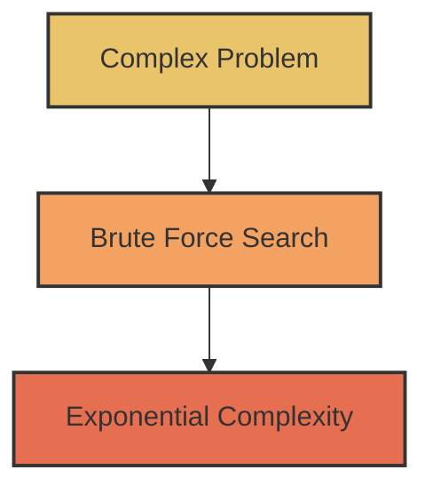
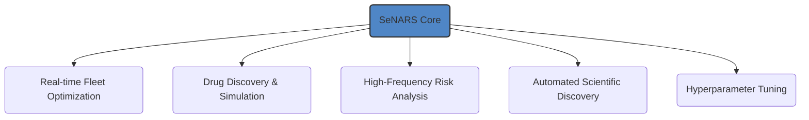
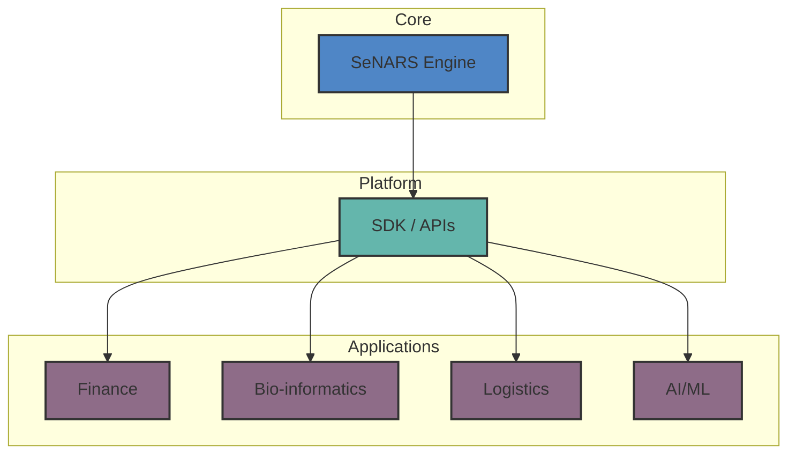

# SeNARS 🧠

Primitives for Neuro-Symbolic Cognition

<div class="center text-sm opacity-75">
  [github.com/automenta/senars8](https://github.com/automenta/senars8)
</div>

---
layout: default
---

# The Paradigm Shift 🔄

SeNARS transforms intractable search problems into straightforward inference by creating a **dynamic knowledge
hypergraph** that continuously reorganizes itself based on the system's goals.

<div class="grid grid-cols-2 gap-8 mt-8 items-start">
<div>
<div class="text-center font-bold mb-4">The Old Way</div>

<div class="text-center text-sm opacity-90 mt-4 p-3 bg-gray-800 rounded">
    Combinatorial Explosion<br>
    State-Space Search<br>
    Computational Limits

```mermaid
graph TD
    A[Dynamic Knowledge Graph] --> B[Elegant Path];
    B --> C[Solution];
    style A fill:#2a9d8f,stroke:#fff,stroke-width:2px
    style B fill:#264653,stroke:#fff,stroke-width:2px
    style C fill:#64B6AC,stroke:#fff,stroke-width:2px
```

</div>
</div>
<div>
<div class="text-center font-bold mb-4">The New Way</div>

<div class="text-center text-sm opacity-90 mt-4 p-3 bg-gray-800 rounded">
    Knowledge Reorganization<br>
    Goal-Directed Inference<br>
    Principled Cognition
</div>
</div>
</div>

---

# Core Concepts

| Concept       | Description                                                                 |
|---------------|-----------------------------------------------------------------------------|
| 🔤 **Term**   | Immutable representation of a concept. Examples: `cat`, `(cat --> animal)`. |
| 🎯 **Task**   | Stateful unit of cognitive work (a belief, goal, or question).              |
| 💾 **Memory** | Unified knowledge hypergraph storing terms and tasks.                       |

---

# System Architecture

```mermaid
graph TD
    subgraph "Cognitive Cycle"
        direction LR
        Perception --> Prioritization --> Reasoning --> MetaCognition --> Enrichment
        Enrichment --> Perception
    end

    subgraph "Core Components"
        Memory
        Reasoner
        LM
        Planner
        ActionExecutor
    end

    Cognitive Cycle -- Orchestrates --> Core Components

    subgraph "System"
        SystemAPI
        SystemFactory
        IntrospectionAPI
    end

    SystemAPI -- Manages --> Cognitive Cycle
    SystemFactory -- Assembles --> SystemAPI
```

---

# Key Features

- **🧠 Dual-Engine**: Combines the rigor of symbolic logic with the creativity of large language models.
- **🔄 Meta-Cognition**: Self-improves by detecting and resolving its own reasoning failures.
- **🏛️ Immutable Constitution**: Core motives and safety constraints are built-in and unchangeable.
- **🔌 Pluggable Design**: Easily extend or replace any component, from the reasoner to the memory system.

---

# A Universe of Applications

SeNARS is a **general-purpose technology** for complex reasoning under uncertainty.



---

# The Platform 🧩

SeNARS is a **foundational layer** for intelligent systems.



<div class="absolute bottom-10 right-10 text-center">
  
  <div class="text-sm opacity-75">AGPL-3.0-or-later License</div>
</div>

---

# SeNARS 🧠

A New Primitive for Neuro-Symbolic Cognition

<div class="center text-lg mt-8">
  Thank you.
</div>

<div class="center text-sm opacity-75 mt-4">
  [github.com/automenta/senars8](https://github.com/automenta/senars8)
</div>
