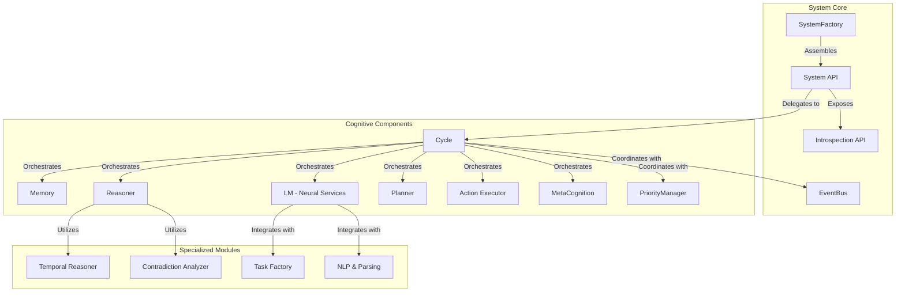
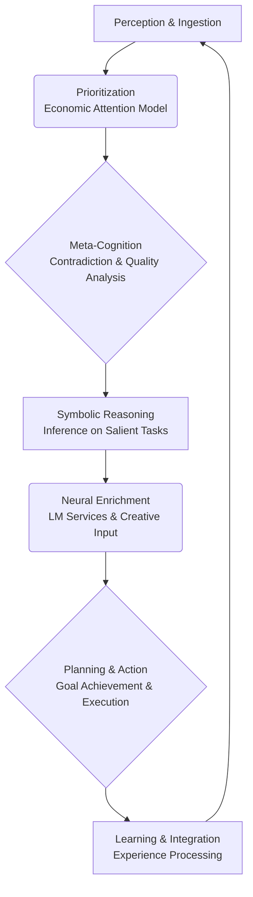
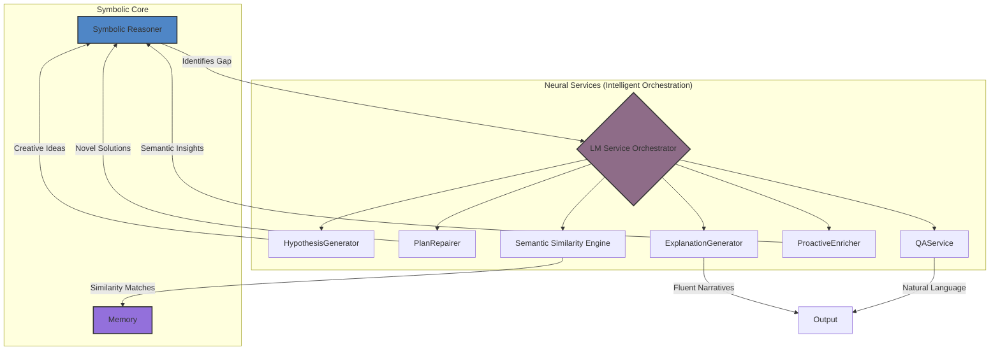
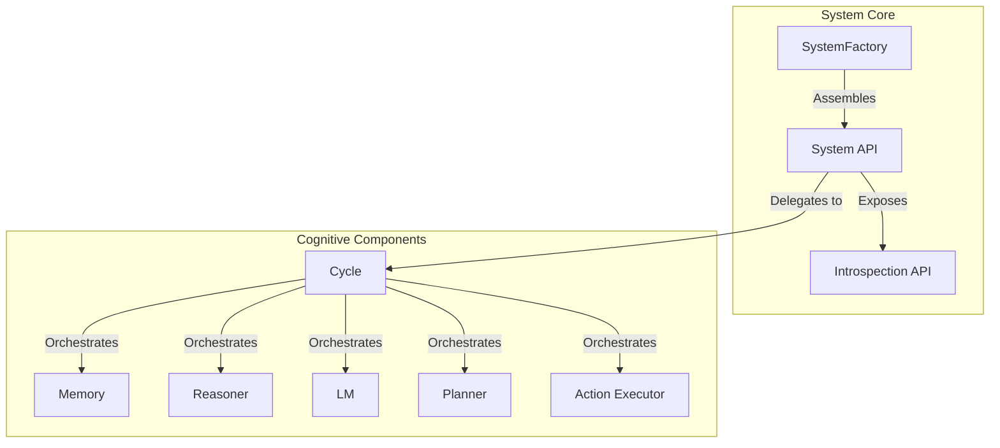
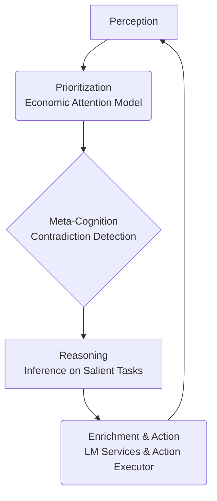
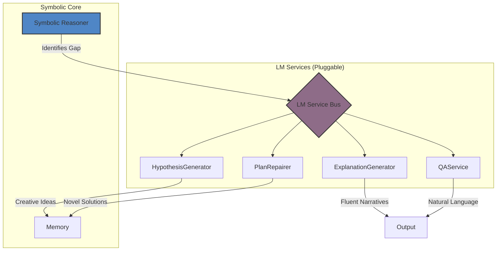

# SeNARS

## A Technical Deep Dive: Unlocking Neuro-Symbolic Intelligence

  For Developers, Researchers, and Cognitive Architects

---

# Agenda

1. **Core Architecture & Philosophy: The Foundation of Cognitive Intelligence**
2. **The Cognitive Cycle: How SeNARS "Thinks" - The Rhythm of Intelligence**
3. **Knowledge Representation: Narsese Grammar - The Language of Cognition**
4. **The Neuro-Symbolic Bridge in Detail: Where Logic Meets Creativity**
5. **Advanced Reasoning: Temporal & Planning - Sophisticated Cognitive Processes**
6. **Cognitive Control & Self-Improvement: Meta-Cognition in Action**
7. **Performance & Scalability: Optimized Cognitive Processing**
8. **Development Roadmap: The Future of Cognitive Architectures**

---

# 1. Core Architecture & Philosophy: The Foundation of Cognitive Intelligence

- **Pragmatism under Scarcity**: The system operates under the fundamental assumption of finite computational resources,
  implementing sophisticated resource allocation strategies.
- **Economic Attention**: A dynamic priority system that directs cognitive focus to the most salient `Task`s based on
  multiple factors including relevance, uncertainty, and potential value.
- **Unified Knowledge Hypergraph**: All `Term`s and `Task`s reside in an integrated `Memory` component with
  sophisticated indexing and retrieval mechanisms.
- **Modularity & Extensibility**: Components are decoupled and assembled by a `SystemFactory`, supporting customization
  and extension for specialized applications.
- **Cognitive Transparency**: All reasoning processes are traceable and explainable, ensuring trustworthiness and
  auditability.

**Realizable Potential:**
The architecture's modular design enables creation of specialized cognitive agents for specific domains while
maintaining the core neuro-symbolic capabilities. This supports applications from personal assistants to industrial
automation systems, all built on the same robust cognitive foundation.

---

# The Three Pillars: Term, Task, Memory

  

    
Term

    
🔤

    
An **immutable** representation of a concept. The stable vocabulary of the system with lazy parsing and semantic embeddings.

    
`(cat --> animal)`

  

  

    
Task

    
🎯

    
A **stateful** unit of cognitive work with dynamic priority, truth values, and temporal properties. The atom of cognition.

    
`Task { term: "(cat --> animal)", punc: '.', truth: { f:1, c:0.9 }, priority: 0.75 }`

  

  

    
Memory

    
💾

    
The central **knowledge hypergraph** with dual-store architecture, specialized indexes, and intelligent forgetting mechanisms.

    
`Memory { shortTerm: [...], longTerm: [...], indexes: {...} }`

  

---

# 2. The Cognitive Cycle: How SeNARS "Thinks" - The Rhythm of Intelligence

The cognitive cycle represents SeNARS' approach to continuous, real-time reasoning. Unlike batch processing systems,
SeNARS operates in discrete cycles that mirror human thought processes, balancing immediate needs with long-term
objectives.

| Phase                      | Description                                                                                                                            | Cognitive Load | Output                                         |
|----------------------------|----------------------------------------------------------------------------------------------------------------------------------------|----------------|------------------------------------------------|
| **Perception & Ingestion** | Ingests new information from the environment into `Task`s using `TaskFactory`. Handles multiple input types and validation.            | Low to Medium  | New `Task` objects with initial state          |
| **Prioritization**         | Calculates the priority of all `Task`s in `Memory` using sophisticated algorithms considering relevance, urgency, and cognitive value. | Medium         | Prioritized task queues and focus sets         |
| **Meta-Cognition**         | Scans for contradictions, reasoning failures, and knowledge gaps, generating goals to address inconsistencies.                         | High           | Contradiction reports and repair goals         |
| **Symbolic Reasoning**     | Applies formal inference rules to high-priority `Task`s to derive new knowledge with complete transparency.                            | High           | Derived `Task`s with reasoning traces          |
| **Neural Enrichment**      | Triggers LM services for creative input, similarity searches, and natural language processing.                                         | Variable       | Enriched knowledge and semantic insights       |
| **Planning & Action**      | For goal tasks, executes planning algorithms and action execution for goal achievement.                                                | Medium to High | Action plans and execution results             |
| **Learning & Integration** | Processes experience, updates beliefs, and consolidates learning for future use.                                                       | Medium         | Updated knowledge base and improved strategies |

**Realizable Potential:**
This cyclical approach enables SeNARS to operate continuously while adapting to new information and changing goals. The
system can handle real-time inputs while maintaining focus on important objectives and learning from experience.

---

# 3. Knowledge Representation: Narsese Grammar - The Language of Cognition

SeNARS employs a rich, formal grammar called Narsese as the foundation for rigorous, explainable reasoning. This grammar
enables precise expression of complex relationships and supports sophisticated cognitive operations including temporal
reasoning and causal analysis.

| Type                          | Syntax                      | Example                             | Cognitive Purpose                                                |
|-------------------------------|-----------------------------|-------------------------------------|------------------------------------------------------------------|
| **Inheritance**               | `(subject --> predicate)`   | `(cat --> mammal)`                  | Represents "is-a" relationships and hierarchical knowledge.      |
| **Implication**               | `(premise ==> conclusion)`  | `(raining ==> wet_streets)`         | Represents predictive or causal links with temporal aspects.     |
| **Conjunction**               | `(&, term1, term2, ...)`    | `(&, cat, furry, pet)`              | Represents logical AND and complex, multi-faceted concepts.      |
| **Disjunction**               | `(\|, term1, term2, ...)`   | `(\|, cat, dog, bird)`              | Represents logical OR and alternative possibilities.             |
| **Negation**                  | `(--, term)`                | `(--, (cat --> bird))`              | Represents logical NOT and contradiction handling.               |
| **Temporal Implication**      | `(premise =/> conclusion)`  | `(see_lightning =/> hear_thunder)`  | Represents temporal sequences and cause-effect relationships.    |
| **Retrospective Implication** | `(premise =\\> conclusion)` | `(hear_thunder =\\> see_lightning)` | Represents backward temporal reasoning and diagnostic inference. |
| **Concurrent Implication**    | `(premise <=> conclusion)`  | `(lightning <=> thunder)`           | Represents synchronous or concurrent relationships.              |
| **Instance**                  | `(instance {-- class)`      | `(fluffy {-- cat)`                  | Represents specific instances of general concepts.               |
| **Property**                  | `(object --} property)`     | `(cat --} furry)`                   | Represents attribute relationships and characteristics.          |
| **Operation**                 | `(&/, action, condition)`   | `(&/, clean, dirty_room)`           | Represents conditional operations and action planning.           |

**Advanced Narsese Expressions:**

- **Nested Expressions**: `(cat --> (&, mammal, pet, (furry --> cute)))` - Complex concept combinations
- **Higher-Order Relations**: `((A --> B) --> (C --> D))` - Relationships between relations
- **Temporal Sequences**: `(&/, (A =/> B), (B =/> C))` - Complex temporal reasoning
- **Uncertainty Expressions**: Intrinsic truth value representation with frequency and confidence

This formal grammar is the bedrock of SeNARS' capability for rigorous, explainable reasoning and complex
problem-solving.

---

# 4. The Neuro-Symbolic Bridge in Detail: Where Logic Meets Creativity

The integration of neural and symbolic components in SeNARS represents a sophisticated approach to cognitive
architecture. Rather than a simple connection, it's a deep, bidirectional integration where each component enhances the
other's capabilities.

**Integration Mechanisms:**

- **Semantic Embeddings**: Each `Term` maintains vector representations enabling similarity calculations and analogical
  reasoning
- **Dynamic Service Invocation**: The symbolic core intelligently calls neural services when symbolic reasoning
  encounters limitations
- **Bidirectional Learning**: Neural insights are validated and integrated into the symbolic knowledge base; symbolic
  structure guides neural processing
- **Contextual Neural Processing**: Neural services operate with full awareness of current cognitive context and
  objectives

**Realizable Potential:**
This integration enables capabilities beyond either component alone: creative hypothesis generation guided by logical
constraints, precise reasoning enhanced by semantic understanding, and explainable outputs enriched by natural language
fluency.

---

# 5. Advanced Reasoning: Temporal & Planning - Sophisticated Cognitive Processes

### Temporal Reasoning Capabilities

SeNARS implements sophisticated mechanisms for reasoning about time, causality, and change, enabling complex
understanding of dynamic situations.

- **Multi-Timescale Analysis**: Reasoning across multiple temporal granularities from milliseconds to years
- **Causal Chain Analysis**: Inferring cause-effect relationships and understanding how events lead to outcomes
- **Pattern Recognition in Time**: Identifying periodic, sequential, and cyclical patterns in data
- **Future Prediction**: Forecasting future `Task` occurrences and potential outcomes based on learned temporal
  implications
- **Anomaly Detection**: Identifying temporal anomalies and unexpected deviations from learned patterns
- **Counterfactual Reasoning**: Exploring "what-if" scenarios with temporal implications

### Temporal Term Types & Operations

| Type                          | Syntax               | Example                               | Cognitive Application                                  |
|-------------------------------|----------------------|---------------------------------------|--------------------------------------------------------|
| **Predictive Implication**    | `(task1 =/> task2)`  | `(see_lightning =/> hear_thunder)`    | Predicting future events based on current observations |
| **Retrospective Implication** | `(task1 \\> task2)`  | `(wet_streets \\> rained_last_night)` | Diagnostic reasoning and cause identification          |
| **Concurrent Implication**    | `(task1 <=> task2)`  | `(lightning <=> thunder)`             | Understanding simultaneous events                      |
| **Duration Representation**   | `(event [duration])` | `(meeting [60_minutes])`              | Representing event durations and temporal extents      |
| **Temporal Ordering**         | `(event1 < event2)`  | `(breakfast < lunch)`                 | Representing sequence relationships                    |

### Planning Architecture

The system supports sophisticated planning strategies with intelligent selection and execution:

- **Hierarchical Task Networks (HTN)**: The default planner decomposes complex goals into structured networks of
  subtasks
- **A* Search**: Optimal pathfinding planner for problems requiring optimal solutions
- **Temporal Planning**: Planning with temporal constraints and scheduling requirements
- **Multi-Agent Planning**: Coordinating actions across multiple cognitive agents
- **Contingency Planning**: Creating alternative plans for different potential future states

### Planning Features & Capabilities

| Feature                        | Implementation                                                     | Realizable Potential                               |
|--------------------------------|--------------------------------------------------------------------|----------------------------------------------------|
| **Plan Cost Calculation**      | Sophisticated cost models considering resources, time, and risk    | Optimization of resource allocation and efficiency |
| **Task Difficulty Assessment** | Dynamic difficulty evaluation based on knowledge availability      | Intelligent allocation of cognitive resources      |
| **Dynamic Strategy Selection** | Automatic selection of planning strategy based on problem type     | Adaptive problem-solving capabilities              |
| **Plan Validation**            | Checking if goals are already achieved or if preconditions are met | Prevention of unnecessary planning cycles          |
| **Plan Repair**                | Automatic identification and repair of failed plan components      | Robust execution in dynamic environments           |
| **Plan Monitoring**            | Real-time monitoring of plan execution and progress                | Adaptive response to changing conditions           |

---

# 6. Cognitive Control & Self-Improvement: Meta-Cognition in Action

### Meta-Cognitive Architecture

SeNARS implements sophisticated meta-cognitive capabilities that enable the system to monitor, reflect on, and improve
its own cognitive processes:

- **Cognitive State Monitoring**: Continuous assessment of reasoning effectiveness, resource utilization, and
  performance metrics
- **Self-Reflection**: Analysis of reasoning patterns, identification of ineffective strategies, and identification of
  improvement opportunities
- **Strategy Optimization**: Dynamic adjustment of cognitive strategies based on effectiveness and context
- **Belief Revision**: Systematic updating of beliefs based on new evidence and reasoning outcomes
- **Goal Refinement**: Intelligent refinement and adjustment of objectives based on changing circumstances

### Contradiction Detection & Resolution

SeNARS features sophisticated contradiction handling through multiple layered mechanisms:

1. **Detection**: Comprehensive scanning for logical inconsistencies, temporal contradictions, and belief conflicts
2. **Classification**: Categorization of contradictions by type, severity, and potential impact
3. **Resolution Strategy Selection**: Intelligent choice of resolution approach based on contradiction characteristics
4. **Implementation**: Execution of resolution strategies with preservation of important knowledge
5. **Verification**: Validation of resolution effectiveness and consistency restoration

### Resolution Strategies & Implementation

| Strategy                      | Approach                                                    | Application Domain                   | Cognitive Benefit                                        |
|-------------------------------|-------------------------------------------------------------|--------------------------------------|----------------------------------------------------------|
| **Bayesian Revision**         | Statistical updating of truth values based on new evidence  | Uncertain or probabilistic knowledge | Gradual, evidence-based belief updating                  |
| **Contextual Resolution**     | Resolution based on situational context and constraints     | Context-dependent knowledge          | Preservation of valid beliefs in different contexts      |
| **Evidence Gathering**        | Generation of questions to collect additional information   | Insufficient information scenarios   | Informed decision-making through information acquisition |
| **Temporal Analysis**         | Resolution considering temporal aspects and change          | Time-dependent contradictions        | Proper handling of temporal evolution of beliefs         |
| **Causal Analysis**           | Examination of causal relationships to understand conflicts | Cause-effect relationship conflicts  | Root-cause identification and resolution                 |
| **Priority-Based Resolution** | Resolution based on task priority and importance            | Resource-constrained scenarios       | Optimal allocation of cognitive resources                |

**Realizable Potential:**
These meta-cognitive capabilities enable SeNARS to function as a truly autonomous cognitive system that continuously
improves its performance, adapts to new situations, and maintains the integrity of its knowledge base over extended
operations.

---

# 7. Performance & Scalability: Optimized Cognitive Processing

### Optimization Strategies

SeNARS implements multiple layers of optimization to ensure efficient cognitive processing:

- **Lazy Evaluation**: Computation is deferred until results are actually needed, reducing unnecessary processing
- **Caching Mechanisms**: Frequently accessed computations and results are cached for rapid retrieval
- **Indexing Strategies**: Sophisticated indexing enables rapid retrieval of relevant information during reasoning
- **Memory Management**: Intelligent allocation and deallocation of memory resources
- **Parallel Processing**: Where possible, cognitive operations are designed to support parallel execution

### Scalability Mechanisms

| Component            | Scalability Strategy                                                  | Performance Benefit                           |
|----------------------|-----------------------------------------------------------------------|-----------------------------------------------|
| **Memory**           | Dual-store architecture with intelligent consolidation and forgetting | Maintains performance as knowledge base grows |
| **Reasoning**        | Focus-set selection and priority-based processing                     | Processes most important tasks first          |
| **Neural Services**  | Batch processing and pipeline optimization                            | Efficient neural computation                  |
| **Inference Rules**  | Selective application and conflict-directed reasoning                 | Reduces redundant inference                   |
| **Event Processing** | Asynchronous event handling and queuing                               | Smooth processing under load                  |

---

# 8. Development Roadmap: The Future of Cognitive Architectures

We are actively advancing SeNARS' capabilities across multiple dimensions to realize the full potential of
neuro-symbolic cognitive systems.

  

    
Core Cognition & Self-Improvement

    <ul class="text-sm space-y-1 list-disc list-inside">
      <li>Self-tuning planners with learning-based optimization</li>
      <li>Principled goal refinement and hierarchical objective management</li>
      <li>Auditable Constitution evolution with change tracking</li>
      <li>Advanced meta-cognitive control mechanisms</li>
      <li>Self-improving reasoning strategies</li>
    </ul>
  

  

    
Knowledge Architecture & Scalability

    <ul class="text-sm space-y-1 list-disc list-inside">
      <li>Vector database integration for semantic search</li>
      <li>Hybrid memory systems with external storage options</li>
      <li>Decentralized knowledge federation for multi-agent systems</li>
      <li>Advanced forgetting algorithms for lifelong learning</li>
      <li>Scalable neural service architectures</li>
    </ul>
  

  

    
Advanced Reasoning & Temporal Capabilities

    <ul class="text-sm space-y-1 list-disc list-inside">
      <li>Probabilistic reasoning with uncertainty propagation</li>
      <li>Advanced temporal reasoning with complex intervals</li>
      <li>Multi-agent coordination and communication</li>
      <li>Causal reasoning with counterfactual analysis</li>
      <li>Quantitative reasoning with mathematical operations</li>
    </ul>
  

  

    
Integration & Application

    <ul class="text-sm space-y-1 list-disc list-inside">
      <li>Industry-specific knowledge bases and ontologies</li>
      <li>Real-time integration with enterprise systems</li>
      <li>Edge computing optimizations for deployment</li>
      <li>Enhanced explainability and visualization tools</li>
      <li>Regulatory compliance and audit capabilities</li>
    </ul>
  

---

# Q&A

  Exploring the Future of Cognitive Architectures

---

# 1. Core Architecture & Philosophy

- **Pragmatism under Scarcity**: The system operates under the assumption of finite computational resources.
- **Economic Attention**: A priority system that directs focus to the most salient `Task`s.
- **Unified Knowledge Hypergraph**: All `Term`s and `Task`s reside in a central `Memory` component.
- **Modularity & Extensibility**: Components are decoupled and assembled by a `SystemFactory`.

---

# The Three Pillars: Term, Task, Memory

  

    
Term

    
🔤

    
An **immutable** representation of a concept. The stable vocabulary of the system.

    
`(cat --> animal)`

  

  

    
Task

    
🎯

    
A **stateful** unit of cognitive work (belief, goal, or question) with dynamic priority.

    
`Task { term: "(cat --> animal)", punc: '.', truth: { f:1, c:0.9 } }`

  

  

    
Memory

    
💾

    
The central **knowledge hypergraph** with specialized indexes and a forgetting mechanism.

    
`Memory { terms: [...], tasks: [...] }`

  

---

# 2. The Cognitive Cycle

The system "thinks" in a discrete loop that orchestrates all cognitive processes.

| Phase              | Description                                                                      |
|--------------------|----------------------------------------------------------------------------------|
| **Perception**     | Ingests new information from the environment into `Task`s.                       |
| **Prioritization** | Calculates the priority of all `Task`s in `Memory`.                              |
| **Meta-Cognition** | Scans for contradictions and reasoning failures, generating goals to fix them.   |
| **Reasoning**      | Applies formal inference rules to high-priority `Task`s to derive new knowledge. |
| **Enrichment**     | Triggers LM services for creative input or executes `Action`s on achieved goals. |

---

# 3. Knowledge Representation: Narsese

SeNARS uses a rich, formal grammar called Narsese to represent knowledge with precision.

| Type                     | Syntax                     | Example                            | Purpose                                 |
|--------------------------|----------------------------|------------------------------------|-----------------------------------------|
| **Inheritance**          | `(subject --> predicate)`  | `(cat --> mammal)`                 | Represents an "is-a" relationship.      |
| **Implication**          | `(premise ==> conclusion)` | `(raining ==> wet_streets)`        | Represents a predictive or causal link. |
| **Conjunction**          | `(&, term1, term2, ...)`   | `(&, cat, furry)`                  | Represents a logical AND.               |
| **Negation**             | `(--, term)`               | `(--, cat)`                        | Represents logical NOT.                 |
| **Temporal Implication** | `(premise =/> conclusion)` | `(see_lightning =/> hear_thunder)` | Represents a temporal sequence.         |

This formal grammar is the foundation for the system's rigorous, explainable reasoning capabilities.

---

# 4. The Neuro-Symbolic Bridge

The LM is not a black-box brain; it's a suite of specialized services orchestrated by the symbolic core.

The **Reasoner** maintains control, calling on the **LM** for specific tasks like generating creative hypotheses when
logic reaches an impasse, or translating formal proofs into human-readable text.

---

# 5. Advanced Reasoning

### Temporal Reasoning

SeNARS has specialized mechanisms for reasoning about time.

- **Temporal Relationship Inference**: Determines relationships between events (before, after, concurrent).
- **Pattern Detection**: Identifies periodic and sequential patterns in data.
- **Future Prediction**: Forecasts future `Task` occurrences based on learned temporal implications.

### Planning

The system supports multiple planning strategies, selectable via configuration.

- **HTN (Hierarchical Task Network)**: The default planner, which decomposes complex goals into primitive, executable
  actions. It's robust and well-suited for structured problems.
- **A* Search**: An experimental, heuristic-based planner that can find optimal paths in a state space.

---

# 6. Development Roadmap & Getting Involved

We are actively working on several key areas to enhance the system's capabilities.

  

    
Core Cognition & Self-Improvement

    <ul class="text-sm space-y-1 list-disc list-inside">
      <li>Self-tuning planners</li>
      <li>Principled goal refinement</li>
      <li>Auditable Constitution evolution</li>
    </ul>
  

  

    
Knowledge Architecture & Scalability

    <ul class="text-sm space-y-1 list-disc list-inside">
      <li>Vector database integration</li>
      <li>Hybrid memory systems</li>
      <li>Decentralized knowledge federation</li>
    </ul>
  

---

# Q&A

  Thank you.

