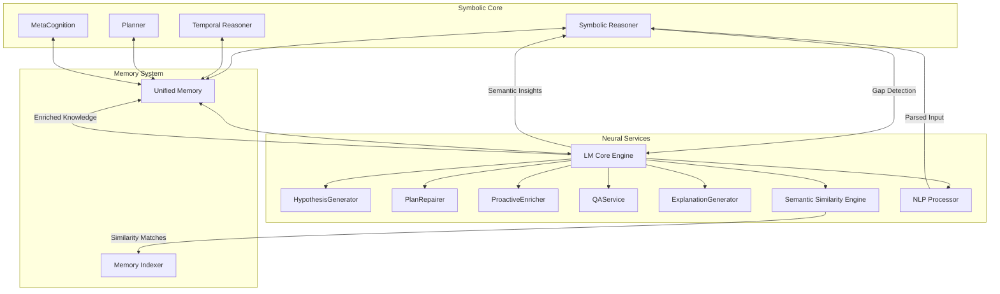

# Advanced Neuro-Symbolic Integration 🤝

How SeNARS achieves revolutionary integration of formal reasoning and neural processing for next-generation cognitive
capabilities.

---

## Advanced Architecture Overview

SeNARS implements a sophisticated, bidirectional neuro-symbolic architecture where neural and symbolic components work
in complete harmony rather than as a simple interface. The system maintains complete transparency and control while
leveraging the complementary strengths of both approaches.

**Core Integration Principles:**

- **Bidirectional Flow:** Information flows seamlessly from symbolic to neural and back, with each component enhancing
  the other
- **Contextual Intelligence:** Neural services operate with full awareness of current cognitive context and objectives
- **Constraint-Guided Creativity:** Neural creativity is guided by symbolic constraints ensuring coherence and
  feasibility
- **Transparency Preservation:** All neural insights maintain traceability to their symbolic foundations
- **Adaptive Coordination:** The system dynamically determines when to engage neural versus symbolic processing based on
  problem characteristics

---

## Comprehensive LM Services Ecosystem

### HypothesisGenerator 🧠

Advanced creative abduction and pattern discovery system

- **Generative Hypothesis Formation:** Creates novel hypotheses when formal logic encounters boundaries, using semantic
  understanding to suggest plausible explanations
- **Cross-Domain Pattern Recognition:** Identifies patterns across different knowledge domains and suggests analogies
  for creative solutions
- **Uncertainty Navigation:** Generates hypotheses that explicitly account for uncertainty and incomplete information
- **Evidence-Based Evaluation:** Evaluates and ranks generated hypotheses based on available evidence and logical
  consistency
- **Iterative Refinement:** Continuously refines hypotheses based on new evidence and feedback from symbolic reasoning

### PlanRepairer 🛠️

Sophisticated solution generation for failed plans and unexpected obstacles

- **Failure Analysis:** Comprehensive analysis of plan failures to identify root causes and prevent similar failures
- **Alternative Strategy Generation:** Creates multiple alternative approaches when initial plans fail, considering
  different problem-solving strategies
- **Context-Aware Repair:** Generates repairs that consider current environmental context and constraints
- **Resource Optimization:** Suggests repairs that optimize resource usage while achieving objectives
- **Risk Assessment:** Evaluates risks associated with alternative repair strategies

### ProactiveEnricher 🌱

Intelligent knowledge graph expansion and enrichment system

- **Automated Knowledge Discovery:** Proactively identifies and suggests new connections between existing concepts and
  knowledge
- **Semantic Embedding Integration:** Uses high-dimensional embeddings to discover conceptual relationships that
  symbolic processing might miss
- **Anomaly Detection:** Identifies unusual patterns in knowledge that might indicate new insights or contradictions
- **Contextual Relevance Assessment:** Determines which potential enrichments are most relevant to current cognitive
  objectives
- **Knowledge Quality Evaluation:** Assesses the quality and reliability of potential knowledge enrichments before
  integration

### QAService ❓

Advanced natural language question answering with deep cognitive integration

- **Multi-Modal Question Processing:** Handles questions expressed in various forms and modalities
- **Context-Aware Answering:** Provides answers that consider the current cognitive context and recent system activities
- **Confidence-Weighted Responses:** Returns answers with associated confidence measures and uncertainty quantification
- **Explanation Integration:** Links answers to underlying reasoning processes and evidence
- **Knowledge Gap Identification:** Identifies when questions cannot be answered and suggests ways to acquire necessary
  information

### ExplanationGenerator 📝

Sophisticated translation of formal reasoning into natural language narratives

- **Reasoning Trace Translation:** Converts complete reasoning traces into fluent, human-readable narratives with full
  logical chain preservation
- **Audience-Adaptive Explanations:** Generates explanations appropriate for different audiences and expertise levels
- **Multi-Modal Explanation:** Creates explanations that combine text, structure, and visual elements as appropriate
- **Counterfactual Reasoning:** Explains alternative reasoning paths and why they weren't taken
- **Uncertainty Communication:** Clearly communicates uncertainty, confidence levels, and reasoning limitations

### Semantic Similarity Engine 🔍

Advanced vector-based knowledge discovery and retrieval

- **High-Dimensional Embedding Processing:** Uses sophisticated neural embeddings to identify conceptually related
  information
- **Context-Aware Similarity:** Calculates similarity based on current cognitive context and objectives
- **Analogical Reasoning Support:** Identifies analogies and structural similarities between different domains
- **Semantic Indexing:** Maintains sophisticated indexes for rapid semantic search and retrieval
- **Cross-Modal Similarity:** Identifies similarities across different types of information and representations

### NLP Processor 📚

Advanced natural language processing for cognitive integration

- **Narsese Translation:** Sophisticated conversion between natural language and formal Narsese representations
- **Contextual Understanding:** Deep understanding of language in cognitive context
- **Ambiguity Resolution:** Resolution of linguistic ambiguities using cognitive context and world knowledge
- **Multi-Lingual Support:** Processing and translation across multiple natural languages
- **Discourse Analysis:** Understanding of extended discourse and dialogue structures

---

## Advanced Integration Patterns

### Intelligent Gap Detection & Filling

Symbolic reasoner identifies limitations → Context-aware LM service selection → Neural insight generation → Symbolic
validation and integration

### Creative Constraint-Guided Generation

Symbolic framework defines logical constraints → Neural creativity generates possibilities within constraints → Symbolic
validation ensures feasibility → Integrated solution formation

### Bidirectional Learning Enhancement

Symbolic reasoning identifies areas needing neural insight → Neural processing provides semantic understanding →
Symbolic processing validates and integrates insights → Enhanced capability for future tasks

### Dynamic Service Orchestration

Real-time assessment of cognitive needs → Intelligent selection of appropriate neural services → Contextual parameter
adjustment → Seamless integration of outputs

### Continuous Validation Loop

Neural services generate insights → Symbolic validation and consistency checking → Integration with existing knowledge →
Performance monitoring and adaptation

---

## Advanced Integration Benefits

| Benefit                    | Description                                                                                           | Realizable Potential                                            |
|----------------------------|-------------------------------------------------------------------------------------------------------|-----------------------------------------------------------------|
| **Rigorous Creativity**    | Formal logical reasoning enhanced with creative neural insights while maintaining logical consistency | Solutions that are both innovative and logically sound          |
| **Explainable Innovation** | Neural creativity with complete transparency and traceability to logical foundations                  | Trustworthy innovation for critical applications                |
| **Adaptive Intelligence**  | Dynamic adaptation combining neural flexibility with symbolic stability                               | Systems that continuously improve while maintaining reliability |
| **Uncertainty Management** | Sophisticated handling of uncertainty through combined probabilistic and logical approaches           | Robust decision-making under uncertainty                        |
| **Scalable Reasoning**     | Efficient neural processing guides focused symbolic reasoning                                         | Complex reasoning at scale without performance degradation      |
| **Cognitive Resilience**   | Multiple reasoning pathways and fallback strategies                                                   | Robust operation despite unexpected challenges                  |
| **Continuous Learning**    | Neural insights continuously enhance symbolic knowledge and vice versa                                | Systems that improve through experience and interaction         |
| **Strategic Intelligence** | Long-term planning with creative insight generation                                                   | Complex strategic decision-making with innovative solutions     |

---

## Implementation Architecture

The neuro-symbolic integration is implemented through a sophisticated service-oriented architecture that maintains clear
interfaces while enabling deep integration:

- **Service Registry:** Dynamic registry of available neural and symbolic services
- **Context Manager:** Maintains cognitive context and state across service interactions
- **Quality Assurance:** Validation and quality checking of all neural outputs before symbolic integration
- **Performance Monitor:** Continuous monitoring of integration effectiveness and performance
- **Adaptation Engine:** Dynamic adjustment of integration strategies based on performance and context

This architecture ensures that the neuro-symbolic integration remains robust, transparent, and continuously improving
while delivering the advanced cognitive capabilities that make SeNARS a revolutionary cognitive architecture.