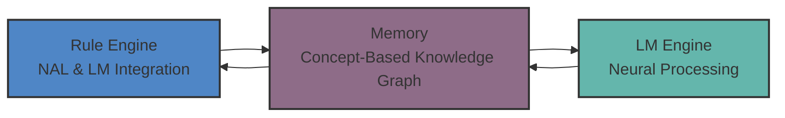
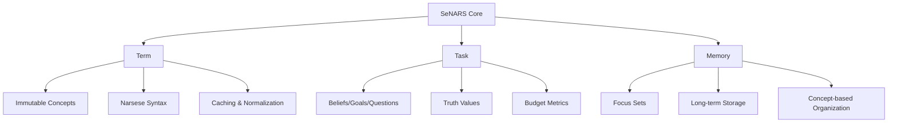
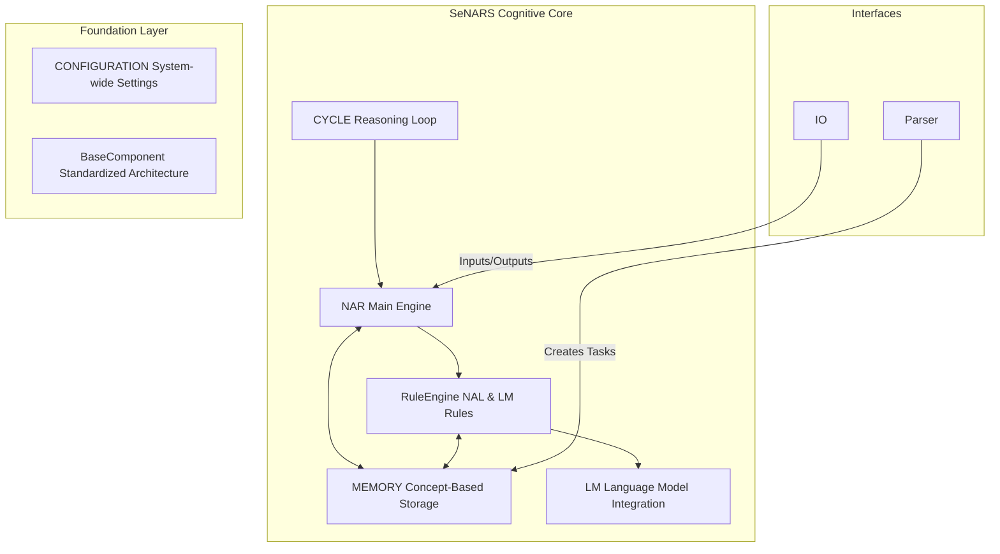
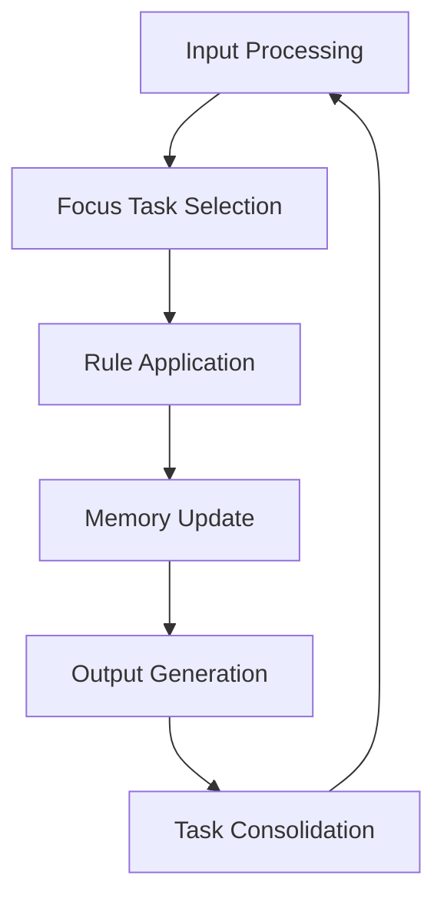
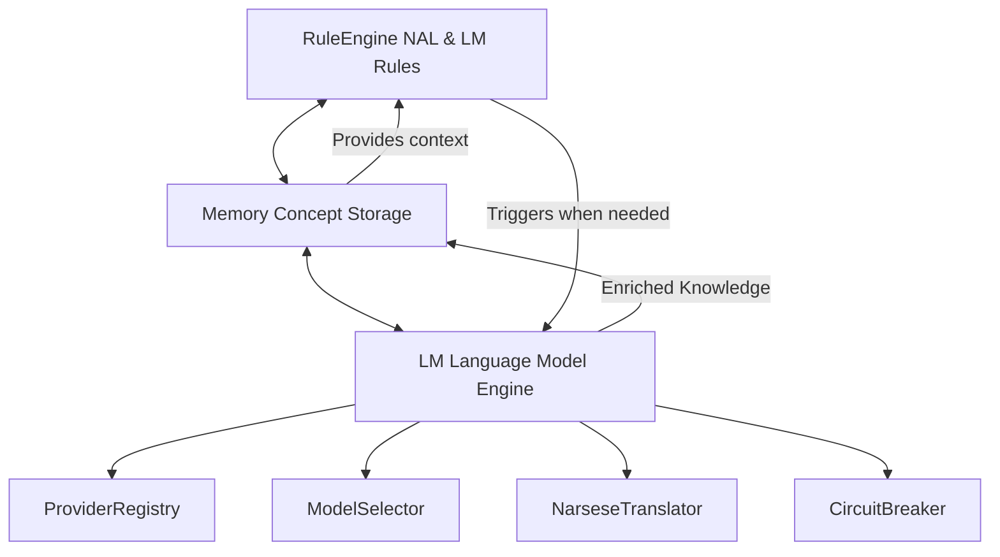

# SeNARS

Semantic Non-Axiomatic Reasoning System

<div class="center text-sm opacity-75">
Advancing AI Power and Reliability through Neuro-Symbolic Cognition
</div>

---

## Introduction

A complete cognitive architecture designed for a synergistic union of:

- **Formal symbolic reasoning** (Non-Axiomatic Logic)
- **Semantic power of Language Models (LMs)**
- **Observable reasoning processes** for transparency

SeNARS combines the best of both worlds to create a transparent, reliable, and adaptive AI system.

---

## The Challenge

Today's powerful AI models often suffer from critical limitations:

- 📦 **Black Box Problem**: "Why did it do that?" is often unanswerable
- 📉 **Instability**: Minor input changes can cause catastrophic failures
- 🧩 **Poor Abstract Reasoning**: Struggles with logic, causality, and long-term planning

These limitations create massive barriers to deploying AI in high-value, regulated industries.

<div class="center text-sm opacity-75 mt-4">
SeNARS addresses these fundamental limitations through principled design
</div>

---

## What is Neuro-Symbolic AI?

Neuro-symbolic AI combines the best of both worlds:

| Approach            | Strengths                                                    | Limitations                               |
|---------------------|--------------------------------------------------------------|-------------------------------------------|
| **Neural Networks** | Pattern recognition, uncertainty handling, unstructured data | Opaque, unstable, poor abstract reasoning |
| **Symbolic AI**     | Logical reasoning, knowledge representation, explainability  | Rigid, limited creativity, brittle        |

---

## Benefits of Neuro-Symbolic Integration

The integration creates systems that are:

- ✅ More interpretable than pure neural approaches
- ✅ More flexible than purely symbolic systems
- ✅ Better at generalizing from limited examples
- ✅ Capable of both intuitive and logical reasoning

<div class="grid grid-cols-2 gap-4 mt-4">
  <div class="text-center p-4 bg-opacity-20 bg-white rounded">
    <div class="text-2xl mb-2">🧠</div>
    <div class="text-lg font-semibold">Symbolic Reasoning</div>
    <div class="text-sm opacity-75">Logic & Structure</div>
  </div>
  <div class="text-center p-4 bg-opacity-20 bg-white rounded">
    <div class="text-2xl mb-2">🤖</div>
    <div class="text-lg font-semibold">Neural Processing</div>
    <div class="text-sm opacity-75">Pattern Recognition</div>
  </div>
</div>

---

## SeNARS: The Neuro-Symbolic Bridge

SeNARS creates a powerful synergy between formal symbolic reasoning and the semantic power of Large Language Models.



This integration enables:
- **Rigorous logical reasoning** from the NAL rule system
- **Creative semantic understanding** from the neural component
- **Bidirectional knowledge exchange** between both systems

---

## Introducing SeNARS

SeNARS is a **neuro-symbolic** architecture that delivers **explainable, robust, and adaptive AI**.

<div class="grid grid-cols-2 gap-2 mt-4 mb-4">
  <div class="text-center text-sm p-2 bg-blue-500 bg-opacity-20 rounded">
    Transparent
  </div>
  <div class="text-center text-sm p-2 bg-green-500 bg-opacity-20 rounded">
    Adaptive
  </div>
  <div class="text-center text-sm p-2 bg-purple-500 bg-opacity-20 rounded">
    Principled
  </div>
  <div class="text-center text-sm p-2 bg-yellow-500 bg-opacity-20 rounded">
    Synergistic
  </div>
</div>

---

## Key Differentiators

- **Transparent Reasoning**: Trace every conclusion back to its premises
- **Immutable Data Foundation**: Ensures consistency and enables efficient caching
- **Component-Based Architecture**: Standardized interfaces with BaseComponent foundation
- **Dual Memory Architecture**: Short-term focus + long-term storage with automatic consolidation
- **Self-Adaptation**: Dynamically adjusts reasoning strategies based on performance
- **True Synergy**: Symbolic reasoning + LM creativity ≠ Black box

**SeNARS is built for high-stakes applications where trust is non-negotiable.**

---

## Market Opportunity

Explainable AI (XAI) is the key to unlocking high-value markets:

| Market                         | Value | Why XAI Matters                                          |
|--------------------------------|-------|----------------------------------------------------------|
| **Financial Services**         | $10B+ | Algorithmic trading, credit scoring, compliance          |
| **Healthcare & Life Sciences** | $15B+ | Medical diagnosis, drug discovery, personalized medicine |
| **Autonomous Systems**         | $20B+ | Self-driving vehicles, robotics, industrial automation   |

**SeNARS captures these markets where standard "black-box" solutions are too risky.**

---

## SeNARS Competitive Edge

| Feature            | Pure LLMs                 | Traditional Symbolic AI  | **SeNARS**                   |
|--------------------|---------------------------|--------------------------|------------------------------|
| **Explainability** | ⬛️ Low                    | ✅ High                   | ✅ **High**                   |
| **Adaptability**   | 🟨 Medium                 | ⬛️ Low                   | ✅ **High**                   |
| **Creativity**     | ✅ High                    | ⬛️ Low                   | ✅ **High**                   |
| **Logical Rigor**  | 🟨 Medium                 | ✅ High                   | ✅ **High**                   |
| **Verdict**        | ✨ Creative but Unreliable | 🧱 Rigid but Explainable | ✅ **Transparent & Powerful** |

---

## Why SeNARS Stands Out

<div class="center text-lg p-4 bg-gradient-to-r from-blue-500 to-purple-500 bg-opacity-20 rounded">
SeNARS represents a fundamental advancement in AI architecture,
combining the best of symbolic and neural approaches with observable reasoning.
</div>

---

## SeNARS Design Principles

SeNARS is built on five core design principles that ensure robust, transparent, and adaptive cognition:

<div class="grid grid-cols-3 gap-4">
  <div class="p-4 bg-blue-500 bg-opacity-20 rounded text-center">
    <div class="font-bold text-lg">1. Modularity and Decoupling</div>
    <div class="text-2xl mb-2">🧩</div>
    <ul class="text-sm space-y-2">
      <li>Component-based architecture with BaseComponent</li>
      <li>Standardized initialization and configuration</li>
    </ul>
  </div>
  <div class="p-4 bg-green-500 bg-opacity-20 rounded text-center">
    <div class="font-bold text-lg">2. Explicit State Management</div>
    <div class="text-2xl mb-2">📦</div>
    <ul class="text-sm space-y-2">
      <li>All state in immutable Term, Task, and Memory objects</li>
      <li>Single source of truth with event-driven updates</li>
    </ul>
  </div>
  <div class="p-4 bg-yellow-500 bg-opacity-20 rounded text-center">
    <div class="font-bold text-lg">3. Strategy over Implementation</div>
    <div class="text-2xl mb-2">🎯</div>
    <ul class="text-sm space-y-2">
      <li>RuleEngine with dynamic rule selection</li>
      <li>Extensible with new reasoning strategies</li>
    </ul>
  </div>
</div>

<div class="grid grid-cols-2 gap-4 mt-4">
  <div class="p-4 bg-purple-500 bg-opacity-20 rounded text-center">
    <div class="font-bold text-lg">4. Meta-Cognition</div>
    <div class="text-2xl mb-2">🔄</div>
    <ul class="text-sm space-y-2">
      <li>ReasoningAboutReasoning as core component</li>
      <li>Self-monitoring and self-correction capabilities</li>
    </ul>
  </div>
  <div class="p-4 bg-red-500 bg-opacity-20 rounded text-center">
    <div class="font-bold text-lg">5. Pragmatism under Scarcity</div>
    <div class="text-2xl mb-2">💰</div>
    <ul class="text-sm space-y-2">
      <li>Finite resources assumption with memory consolidation</li>
      <li>Adaptive forgetting and priority management</li>
    </ul>
  </div>
</div>

---

## Core Components: Term, Task, and Memory

SeNARS is built on three fundamental immutable data structures:

<div class="grid grid-cols-3 gap-4 mb-4">
  <div class="text-center p-4 bg-blue-500 bg-opacity-20 rounded">
    <div class="text-2xl">🔤</div>
    <div class="font-bold text-lg">Term</div>
    <div class="text-sm">Immutable Concepts</div>
  </div>
  <div class="text-center p-4 bg-green-500 bg-opacity-20 rounded">
    <div class="text-2xl">🎯</div>
    <div class="font-bold text-lg">Task</div>
    <div class="text-sm">Cognitive Atoms</div>
  </div>
  <div class="text-center p-4 bg-purple-500 bg-opacity-20 rounded">
    <div class="text-2xl">💾</div>
    <div class="font-bold text-lg">Memory</div>
    <div class="text-sm">Knowledge Graph</div>
  </div>
</div>

---

## Understanding Terms

**Term** - Immutable representations of concepts with structural intelligence:

- **Examples**: `cat`, `(cat --> animal)`, `(cat ==> furry)`
- **Key Properties**:
    - Strict immutability with frozen objects
    - Canonical normalization (e.g., `(&, A, B)` = `(&, B, A)`)
    - Efficient caching in TermFactory
    - Structural analysis with visitor/reducer patterns

---

```javascript
// Example Term structure
const catTerm = new Term({
    components: ['cat'],
    operator: null
});
const inheritanceTerm = new Term({
    components: [catTerm, new Term({components: ['animal']})],
    operator: '-->'
});
```

---

Terms are the building blocks of all knowledge in SeNARS, providing:

- **Normalization**: Automatic reduction of equivalent terms
- **Immutability**: Ensures consistency across reasoning
- **Structural Intelligence**: Visitor/reducer patterns for analysis

---

## Understanding Tasks

**Task** - Stateful cognitive atoms representing beliefs, goals, or questions:

- **Structure**:
    - `term`: Reference to a Term object
    - `punctuation`: `.`, `!`, or `?` (Belief, Goal, Question)
    - `truth`: Truth value object with frequency and confidence
    - `stamp`: Evidence tracking with origin and derivation history
    - `budget`: Attention allocation metrics (priority, durability, quality)
- **Types**:
    - **Belief (.):** What the system knows about the world
    - **Goal (!):** What the system wants to achieve
    - **Question (?):** What the system wants to know

---

```javascript
// Example Task structure
const beliefTask = new Task({
    term: inheritanceTerm,
    punctuation: '.',
    truth: new Truth(1.0, 0.9),
    budget: { priority: 0.8, durability: 0.7, quality: 0.9 }
});
```

----

Tasks represent the dynamic aspects of cognition:

- **Typed Punctuation**: Clear distinction between beliefs, goals, and questions
- **Evidence Tracking**: Complete derivation history with timestamps
- **Attention Management**: Dynamic budget metrics for cognitive focus
- **Truth Semantics**: Enable reinforcement learning (beliefs model world, goals define rewards)

---

## Understanding Memory

**Memory** - Concept-based knowledge graph managing Terms and Tasks:

- **Dual Storage System**:
    - Focus sets: Short-term memory with high-priority tasks
    - Long-term storage: All concepts and tasks with adaptive consolidation
- **Concept Management**:
    - Each concept holds related tasks for the same term
    - Specialized indexes for different term types (inheritance, implication, etc.)
- **Forgetting Mechanisms**: Adaptive consolidation based on priority and activation

---



---



---

## How SeNARS "Thinks"

Think of SeNARS as a **digital brain** with distinct yet synergistic components:

1. **The Logical "Conscious Mind" (RuleEngine)**
    - Handles formal, step-by-step reasoning
    - Analytical and auditable through event-based tracing
    - Ensures every decision can be fully explained

2. **The Creative "Subconscious" (LM)**
    - Provides intuition and semantic understanding
    - Source of novel ideas and fluent language
    - Grounds symbolic knowledge in meaning

3. **The Self-Awareness (Meta-Cognition)**
    - Constantly monitors reasoning performance
    - Improves thinking through feedback loops
    - Ensures consistency and coherence

---

## The Cognitive Cycle

SeNARS operates in discrete cognitive cycles that emulate a stream of consciousness:

1. **Perception** 👁️: Ingest new information from the world
2. **Focus Selection** 🎯: Apply attention to salient tasks in focus sets
3. **Rule Application** 🔍: Apply relevant NAL and LM rules to tasks
4. **Memory Consolidation** 🧠: Update knowledge graph and manage attention
5. **Output Generation** 🌱: Produce answers, beliefs, or actions

---



Each cycle is a complete reasoning loop, ensuring continuous learning and adaptation.

---

## Attention Model and Formal Reasoning

SeNARS implements a pragmatic attention mechanism that focuses computational resources like a stream of consciousness.

Budget calculation factors:
| Factor | Description | Impact |
|--------|-------------|--------|
| **Priority** | Task importance metric | Higher priority = higher selection probability |
| **Durability** | Persistence requirements | Longer-term tasks maintained in focus |
| **Quality** | Relevance and usefulness | Higher quality tasks receive more attention |

---

SeNARS implements rigorous, explainable reasoning through formal inference rules:

| Rule             | Structure                          | Purpose                        |
|------------------|------------------------------------|--------------------------------|
| **Deduction**    | `(M --> P), (S --> M) ⊢ (S --> P)` | Classical logical deduction    |
| **Induction**    | `(M --> P), (M --> S) ⊢ (S --> P)` | Evidence-based generalization  |
| **Abduction**    | `(P --> M), (S --> M) ⊢ (S --> P)` | Hypothesis generation          |
| **Analogy**      | `(M --> P), (M <-> S) ⊢ (S --> P)` | Structure-preserving inference |
| **Modus Ponens** | `(P ==> Q), P ⊢ Q`                 | Conditional reasoning          |

---

## The Neuro-Symbolic Bridge

SeNARS integrates LMs as a specialized service layer rather than a black box:

- **ProviderRegistry**: Registry and selection of multiple LM providers
- **ModelSelector**: Dynamic model selection based on task requirements
- **NarseseTranslator**: Bidirectional translation between Narsese and natural language
- **CircuitBreaker**: Resilient operation with fallback mechanisms

This creates powerful synergy: the **RuleEngine** provides rigor, while the **LM** provides creativity and grounding.

---



---

## Meta-Cognition and Reasoning

SeNARS is designed for **adaptive self-improvement**:

1. **Performance Monitoring**: Constantly tracks rule effectiveness and reasoning outcomes
2. **Analysis**: Classifies successful and failed reasoning patterns
3. **Adaptation**: Adjusts rule priorities and reasoning strategies based on metrics

---

| Strategy                | Approach                      | Use Case                            |
|-------------------------|-------------------------------|-------------------------------------|
| **Rule Effectiveness**  | Track success/failure rates   | Adapt rule selection and priorities |
| **Performance Metrics** | Monitor execution times       | Optimize reasoning workflows        |
| **Cognitive Load**      | Balance task complexity       | Maintain reasoning efficiency       |
| **Resource Management** | Adaptive memory consolidation | Optimize memory utilization         |
| **Error Recovery**      | Circuit breaker mechanisms    | Maintain system resilience          |

---

Key features:

- Performance optimization with caching strategies
- Dynamic rule selection based on task type
- Resilient operation with fallback mechanisms
- Cross-validation between symbolic and neural reasoning

---

## Temporal Reasoning

SeNARS implements sophisticated temporal reasoning capabilities through:

- **Stamp Management**: Complete event tracing with timestamps and derivation history
- **Evidence Tracking**: Maintains complete origin and evidence chain for every piece of knowledge
- **Temporal Coherence**: Ensures consistency of temporal relationships between events

---

Specialized temporal concepts:

- **Occurrence Time**: When tasks were created or observed
- **Derivation History**: Complete chain of reasoning steps leading to conclusions
- **Evidential Base**: Set of direct evidence supporting each belief

---

## Component Architecture: BaseComponent

SeNARS implements a robust component architecture with standardized interfaces:

**BaseComponent Features**:

- **Initialization Framework**: Standardized initialization with configuration support
- **Metrics Collection**: Base metrics and statistics gathering
- **Logging Integration**: Consistent logging across all components
- **Validation Framework**: Input and configuration validation utilities
- **Event Integration**: Built-in event bus for component communication
- **Lifecycle Management**: Initialize, start, stop, and dispose patterns

---

```javascript
class Memory extends BaseComponent {
    constructor(config = {}) {
        super(config, 'Memory');
        this._config = {...this.config, ...config};
        // Component-specific initialization
    }
}
```

This architecture ensures consistent behavior and maintainability across all system components.

---

## Narsese: Formal Knowledge Representation

SeNARS supports a comprehensive set of Narsese expressions:

| Type                       | Syntax                     | Example                             |
|----------------------------|----------------------------|-------------------------------------|
| **Atomic Terms**           | Simple identifiers         | `cat`                               |
| **Inheritance**            | `(subject --> predicate)`  | `(cat --> mammal)`                  |
| **Implication**            | `(premise ==> conclusion)` | `(cat ==> furry)`                   |
| **Negation**               | `(--, term)`               | `(--, cat)`                         |
| **Conjunction**            | `(&, term1, term2, ...)`   | `(&, cat, dog)`                     |
| **Disjunction**            | `(\|, term1, term2, ...)`  | `(\|, cat, dog)`                    |
| **Extensional Difference** | `(#, term1, term2)`        | `(#, cat, dog)`                     |
| **Intensional Difference** | `(\, term1, term2)`        | `(\, cat, dog)`                     |
| **Instance**               | `(term {-- class)`         | `(cat {-- animal)`                  |
| **Property**               | `(term --} property)`      | `(cat --} furry)`                   |
| **Nested Expressions**     | Complex combinations       | `(cat --> (&, furry, intelligent))` |

This formal language enables precise knowledge representation and logical reasoning.

---

## Implementation Details

SeNARS is implemented with modern software engineering practices:

- **Language**: JavaScript/Node.js with ES6+ features for cross-platform compatibility
- **Architecture**: Component-based design with BaseComponent pattern for consistency
- **Performance**: Term caching, normalization, and efficient priority-based collections
- **Extensibility**: Plugin architecture for adding new capabilities through component registration
- **Testing**: Comprehensive unit and integration tests with property-based testing
- **Documentation**: Self-documenting code with inline examples and JSDoc annotations

---

Key implementation features:

- TermFactory with normalization and caching for performance optimization
- Bag data structure for probabilistic priority selection in focus sets
- ComponentManager with lifecycle management for all system components
- Circuit breaker patterns for resilient LM integration
- Memory consolidation with adaptive forgetting strategies

These implementation details ensure SeNARS is both powerful and practical.

---

## Investor-Ready Highlights

SeNARS is designed from the ground up to deliver value and attract investment:

- 📈 **Built to Scale**: Component-based architecture with clear paths to enterprise-level workloads
- 💰 **High-Value Markets**: Targeting lucrative opportunities in XAI, Cognitive Automation, and Safe AI
- 👨‍💻 **Attracts Top Talent**: Clean, modular, well-documented design that developers love
- 📊 **Clear Path to ROI**: Research agenda focused on delivering commercial value at every step

SeNARS represents a unique investment opportunity at the intersection
of cutting-edge AI research and practical commercial applications.

---

## Verified Capabilities

All SeNARS functionality has been verified through comprehensive unit tests and runnable demos:

<div class="grid grid-cols-2 gap-4">
  <div class="p-4 bg-blue-500 bg-opacity-20 rounded">
    <div class="font-bold text-lg mb-2">Core Knowledge Representation</div>
    <ul class="text-sm space-y-1">
      <li>Immutable Term system with intelligent normalization and caching</li>
      <li>Task system with comprehensive truth value management</li>
      <li>Concept-based memory with adaptive consolidation</li>
    </ul>
  </div>
  <div class="p-4 bg-green-500 bg-opacity-20 rounded">
    <div class="font-bold text-lg mb-2">Reasoning Engine</div>
    <ul class="text-sm space-y-1">
      <li>Formal inference with NAL rules (deduction, induction, abduction, analogy)</li>
      <li>LM-enhanced reasoning with multiple provider integration</li>
      <li>Performance monitoring and adaptive reasoning strategies</li>
    </ul>
  </div>
</div>

---

### Advanced Features

- Component-based architecture with BaseComponent standardization
- Focus-driven attention mechanisms with configurable selection strategies
- Circuit breaker patterns for resilient LM integration
- Event-driven architecture for component communication
- Layer-based extensibility (TermLayer, EmbeddingLayer)

---

### Demonstrated Capabilities

- Inheritance chaining and modus ponens inference
- Multi-step reasoning with complex term structures
- Adaptive forgetting and memory consolidation
- Hybrid NAL-LM reasoning workflows
- Reinforcement learning through belief-goal distinction

These capabilities represent a solid foundation for building robust, explainable AI systems.

---